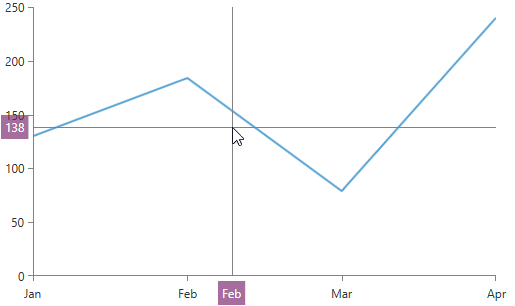

# Crosshair

__RadChartView__ provides a crosshair functionality through the __ChartCrosshairBehavior__ class. This behavior display vertical and horizontal lines across the chart's plot area that intersect on the mouse position. The lines are following the mouse position.



The behavior also displays two labels (one for each line) which, by default, are moving along the axes, outside the plot area, following the lines.

You can add the crosshair behavior in the RadCartesianChart’s __Behaviors__ collection. The following code snippet demonstrates a simple chart definition that includes ChartCrosshairBehavior and it recreates the visualization shown in the image above.

#### __XAML__
```XAML
	<telerik:RadCartesianChart>
		<telerik:RadCartesianChart.VerticalAxis>
			<telerik:LinearAxis />
		</telerik:RadCartesianChart.VerticalAxis>            
		<telerik:RadCartesianChart.HorizontalAxis>
			<telerik:CategoricalAxis />
		</telerik:RadCartesianChart.HorizontalAxis>
		
		<telerik:RadCartesianChart.Behaviors>
			<telerik:ChartCrosshairBehavior />
		</telerik:RadCartesianChart.Behaviors>
		
		<telerik:LineSeries>
			<telerik:LineSeries.DataPoints>
				<telerik:CategoricalDataPoint Category="Jan" Value="140" />
				<telerik:CategoricalDataPoint Category="Feb" Value="180" />
				<telerik:CategoricalDataPoint Category="Mar" Value="80" />
				<telerik:CategoricalDataPoint Category="Apr" Value="230" />
			</telerik:LineSeries.DataPoints>
		</telerik:LineSeries>
	</telerik:RadCartesianChart>
```

## Properties

The crosshair behavior exposes the following properties:
* __HorizontalLineLabelDefinition__ – gets or sets the LabelDefinition of the horizontal line of the crosshair
* __VerticalLineLabelDefinition__ – gets or sets the LabelDefinition of the vertical line of the crosshair
* __HorizontalLineLabelVisibility__ – gets or sets the Visibility of the horizontal line’s label
* __VerticalLineLabelVisibility__ – gets or sets the Visibility of the vertical line’s label
* __HorizontalLineStyle__ – gets (if manually set) or sets the Style of the horizontal line of the crosshair. The property accepts a value of type Style with TargetType set to Line
* __VerticalLineStyle__ – gets (if manually set) or sets the Style of the vertical line of the crosshair. The property accepts a value of type Style with TargetType set to Line
* __HorizontalLineVisibility__ – gets or sets the Visibility of the horizontal line
* __VerticalLineVisibility__ – gets or sets the Visibility of the vertical line.	

## Events

The crosshair behavior exposes the following events:
* __PositionChanged__ – it occurs when the position of the lines that represent the crosshair changes. The arguments of the event expose the following properties:
	* __Data__ – an object of type `Telerik.Charting.DataTuple`. It holds the vertical and the horizontal value on the chart that corresponds to the crosshair position.
	* __Position__ – an object of type Point. It holds the position of the mouse relative to the chart.

>tip Find a runnable project of the previous example in the [WPF Samples GitHub repository](https://github.com/telerik/xaml-sdk/tree/master/ChartView/WPF/Crosshair).
	
## See Also	

* [ChartCrosshairBehavior](https://docs.telerik.com/devtools/wpf/api/telerik.windows.controls.chartview.chartcrosshairbehavior)
* [ChartCrosshairPositionChangedEventArgs](https://docs.telerik.com/devtools/wpf/api/telerik.windows.controls.chartview.chartcrosshairpositionchangedeventargs)
* [DataTuple](https://docs.telerik.com/devtools/wpf/api/telerik.charting.datatuple)

* [ChartCrosshairBehavior](https://docs.telerik.com/devtools/silverlight/api/telerik.windows.controls.chartview.chartcrosshairbehavior)
* [ChartCrosshairPositionChangedEventArgs](https://docs.telerik.com/devtools/silverlight/api/telerik.windows.controls.chartview.chartcrosshairpositionchangedeventargs)
* [DataTuple](https://docs.telerik.com/devtools/silverlight/api/telerik.charting.datatuple)

* [LabelDefinition]()
* [Axes]()
