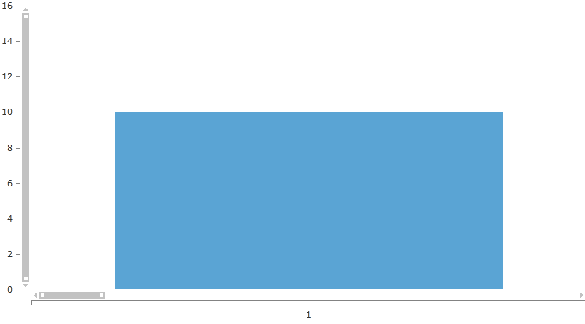

# Scroll and Zoom 

## 

RadChartView provides zoom and scroll interactivity with the __ChartPanAndZoomBehavior__ class. It is very simple to use and allows users to zoom in the chart plot area when are there is a dense area of data points that can not be seen clearly at the normal chart scale. The scroll functionality allows moving the visible area of the chart. In order to utilize this behavior users simply have to add it to the chart's __Behaviors__ collection and specify the zoom mode. For example:
        

#### __XAML__

{{region radchart-features-panzoom_0}}
	<telerikChart:RadCartesianChart.Behaviors>
	   <telerikChart:ChartPanAndZoomBehavior ZoomMode="Horizontal" PanMode="Horizontal"/>
	</telerikChart:RadCartesianChart.Behaviors>
	{{endregion}}

The __ZoomMode__ property allow developers to restrict zooming. Setting either of these properties to the __Both__ value removes any restrictions and the chart can be zoomed in both the horizontal and vertical axes. Setting it to __None__ on the other hand stops the zoom functionality of the behavior. The last two values are __Horizontal__ and __Vertical__ which restrict the behavior horizontally and vertically respectively.
        

>The ChartPanAndZoomBehavior works with the default axes. If the RadCartesianChart.HorizontalAxis is null, for example, the user will not be able to zoom or scroll horizontally, even though the individual series have horizontal axis (axes) defined. 
          

You can now get/set the zoom and pan values of the __RadCartesianChart__ using the __RadCartesianChart.Zoom__ and __RadCartesianChart.PanOffset__ properties. Note that the offset should be provided in negative absolute values e.g. RadCartesianChart.PanOffset = new Point (-7500,0) will offset the chart horizontally at 7500px.
        

RadCartesianChart also exposes a __Zoom__ property. You may use it to simultaneously set zoom for the both axes by separating the values with comma. For example a __Zoom = "10 , 1"__ setting specifies that the data will be zoomed 10 times according to the XAxis and won't be zoomed by YAxis.
        

A sample is shown below:

#### __XAML__

{{region radchart-features-scrollandzoom_0}}
	 <telerik:RadCartesianChart x:Name="telerik" Zoom="10,1">
	            <telerik:RadCartesianChart.HorizontalAxis>
	                <telerik:CategoricalAxis/>
	            </telerik:RadCartesianChart.HorizontalAxis>
	
	            <telerik:RadCartesianChart.VerticalAxis>
	                <telerik:LinearAxis/>
	            </telerik:RadCartesianChart.VerticalAxis>
	
	            <telerik:RadCartesianChart.Behaviors>
	                <telerik:ChartPanAndZoomBehavior ZoomMode="Both">
	                </telerik:ChartPanAndZoomBehavior>
	            </telerik:RadCartesianChart.Behaviors>           
	
	            <telerik:RadCartesianChart.Series>
	                <telerik:BarSeries>
	                    <telerik:BarSeries.DataPoints>
	                        <telerik:CategoricalDataPoint Value="10"
	                                              Category="1"/>
	                        <telerik:CategoricalDataPoint Value="4"
	                                              Category="2"/>
	                        <telerik:CategoricalDataPoint Value="7"
	                                              Category="3"/>
	                        <telerik:CategoricalDataPoint Value="11"
	                                              Category="4"/>
	                        <telerik:CategoricalDataPoint Value="15"
	                                              Category="5"/>
	                        <telerik:CategoricalDataPoint Value="10"
	                                              Category="6"/>
	                        <telerik:CategoricalDataPoint Value="4"
	                                              Category="7"/>
	                        <telerik:CategoricalDataPoint Value="7"
	                                              Category="8"/>
	                        <telerik:CategoricalDataPoint Value="11"
	                                              Category="9"/>
	                        <telerik:CategoricalDataPoint Value="15"
	                                              Category="10"/>
	                    </telerik:BarSeries.DataPoints>
	                </telerik:BarSeries>
	            </telerik:RadCartesianChart.Series>
	        </telerik:RadCartesianChart>
	{{endregion}}

As result you'll see 1 bar out of 10:

