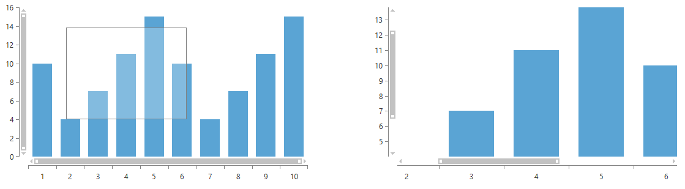
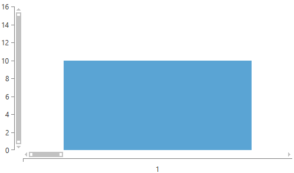
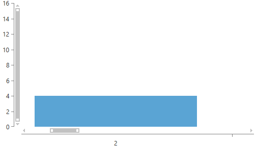
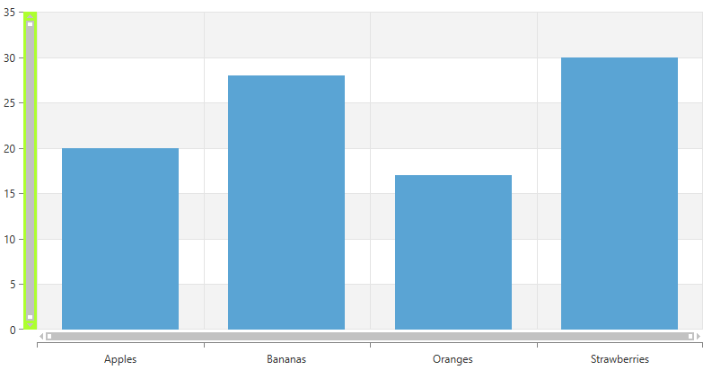
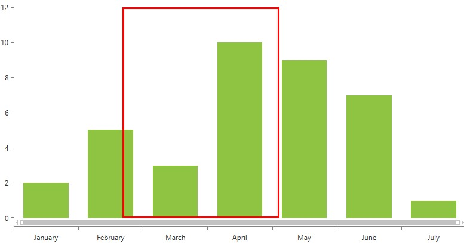
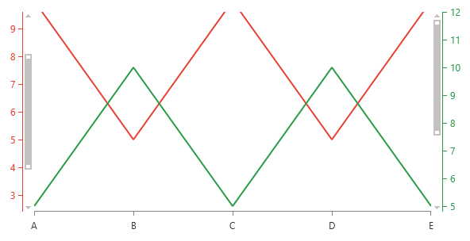

# Scroll and Zoom 

__RadChartView__ provides zoom and scroll interactivity via the __ChartPanAndZoomBehavior__ class. It is very simple to use and allows users to zoom in the chart plot area when there is a dense area of data points that can not be seen clearly at the normal chart scale. The scroll functionality allows moving the visible area of the chart. 

In order to utilize this behavior users simply have to add it to the chart's __Behaviors__ collection.

__Example 1: Defining pan and zoom behavior__
```XAML
	<telerikChart:RadCartesianChart.Behaviors>
	   <telerikChart:ChartPanAndZoomBehavior />
	</telerikChart:RadCartesianChart.Behaviors>
```

By default only the panning and zooming of the horizontal axis are enabled. You can alter this by setting the __ZoomMode__ and __PanMode__ properties of the __ChartPanAndZoomBehavior__. Both properties are of type __ChartPanZoomMode__ and accept the following values:

* __None__: The zooming/panning with the mouse device is disabled. You can use this value to disable the zoom functionality of the behavior.
* __Horizontal__: The zooming/panning with the mouse device is enabled only on the horizontal axis.
* __Vertical__: The zooming/panning with the mouse device is enabled only on the vertical axis.
* __Both__: The zooming/panning with the mouse device is enabled both on the horizontal and vertical axes. You can use this value to removes any restrictions, thus the chart can be zoomed in both the horizontal and vertical axes.

The __ZoomMode__ and __PanMode__ properties can be used to restrict zooming/panning.

__Example 2: Setting zoom mode__
```XAML
	<telerikChart:RadCartesianChart.Behaviors>
	   <telerikChart:ChartPanAndZoomBehavior ZoomMode="Both" />
	</telerikChart:RadCartesianChart.Behaviors>
```

> The __ChartPanAndZoomBehavior__ works with the default axes. If the RadCartesianChart.HorizontalAxis is null, for example, the user will not be able to zoom or scroll horizontally, even though the individual series have horizontal axis (axes) defined. 

* [Drag to zoom/scroll](#drag-to-zoomscroll)
* [Manual scroll and zoom](#manual-scroll-and-zoom)
* [Mouse wheel mode](#mouse-wheel-mode)

## Drag to zoom/scroll

The pan and zoom behavior enables drag-to-zoom and drag-to-pan functionalities. By default, when the ChartPanAndZoomBehavior is activated and you start dragging on the plot area, a zoom rectangle will be created and when the mouse is released the visible area will fit into the rectangle. 

#### __Figure 1: Drag to zoom__


You can alter the drag action using the __DragMode__ property of the behavior. Setting it to __Pan__ will start panning, instead of zooming when you drag the mouse over the plot area. To forbid any drag actions you can set the DragMode to __None__.

__Example 3: Setting drag mode__
```XAML
	<telerik:ChartPanAndZoomBehavior DragMode="Pan" />
```

You can also specify the minimum distance between the start and end points of the drag operation that will allow the drag-to-zoom/pan action to be activated. This is controlled by the __DragToZoomThreshold__ property.

__Example 4: Setting minimum drag-to-zoom distance__
```XAML
	<telerik:ChartPanAndZoomBehavior DragToZoomThreshold="100" />
```
	
The __ChartPanAndZoomBehavior__ allows you to define custom key combinations that activate the panning and zooming. You can do this using the __DragToZoomKeyCombinations__ and __DragToPanKeyCombinations__ collections.

__Example 5: Setting the left Ctrl key + mouse right button down as a combination that activates the zooming__
```C#
	var keyCombo = new ChartKeyCombination();
	keyCombo.Keys.Add(Key.LeftCtrl);
	keyCombo.MouseButtons.Add(MouseButton.Right);
	
	panAndZoomBehavior.DragToZoomKeyCombinations.Add(keyCombo);
```
	
__Example 6: Setting the mouse right button down as a trigger that activates the panning__
```C#
	var keyCombo = new ChartKeyCombination();
	keyCombo.MouseButtons.Add(MouseButton.Right);
	
	panAndZoomBehavior.DragToPanKeyCombinations.Add(keyCombo);
```

> The __DragToZoomKeyCombinations__ and __DragToPanKeyCombinations__ properties have higher priority than the __DragMode__ property and if any combination is satisfied, a drag/pan-to-zoom operation is started.
	
To cancel the drag to zoom operation you can use the __CancelDragToZoom()__ method of the behavior.	

__Example 7: Canceling drag to zoom__
```C#
	panAndZoomBehavior.CancelDragToZoom();
```

## Manual scroll and zoom

The chart control has several properties which can be used to manually control the panning and zooming. 

The __Zoom__ property allows you to set the scale level for both axes. For example a `Zoom=new Size(10,1)` setting specifies that the data will be zoomed 10 times according to the horizontal axis and won't be zoomed by the vertical axis. 

With the __PanOffset__ you can specify the visible area of the chart. Note that PanOffset works with negative absolute values. For example, `PanOffset=new Point(-500,0)` will offset the visible area at 500px.

__Example 8: Setting zoom__
```XAML
	<telerik:RadCartesianChart Zoom="10,1">
		<telerik:RadCartesianChart.HorizontalAxis>
			<telerik:CategoricalAxis/>
		</telerik:RadCartesianChart.HorizontalAxis>	
		<telerik:RadCartesianChart.VerticalAxis>
			<telerik:LinearAxis/>
		</telerik:RadCartesianChart.VerticalAxis>	
		<telerik:RadCartesianChart.Behaviors>
			<telerik:ChartPanAndZoomBehavior ZoomMode="Both">
			</telerik:ChartPanAndZoomBehavior>
		</telerik:RadCartesianChart.Behaviors>           	
		<telerik:RadCartesianChart.Series>
			<telerik:BarSeries>
				<telerik:BarSeries.DataPoints>
					<telerik:CategoricalDataPoint Category="1" Value="10" />
					<telerik:CategoricalDataPoint Category="2" Value="4" />
					<telerik:CategoricalDataPoint Category="3" Value="7" />
					<telerik:CategoricalDataPoint Category="4" Value="11" />
					<telerik:CategoricalDataPoint Category="5" Value="15" />
					<telerik:CategoricalDataPoint Category="6" Value="10" />
					<telerik:CategoricalDataPoint Category="7" Value="4" />
					<telerik:CategoricalDataPoint Category="8" Value="7" />
					<telerik:CategoricalDataPoint Category="9" Value="11" />
					<telerik:CategoricalDataPoint Category="10" Value="15" />
				</telerik:BarSeries.DataPoints>
			</telerik:BarSeries>
		</telerik:RadCartesianChart.Series>
	</telerik:RadCartesianChart>
```

#### __Figure 2: Zoom-in chart__


Note that the setting the __PanOffset__ in XAML or the constructor of the view that holds the chart won't be respected. This is because the property uses the chart's size which is not yet calculated at this point. In order to apply the offset you can set it after the chart is loaded.

__Example 9: Setting pan offset in code__
```C#
	private void RadCartesianChart_Loaded(object sender, RoutedEventArgs e)
	{
		var chart = (RadCartesianChart)sender;
		chart.PanOffset = new Point(-500, 0);            
	} 
```
   
#### __Figure 3: Offset visible area__


The chart also provides few properties that combines the behaviors of Zoom and PanOffset.

* __HorizontalZoomRangeStart__ and __HorizontalZoomRangeEnd__
* __VerticalZoomRangeStart__ and __VerticalZoomRangeEnd__

Those properties controls the visible are of the chart by defining the start and end positions of the scrollbar of the corresponding axis. The properties work in __relative units between 0 and 1__. So if the start of the plot area is at 0, the end it will be at 1, and the center at 0.5. Having this in mind we can construct the same view as the one demonstrated in __Figure 3__ but using the zoom range properties.

__Example 10: Using zoom range properties__
```XAML
	<telerik:RadCartesianChart HorizontalZoomRangeStart="0.1" HorizontalZoomRangeEnd="0.2">
		<telerik:RadCartesianChart.HorizontalAxis>
			<telerik:CategoricalAxis/>
		</telerik:RadCartesianChart.HorizontalAxis>
		<telerik:RadCartesianChart.VerticalAxis>
			<telerik:LinearAxis/>
		</telerik:RadCartesianChart.VerticalAxis>
		<telerik:RadCartesianChart.Behaviors>
			<telerik:ChartPanAndZoomBehavior ZoomMode="Both">
			</telerik:ChartPanAndZoomBehavior>
		</telerik:RadCartesianChart.Behaviors>
		<telerik:RadCartesianChart.Series>
			<telerik:BarSeries>
				<telerik:BarSeries.DataPoints>
					<telerik:CategoricalDataPoint Category="1" Value="10" />
					<telerik:CategoricalDataPoint Category="2" Value="4" />
					<telerik:CategoricalDataPoint Category="3" Value="7" />
					<telerik:CategoricalDataPoint Category="4" Value="11" />
					<telerik:CategoricalDataPoint Category="5" Value="15" />
					<telerik:CategoricalDataPoint Category="6" Value="10" />
					<telerik:CategoricalDataPoint Category="7" Value="4" />
					<telerik:CategoricalDataPoint Category="8" Value="7" />
					<telerik:CategoricalDataPoint Category="9" Value="11" />
					<telerik:CategoricalDataPoint Category="10" Value="15" />
				</telerik:BarSeries.DataPoints>
			</telerik:BarSeries>
		</telerik:RadCartesianChart.Series>
	</telerik:RadCartesianChart>
```

## Mouse wheel mode

You can use the __MouseWheelMode__ property of __ChartPanAndZoomBehavior__ to specify how the chart will respond to mouse wheel. The property value is an enumeration that accepts the following values:

* __Default__: The mouse wheel action will zoom the chart in respect to the __ZoomMode__ property.
* __None__: The mouse wheel action won't be respected. Nothing will happen.
* __Zoom__: The mouse wheel action will zoom the chart both horizontally and vertically.
* __ZoomHorizontally__ and __ZoomVertically__: The mouse wheel action will zoom the chart horizontally/vertically.
* __PanHorizontally__ and __PanVertically__: The mouse wheel action will pan the chart horizontally/vertically.

__Example 11: Settings mouse wheel mode__
```XAML
	<telerik:ChartPanAndZoomBehavior MouseWheelMode="Zoom" />
```

## Restrict zooming 

To restrict the zooming you can set the __MinZoom__ and __MaxZoom__ properties of the chart. This defines a minimum and maximum scale values for chart axes. For example a __MaxZoom=new Size(50, 15)__ setting specifies that the maximum zoom level on the horizontal axis is 50, and the maximum zoom level on the vertical axis is 15.

__Example 12: Restrict zooming__
```XAML
	  <telerik:RadCartesianChart MaxZoom="30, 30" MinZoom="5, 5">
		<telerik:RadCartesianChart.HorizontalAxis>
			<telerik:CategoricalAxis/>
		</telerik:RadCartesianChart.HorizontalAxis>
		<telerik:RadCartesianChart.VerticalAxis>
			<telerik:LinearAxis/>
		</telerik:RadCartesianChart.VerticalAxis>
		<telerik:RadCartesianChart.Behaviors>
			<telerik:ChartPanAndZoomBehavior ZoomMode="Both" />
		</telerik:RadCartesianChart.Behaviors>
		<telerik:RadCartesianChart.Series>
			<telerik:BarSeries>
				<telerik:BarSeries.DataPoints>
					<telerik:CategoricalDataPoint Category="1" Value="18" />
					<telerik:CategoricalDataPoint Category="2" Value="4" />
					<telerik:CategoricalDataPoint Category="3" Value="7" />
					<telerik:CategoricalDataPoint Category="4" Value="11" />
					<telerik:CategoricalDataPoint Category="5" Value="15" />
					<telerik:CategoricalDataPoint Category="6" Value="10" />
					<telerik:CategoricalDataPoint Category="7" Value="4" />
					<telerik:CategoricalDataPoint Category="8" Value="7" />
					<telerik:CategoricalDataPoint Category="9" Value="11" />
					<telerik:CategoricalDataPoint Category="10" Value="15" />
				</telerik:BarSeries.DataPoints>
			</telerik:BarSeries>
		</telerik:RadCartesianChart.Series>
	</telerik:RadCartesianChart>
```

## Style the PanZoomBar

You can use the __PanZoomBarStyle__ property in order to stylize the __PanZoomBar__. The applied style is individual for each axis.

__Example 13: Style the PanZoomBar on the VerticalAxis__
```XAML
	<telerik:RadCartesianChart.VerticalAxis>
        <telerik:LinearAxis>
            <telerik:LinearAxis.PanZoomBarStyle>
                <Style TargetType="telerik:PanZoomBar">
                    <Setter Property="Background" Value="GreenYellow"/>
                </Style>
            </telerik:LinearAxis.PanZoomBarStyle>
        </telerik:LinearAxis>
    </telerik:RadCartesianChart.VerticalAxis>
```

#### __Figure 4: Stylized PanZoomBar on the VerticalAxis__


## Style Drag Zoom Border

You can use the DragZoomBorderStyle property of the RadCartesianChart in order to stylize the DragZoomBorder element. The applied style needs to target the __Border__ element.

__Example 14: Style the Drag Zoom Border__
```XAML
	<telerik:RadCartesianChart.DragZoomBorderStyle>
		<Style TargetType="Border">
			<Setter Property="BorderThickness" Value="3"/>
			<Setter Property="BorderBrush" Value="Red"/>
		</Style>
	</telerik:RadCartesianChart.DragZoomBorderStyle>
```

#### __Figure 5: Stylized Drag Zoom Border__


## Separate Axis Zooming and Panning

The Cartesian chart allows you to define separate axis for each chart series, thus displaying [multiple axes](). The pan/zoom related properties of the chart and the ChartPanAndZoomBehavior are zooming all axes simultaneously. To enable individual zooming/panning per axis, you can use the `AxisPanAndZoomExtensions` static class and its attached properties. The properties are used with a chart axis instance (like `LinearAxis`, `CategoricalAxis`, etc.).

To display a PanZoomBar for a series axis, set the `AxisPanAndZoomExtensions.EnablePanAndZoom` attached property. 

The pan zoom can be adjusted manually using the `Zoom`, `MaxZoom`, `MinZoom`, `MaxZoom`, `ZoomRangeStart` and `ZoomRangeEnd` properties of the `AxisPanAndZoomExtensions` class. These work the same as the chart zoom/pan properties described [previously in this article](#manual-scroll-and-zoom).

__Example 15: Showing pan zoom bar for the separate series axes__
```XAML
	<telerik:RadCartesianChart>
		<telerik:RadCartesianChart.HorizontalAxis>
			<telerik:CategoricalAxis />
		</telerik:RadCartesianChart.HorizontalAxis>
		<telerik:RadCartesianChart.Series>
			<telerik:LineSeries Stroke="#E84033">
				<telerik:LineSeries.DataPoints>
					<telerik:CategoricalDataPoint Category="A" Value="10" />
					<telerik:CategoricalDataPoint Category="B" Value="5" />
					<telerik:CategoricalDataPoint Category="C" Value="10" />
					<telerik:CategoricalDataPoint Category="D" Value="5" />
					<telerik:CategoricalDataPoint Category="E" Value="10" />
				</telerik:LineSeries.DataPoints>
				<telerik:LineSeries.VerticalAxis>
					<telerik:LinearAxis ElementBrush="#E84033" 
										telerik:AxisPanAndZoomExtensions.EnablePanAndZoom="True"
										telerik:AxisPanAndZoomExtensions.ZoomRangeStart="0.2"
										telerik:AxisPanAndZoomExtensions.ZoomRangeEnd="0.8"/>
				</telerik:LineSeries.VerticalAxis>
			</telerik:LineSeries>
			<telerik:LineSeries Stroke="#299B48">
				<telerik:LineSeries.DataPoints>
					<telerik:CategoricalDataPoint Category="A" Value="5" />
					<telerik:CategoricalDataPoint Category="B" Value="10" />
					<telerik:CategoricalDataPoint Category="C" Value="5" />
					<telerik:CategoricalDataPoint Category="D" Value="10" />
					<telerik:CategoricalDataPoint Category="E" Value="5" />
				</telerik:LineSeries.DataPoints>
				<telerik:LineSeries.VerticalAxis>
					<telerik:LinearAxis ElementBrush="#299B48" HorizontalLocation="Right"
										telerik:AxisPanAndZoomExtensions.EnablePanAndZoom="True"
										telerik:AxisPanAndZoomExtensions.ZoomRangeStart="0.4"
										telerik:AxisPanAndZoomExtensions.ZoomRangeEnd="1"/>
				</telerik:LineSeries.VerticalAxis>
			</telerik:LineSeries>
		</telerik:RadCartesianChart.Series>
	</telerik:RadCartesianChart>   
```

#### __Figure 6: Series axes with individual PanZoomBars__


In case the `ChartPanAndZoomBehavior` is enabled the zooming/pan is applied to the main axes of the chart (assigned to the VerticalAxis and HorizontalAxis of RadCartesianChart). When you scroll the mouse wheel or use PanZoomBars of the main axes, the new zoom range is synchronized with the other (series) axes.

## See Also  
* [Getting Started]()
* [Series and Axes]()
* [Selection Behavior]()
