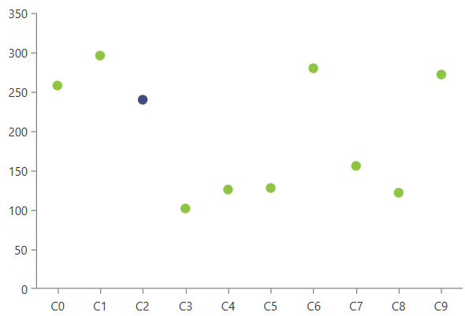
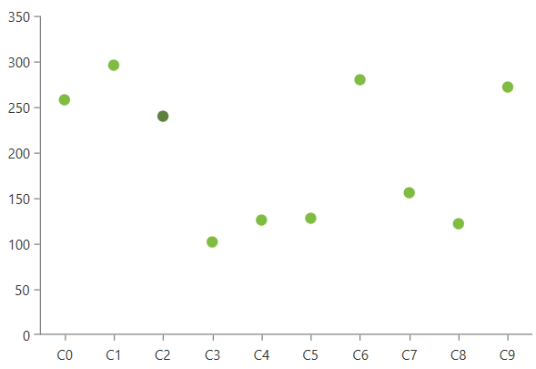
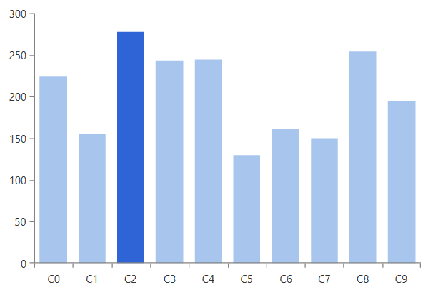
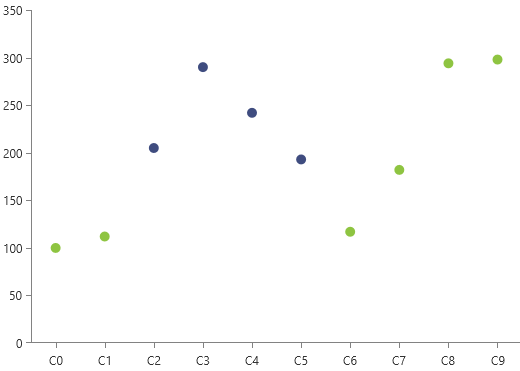

# Selection

The chart selection behavior enables interactions with the data point visual elements.

If the feature is enabled, clicking on a data point will select or deselect it, based on the selection mode and the current selection state of the point. There is no default visual feedback for the selection. This article shows how to use the selection behavior, enable the visual feedback and customize it.

To enable the selection, add a __ChartSelectionBehavior__ element in the __Behaviors__ collection of the chart control. The following example shows how to create a sample data binding setup and enable the feature.

__Example 1: Define the data point model__
```C#
	public class PlotInfo
    {
        public string Category { get; set; }
        public double Value { get; set; }
    }
```

__Example 2: Populating with data__
```C#
	private static Random r = new Random();
	public MyUserControl()
	{
		InitializeComponent();
		var source = new ObservableCollection<PlotInfo>();
		for (int i = 0; i < 10; i++)
		{
			source.Add(new PlotInfo() { Category = "C" + i, Value = r.Next(100, 300) });
		}
		this.DataContext = source;
	}
```

__Example 3: Using the ChartSelectionBehavior__
```XAML
	<telerik:RadCartesianChart Palette="Windows8" SelectionPalette="VisualStudio2019Selected">
		<telerik:RadCartesianChart.Behaviors>
			<telerik:ChartSelectionBehavior />
		</telerik:RadCartesianChart.Behaviors>
		<telerik:RadCartesianChart.VerticalAxis>
			<telerik:LinearAxis/>
		</telerik:RadCartesianChart.VerticalAxis>
		<telerik:RadCartesianChart.HorizontalAxis>
			<telerik:CategoricalAxis/>
		</telerik:RadCartesianChart.HorizontalAxis>		
		<telerik:PointSeries CategoryBinding="Category" ValueBinding="Value" ItemsSource="{Binding}" />
	</telerik:RadCartesianChart>
```

#### Figure 1: Selected data point


The selected data points can be accessed using the __Selected

## Visual Feedback

By default selecting a data point doesn't highlight it on the plot area. To enable this, you can use the chart [palettes](). The __Palette__ property of the chart defines the fill color of the data points. The __SelectionPalette__ property defines the colors of the data points when selected.

__Example 4: Setting the selection palette__
```XAML
	<telerik:RadCartesianChart Palette="Green" SelectionPalette="GreenSelected">
		<telerik:RadCartesianChart.Behaviors>
			<telerik:ChartSelectionBehavior />
		</telerik:RadCartesianChart.Behaviors>
		<!-- other elements here (see Examples 1 to 3)-->
	</telerik:RadCartesianChart>
```

#### Figure 2: Palette based selection coloring


To define selection colors different than the ones provided by the predefined palettes, you can create a [custom palette]() and assign it to the SelectionPalette property of the chart. Or alternatively, use the [DefaultVisualStyle or PointTemplate]() of the chart series. 

The following example shows one way to change the selected point's background using a __PointTemplate__. In this case the palette won't be used so there is no need to set the palette propreties.

__Example 5: Customizing the data point visual__
```XAML
	<telerik:RadCartesianChart>
		<telerik:RadCartesianChart.VerticalAxis>
			<telerik:LinearAxis/>
		</telerik:RadCartesianChart.VerticalAxis>
		<telerik:RadCartesianChart.HorizontalAxis>
			<telerik:CategoricalAxis/>
		</telerik:RadCartesianChart.HorizontalAxis>
		<telerik:RadCartesianChart.Behaviors>
			<telerik:ChartSelectionBehavior />
		</telerik:RadCartesianChart.Behaviors>
		<telerik:BarSeries CategoryBinding="Category" ValueBinding="Value" ItemsSource="{Binding}">
			<telerik:BarSeries.PointTemplate>
				<DataTemplate>
					<Border>
						<Border.Style>
							<Style TargetType="Border">
								<Setter Property="Background" Value="#A8C6ED" />
								<Style.Triggers>
									<DataTrigger Binding="{Binding IsSelected}" Value="True">
										<Setter Property="Background" Value="#2E64D6" />
									</DataTrigger>
								</Style.Triggers>
							</Style>
						</Border.Style>
					</Border>
				</DataTemplate>
			</telerik:BarSeries.PointTemplate>
		</telerik:BarSeries>
	</telerik:RadCartesianChart>
```

The __data context__ of the element in the __PointTemplate__ is an object of type [DataPoint]()

#### Figure 3: PointTemplate based selection coloring


An additional way of customizing the selection's visual feedback is to data bind the color property of the default visual element (via DefaultVisualStyle) or the element in the PointTemplate. Then update the underlying property in case the selection changes, using the [SelectionChanged](#events) event of the ChartSelectionBehavior.

## Selection Mode

ChartSelectionBehavior supports two selection modes - __Single__ (default) and __Multiple__. Also, there is a __None__ selection mode which disables the selection.

When the __Single__ mode is used, the click on a data point selects it. If a data point was previously selected, it gets deselected.

When the __Multiple__ mode is used, the click on a data point includes it in the selection. Multiple data points are selected. A click on a selected data point will deselect it.

The selection mode is controlled with the __DataPointSelectionMode__ property of ChartSelectionBehavior.

__Example 6: Setting DataPointSelectionMode__
```XAML
	<telerik:RadCartesianChart.Behaviors>
		<telerik:ChartSelectionBehavior DataPointSelectionMode="Multiple"/>
	</telerik:RadCartesianChart.Behaviors>
```

#### Figure 4: Multiple selection


## Hit Test Area

The hit test area is the space in the data point visual where you can click to select it. By default the area matches the layout slot (position and size) of the data point visual. 

To change expand the size of the hit test area, set the __HitTestMargin__ property of ChartSelectionBehavior. This is useful when showing small data point visuals that are hard to click.

__Example 7: Setting HitTestMargin__
```XAML
	<telerik:RadCartesianChart.Behaviors>
		<telerik:ChartSelectionBehavior HitTestMargin="30"/>
	</telerik:RadCartesianChart.Behaviors>
```

## Events

ChartSelectionBehavior exposes the __SelectionChanged__ event which is raised when a data point is selected or deselected.

__Example 8: Subscribing to SelectionChanged__
```XAML
	<telerik:RadCartesianChart.Behaviors>
		<telerik:ChartSelectionBehavior SelectionChanged="ChartSelectionBehavior_SelectionChanged"/>
	</telerik:RadCartesianChart.Behaviors>
```

__Example 9: SelectionChanged event handler__
```C#
	private void ChartSelectionBehavior_SelectionChanged(object sender, Telerik.Windows.Controls.ChartView.ChartSelectionChangedEventArgs e)
	{
		IList<DataPoint> selectedPoints = e.AddedPoints;
		IList<DataPoint> deselectedPoints = e.RemovedPoints;
	}
```

## Programmatic Selection

To get the selected data points, use the __SelectedPoints__ collection of the chart control. The collection is read-only, so it cannot be replaced, data bound or modified.

__Example 10: Getting the selected data points__
```C#
	ReadOnlyDataPointCollection currentSelection = this.radCartesianChart.SelectedPoints;
```

To select or deselect a data point, set the __IsSelected__ property of the corresponding [DataPoint]() object. 

__Example 11: Selecting a data point from a PointSeries__
```C#
	var chartSeries = (PointSeries)this.radCartesianChart.Series[0];
	CategoricalDataPoint dataPoint = chartSeries.DataPoints[0];
	dataPoint.IsSelected = true;
```

>tip See how to implement a custom behavior allowing SelectedPoints data binding in the [BindingSelectedItemsToViewModel](https://github.com/telerik/xaml-sdk/tree/master/ChartView/WPF/BindingSelectedItemsToViewModel) SDK example.

## See Also  
* [Create Data-Bound Chart]() 