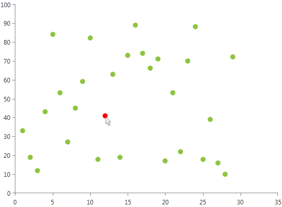

# Selection

This help topic will demonstrate how you can make your charts more interactive by adding a selection behavior.        

Here are the main properties that *ChartSelectionBehavior* exposes:        

* __DataPointSelectionMode__ - to control single / multiple data point selection.          

* __HitTestMargin__ - to increase the hit-testable area around the data point (especially useful when visualizing small scatter points that can be selected).          

* __SelectionPoints__ - to detect the selection. You may also use the SelectionChanged event of the RadChartView for the same purpose.          

* __SelectionPalette__ - to control the selected element appearance.          

For the purpose of this section we'll create a Scatter Series and demonstrate selecting points and styling them.        

You may read how to create a databound Series in [Create Data-Bound Chart]() topic.          

#### __XAML__
{{region radchart-features-selection_0}}
	<telerik:RadCartesianChart x:Name="RadChart1" Palette="Metro">
	
	    <telerik:RadCartesianChart.Behaviors>
	        <telerik:ChartSelectionBehavior DataPointSelectionMode="Single" />
	    </telerik:RadCartesianChart.Behaviors>
	
	    <telerik:ScatterPointSeries />
	
	    <telerik:RadCartesianChart.HorizontalAxis>
	        <telerik:LinearAxis />
	    </telerik:RadCartesianChart.HorizontalAxis>
	    <telerik:RadCartesianChart.VerticalAxis>
	        <telerik:LinearAxis />
	    </telerik:RadCartesianChart.VerticalAxis>
	
	</telerik:RadCartesianChart>
{{endregion}}

#### __C#__
{{region radchart-features-selection_1}}
	    public MainWindow()
	    {
	        InitializeComponent();
	        var series = RadChart1.Series[0] as ScatterPointSeries;
	        series.XValueBinding = new PropertyNameDataPointBinding("XValue");
	        series.YValueBinding = new PropertyNameDataPointBinding("YValue");
	        series.ItemsSource = this.GetData();
	    }
	
	    private List<ChartData> GetData()
	    {
	        Random rand = new Random();
	        List<ChartData> data = new List<ChartData>();
	
	        for (int i = 1; i < 30; i++)
	        {
	            data.Add(new ChartData() { XValue = i, YValue = rand.Next(10, 100) });
	        }
	
	        return data;
	    }
	}
	
	public class ChartData
	{
	    public double XValue
	    {
	        get;
	        set;
	    }
	
	    public double YValue
	    {
	        get;
	        set;
	    }
	}
{{endregion}}

#### __VB.NET__
{{region radchart-features-selection_2}}
	public MainWindow()
	   Public Sub New()
			InitializeComponent()
			Dim series = TryCast(RadChart1.Series(0), ScatterPointSeries)
			series.XValueBinding = New PropertyNameDataPointBinding("XValue")
			series.YValueBinding = New PropertyNameDataPointBinding("YValue")
			series.ItemsSource = Me.GetData()
	   End Sub

		Private Function GetData() As List(Of ChartData)
			Dim rand As New Random()
			Dim data As New List(Of ChartData)()

			For i As Integer = 1 To 29
				data.Add(New ChartData() With {.XValue = i, .YValue = rand.Next(10, 100)})
			Next i

			Return data
		End Function
	}

	Public Class ChartData
		Public Property XValue() As Double

		Public Property YValue() As Double
	End Class
{{endregion}}

To be able to change the selected element(s) appearance we'll use Selection Palette:

#### __XAML__
{{region radchart-features-selection_5}}
	<telerik:RadCartesianChart.SelectionPalette>
	    <telerik:ChartPalette>
	        <telerik:ChartPalette.GlobalEntries>
	            <telerik:PaletteEntry Fill="Red" />
	        </telerik:ChartPalette.GlobalEntries>
	    </telerik:ChartPalette>
	</telerik:RadCartesianChart.SelectionPalette>
{{endregion}}

A sample result can be seen below:

Let's wire to __SelectionChanged__ event of the ChartSelectionBehavior where we can easily determine the data point clicked, the series it belongs to and was it selected or de-selected:        

#### __C#__
{{region radchart-features-selection_3}}
	private void RadChart1_SelectionChanged(object sender, ChartSelectionChangedEventArgs e)
	{
	    //Handle selection of the current point
	    if (e.AddedPoints.Count > 0)
	    {
	        // Get the data point.
	        var addedPoint = e.AddedPoints[0];
	        // Get the series.
	        var series = addedPoint.Presenter as ScatterPointSeries;
	
	        //Your code here...
	    }
	
	    //Handle de-selection of the current point
	    if (e.RemovedPoints.Count > 0)
	    {
	        // Get the data point.
	        var removedPoint = e.RemovedPoints[0];
	        // Get the series.
	        var series = removedPoint.Presenter as LineSeries;
	
	        //Your code here...
	    }
	}
{{endregion}}

#### __VB.NET__
{{region radchart-features-selection_4}}
	Private Sub RadChart1_SelectionChanged(sender As Object, e As ChartSelectionChangedEventArgs)
	    'Handle selection of the current point '
	    If e.AddedPoints.Count > 0 Then
	        ' Get the data point. '
	        Dim addedPoint = e.AddedPoints(0)
	        ' Get the series. '
	        Dim series = TryCast(addedPoint.Presenter, ScatterPointSeries)
	
	        'Your code here... '
			
	    End If
	
	    'Handle de-selection of the current point '
	    If e.RemovedPoints.Count > 0 Then
	        ' Get the data point. '
	        Dim removedPoint = e.RemovedPoints(0)
	        ' Get the series. '
	
	        'Your code here... '
			
	        Dim series = TryCast(removedPoint.Presenter, LineSeries)
	    End If
	End Sub
{{endregion}}

>For Line/Area/Spline/SplineArea series selection refers to selecting the pointmarks and is therefore triggered when clicking any of the corresponding pointmarks. You will need to define a PointMarkTemplate so the item can be selected. For example:          

#### __XAML__
{{region radchart-features-selection_6}}
	<telerik:LineSeries>
	    <telerik:LineSeries.PointTemplate>
	        <DataTemplate>
	            <Ellipse Height="8" Width="8" Fill="Yellow" Stroke="Black" />
	        </DataTemplate>
	    </telerik:LineSeries.PointTemplate>
	</telerik:LineSeries>
{{endregion}}

In order distinguish the selected point from the not-selected one (for example to change the Ellipse color) in the SelectionChanged event you will have to get the series' ContentPresenter:        

#### __C#__
{{region radchart-features-selection_5}}
	private void RadChart1_SelectionChanged(object sender, ChartSelectionChangedEventArgs e)
	{
		//Handle selection of the current point
	    if (e.AddedPoints.Count > 0)
	    {
	        var addedPoint = e.AddedPoints[0];
	        var series = addedPoint.Presenter as LineSeries;
			
			//Get the Content Presenter of the series
	        var pointPresenter = series.
	            ChildrenOfType<ContentPresenter>().
	            Where(cp => cp.Tag == addedPoint).FirstOrDefault();
	        var ellipseElement = pointPresenter.
	            ChildrenOfType<Ellipse>().FirstOrDefault();
	  
	        //Do whatever you want with it :)
	        ellipseElement.Fill = new SolidColorBrush(Colors.Red);
	    }
	
	    //Handle de-selection of the current point
	    if (e.RemovedPoints.Count > 0)
	    {
	        var removedPoint = e.RemovedPoints[0];
	        var series = removedPoint.Presenter as LineSeries;
	        var pointPresenter = series.
	            ChildrenOfType<ContentPresenter>().
	            Where(cp => cp.Tag == removedPoint).FirstOrDefault();
	        var ellipseElement = pointPresenter.
	            ChildrenOfType<Ellipse>().FirstOrDefault();
	  
	        //Do whatever you want with it :)
	        ellipseElement.Fill = new SolidColorBrush(Colors.Yellow);
	    }    
	}
{{endregion}}

#### __VB.NET__

{{region radchart-features-selection_6}}
	Private Sub RadChart1_SelectionChanged(sender As Object, e As ChartSelectionChangedEventArgs)   
	    'Handle selection of the current point '
	    If e.AddedPoints.Count > 0 Then
	        Dim addedPoint = e.AddedPoints(0)
	        Dim series = TryCast(addedPoint.Presenter, LineSeries)
	        Dim pointPresenter = series.ChildrenOfType(Of ContentPresenter)().Where(Function(cp) cp.Tag = addedPoint).FirstOrDefault()
	        Dim ellipseElement = pointPresenter.ChildrenOfType(Of Ellipse)().FirstOrDefault()
	
	        'Do whatever you want with it :) '
	        ellipseElement.Fill = New SolidColorBrush(Colors.Red)
	    End If
		
		'Handle de-selection of the current point '
	    If e.RemovedPoints.Count > 0 Then
	        Dim removedPoint = e.RemovedPoints(0)
	        Dim series = TryCast(removedPoint.Presenter, LineSeries)
	        Dim pointPresenter = series.ChildrenOfType(Of ContentPresenter)().Where(Function(cp) cp.Tag = removedPoint).FirstOrDefault()
	        Dim ellipseElement = pointPresenter.ChildrenOfType(Of Ellipse)().FirstOrDefault()
	
	        'Do whatever you want with it :) '
	        ellipseElement.Fill = New SolidColorBrush(Colors.Yellow)
	    End If
	End Sub
	
{{endregion}}