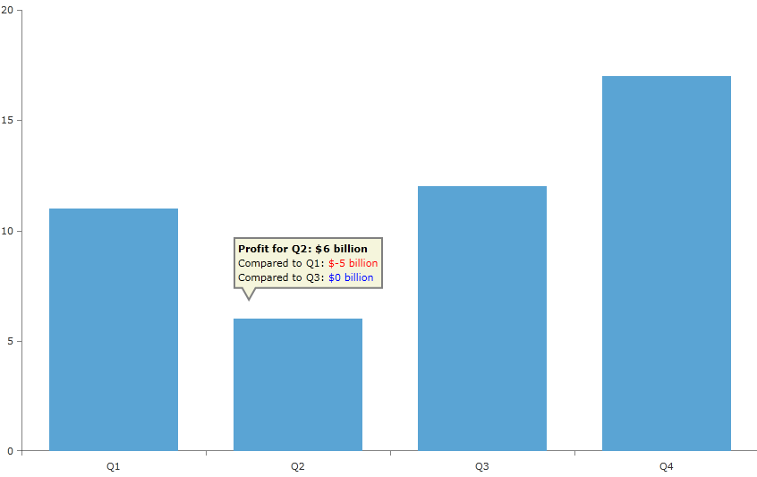

# Tooltip

## 

RadChartView provides a tooltip behavior which can be used to visualize arbitrary information related to a data point. The tooltip is triggered by setting the __ToolTipTemplate__ property of __ChartToolTipBehavior__ to a valid DataTemplate object during design-time and positioning the mouse cursor down somewhere on the chart during run-time. If the user hovers directly over a data point, the tooltip will display information for this particular data point.      

>By default the tooltips of series are shown for their datapoints only. By default each bar represents a datapoint for Bar series, but for Line, Spline and Area series the datapoints are the points that connect the line segments. You should specify the desired shape, color and size for these points to be visualized using PointTemplate. Without it you won't see practically no point and respectively no tooltip for these series.

The user has full control over the visualization of the tooltip itself and over the information that the tooltip will display. The visualization is represented by the ToolTipTemplate but where will the tooltip information come from? What will the data template contents be bound to? In order to define the information that will be visualized the user can provide a custom view model object to which the ToolTipTemplate will be bound.

In this section we will create a custom tool tip that will display the growing or shrinking profits of a fictitious company for each quarter over one year. Even though it will be a bar chart and the bars are more than enough to clearly visualize the relative profits, the example is simple and highlights the usage of RadChartView's tooltip API.

First we will need a chart, which is bound to a collection of custom objects (refer to [Create Data-Bound Chart]() for more details on the binding). The objects in the data source will be used directly as values for the data points as well as content for out tooltips. We create several properties like Quarter, Profit, PreviousQuarter, PreviousDifference, NextQuarter and NextDifference properties for the purpose.

#### __C#__

{{region radchart-features-tooltip_5}}
	public class ProfitDifferenceContext
	    {
	        public string Quarter
	        {
	            get;
	            set;
	        }
	        public double Profit
	        {
	            get;
	            set;
	        }
	        public object PreviousQuarter
	        {
	            get;
	            set;
	        }
	        public double PreviousDifference
	        {
	            get;
	            set;
	        }
	        public object NextQuarter
	        {
	            get;
	            set;
	        }
	        public double NextDifference
	        {
	            get;
	            set;
	        }
	    }
	{{endregion}}

#### __VB.NET__

{{region radchart-features-tooltip_6}}
	Public Class ProfitDifferenceContext
	    Dim _quarter As String
	    Dim _profit As Double
	    Dim _previousQuarter As Object
	    Dim _previousDifference As Double
	    Dim _nextQuarter As Object
	    Dim _nextDifference As Double
	
	
	    Public Property Quarter() As String
	        Get
	            Return Me._quarter
	        End Get
	        Set(value As String
	            Me._quarter = value
	        End Set
	    End Property
	   
	    Public Property Profit() As Double
	        Get
	            Return Me._profit
	        End Get
	        Set(value As Double)
	            Me._profit = value
	        End Set
	    End Property
	
	  Public Property PreviousQuarter() As Object
	        Get
	            Return Me._previousQuarter
	        End Get
	        Set(value As Object)
	            Me._previousQuarter = value
	        End Set
	    End Property
	   
	    Public Property Profit() As Double
	        Get
	            Return Me._previousDifference 
	        End Get
	        Set(value As Double)
	            Me._previousDifference = value
	        End Set
	    End Property
	
	  Public Property NextQuarter() As Object
	        Get
	            Return Me._nextQuarter 
	        End Get
	        Set(value As Object)
	            Me._nextQuarter = value
	        End Set
	    End Property
	   
	    Public Property NextDifference() As Double
	        Get
	            Return Me._nextDifference 
	        End Get
	        Set(value As Double)
	            Me._nextDifference = value
	        End Set
	    End Property    
	End Class
	{{endregion}}

We should set data to the values so that it will be able to display information about the currently hovered data point via the ToolTipTemplate.

#### __C#__

{{region radchart-features-tooltip_7}}
	  public MainPage()
	        {
	            InitializeComponent();
	            List<ProfitDifferenceContext> items = CreateItems();
	            this.chart.Series[0].ItemsSource = items;
	        }
	
	        private List<ProfitDifferenceContext> CreateItems()
	        {
	            List<ProfitDifferenceContext> items = new List<ProfitDifferenceContext>();
	            Random r = new Random();
	            const int itemsCount = 4;
	            for (int i = 0; i < itemsCount; i++)
	            {
	                ProfitDifferenceContext profitDiffContext = new ProfitDifferenceContext()
	                {
	                    Quarter = string.Format("Q{0}", i + 1),
	                    Profit = r.Next(1, 20),
	                };
	                items.Add(profitDiffContext);
	            }
	            for (int i = 0; i < itemsCount; i++)
	            {
	                ProfitDifferenceContext profitDiffContext = items[i];
	                if (i > 0)
	                {
	                    ProfitDifferenceContext prevPoint = items[i - 1];
	                    profitDiffContext.PreviousDifference = profitDiffContext.Profit - prevPoint.Profit;
	                    profitDiffContext.PreviousQuarter = prevPoint.Quarter;
	                }
	                if (i < itemsCount - 1)
	                {
	                    ProfitDifferenceContext nextPoint = items[i + 1];
	                    profitDiffContext.NextDifference = nextPoint.Profit - nextPoint.Profit;
	                    profitDiffContext.NextQuarter = nextPoint.Quarter;
	                }
	            }
	            return items;
	        }
	{{endregion}}

#### __XAML__

{{region radchart-features-tooltip_0}}
	<telerik:RadCartesianChart x:Name="chart">
	
	            <telerik:RadCartesianChart.HorizontalAxis>
	                <telerik:CategoricalAxis/>
	            </telerik:RadCartesianChart.HorizontalAxis>
	
	            <telerik:RadCartesianChart.VerticalAxis>
	                <telerik:LinearAxis/>
	            </telerik:RadCartesianChart.VerticalAxis>
	
	            <telerik:BarSeries CategoryBinding="Quarter" ValueBinding="Profit"/>
	</telerik:RadCartesianChart>
	{{endregion}}

Now we need to define our tooltip behavior and set its tool tip template. It will display the value of the selected data point and also how this value relates to the previous and next quarters.

#### __XAML__

{{region radchart-features-tooltip_1}}
	<telerik:RadCartesianChart.Behaviors>
	                <telerik:ChartTooltipBehavior Placement="Top" VerticalOffset="20" />
	            </telerik:RadCartesianChart.Behaviors>
	            <telerik:RadCartesianChart.TooltipTemplate>
	                <DataTemplate>
	                    <Grid>
	                        <Path Data="M-1236,-441 L-1180,-441 -1180,-424 -1228,-424 -1230.5,-420 -1233,-424 -1236,-424 z"
	                                  Stretch="Fill" Fill="Beige" Stroke="Gray" StrokeThickness="2"/>
	                            <StackPanel Margin="5,5,5,18">
	                                <StackPanel Orientation="Horizontal">
	                                    <TextBlock Text="Profit for "
	                          FontWeight="Bold" FontSize="11"/>
	                                    <TextBlock Text="{Binding Path=DataItem.Quarter}" FontWeight="Bold" FontSize="11"/>
	                                    <TextBlock Text=": $" FontWeight="Bold" FontSize="11"/>
	                                    <TextBlock Text="{Binding Path=DataItem.Profit}" FontWeight="Bold" FontSize="11"/>
	                                    <TextBlock Text=" billion" FontWeight="Bold" FontSize="11"/>
	                                </StackPanel>
	                                <StackPanel Orientation="Horizontal"
	                        Visibility="{Binding Path=DataItem.PreviousQuarter, Converter={StaticResource QuarterToVisibilityConverter}}">
	                                    <TextBlock Text="Compared to "/>
	                                    <TextBlock Text="{Binding Path=DataItem.PreviousQuarter}"/>
	                                    <TextBlock Text=": "/>
	                                    <TextBlock Text="$"
	                          Foreground="{Binding Path=DataItem.PreviousDifference, Converter={StaticResource ProfitToBrushConverter}}"/>
	                                    <TextBlock Text="{Binding Path=DataItem.PreviousDifference}"
	                          Foreground="{Binding Path=DataItem.PreviousDifference, Converter={StaticResource ProfitToBrushConverter}}"/>
	                                    <TextBlock Text=" billion"
	                          Foreground="{Binding Path=DataItem.PreviousDifference, Converter={StaticResource ProfitToBrushConverter}}"/>
	                                </StackPanel>
	                                <StackPanel Orientation="Horizontal"
	                        Visibility="{Binding Path=DataItem.NextQuarter, Converter={StaticResource QuarterToVisibilityConverter}}">
	                                    <TextBlock Text="Compared to "/>
	                                    <TextBlock Text="{Binding Path=DataItem.NextQuarter}"/>
	                                    <TextBlock Text=": "/>
	                                    <TextBlock Text="$"
	                          Foreground="{Binding Path=DataItem.NextDifference, Converter={StaticResource ProfitToBrushConverter}}"/>
	                                    <TextBlock Text="{Binding Path=DataItem.NextDifference}"
	                          Foreground="{Binding Path=DataItem.NextDifference, Converter={StaticResource ProfitToBrushConverter}}"/>
	                                    <TextBlock Text=" billion"
	                          Foreground="{Binding Path=DataItem.NextDifference, Converter={StaticResource ProfitToBrushConverter}}"/>
	                                </StackPanel>
	                            </StackPanel>
	                    </Grid>
	                </DataTemplate>
	            </telerik:RadCartesianChart.TooltipTemplate>
	{{endregion}}

Here are the binding converters and their implementations:

#### __XAML__

{{region radchart-features-tooltip_2}}
	<telerik:RadCartesianChart.Resources>
	       <local:ProfitToBrushConverter x:Key="ProfitToBrushConverter"/>
	       <local:QuarterToVisibilityConverter x:Key="QuarterToVisibilityConverter"/>
	</telerik:RadCartesianChart.Resources>
	{{endregion}}

#### __C#__

{{region radchart-features-tooltip_3}}
	public class QuarterToVisibilityConverter : IValueConverter
	{
	    public object Convert(object value, Type targetType, object parameter, System.Globalization.CultureInfo culture)
	    {
	        if (value == null)
	        {
	            return Visibility.Collapsed;
	        }
	
	        return Visibility.Visible;
	    }
	    public object ConvertBack(object value, Type targetType, object parameter, System.Globalization.CultureInfo culture)
	    {
	        throw new NotImplementedException();
	    }
	}
	public class ProfitToBrushConverter : IValueConverter
	{
	    public object Convert(object value, Type targetType, object parameter, System.Globalization.CultureInfo culture)
	    {
	        double profitDifference = (double)value;
	        if (profitDifference < 0)
	        {
	            return new SolidColorBrush(Colors.Red);
	        }
	        if (profitDifference > 0)
	        {
	            return new SolidColorBrush(Colors.Green);
	        }
	        return new SolidColorBrush(Colors.Green);
	    }
	    public object ConvertBack(object value, Type targetType, object parameter, System.Globalization.CultureInfo culture)
	    {
	        throw new NotImplementedException();
	    }
	}
	{{endregion}}

#### __VB.NET__

{{region radchart-features-tooltip_4}}
	Public Class QuarterToVisibilityConverter
	    Implements IValueConverter
	
	    Public Function Convert(value As Object, targetType As System.Type, parameter As Object, culture As System.Globalization.CultureInfo) As Object Implements System.Windows.Data.IValueConverter.Convert
	
	        If value Is Nothing Then
	            Return Visibility.Collapsed
	        End If
	
	        Return Visibility.Visible
	    End Function
	
	    Public Function ConvertBack(value As Object, targetType As System.Type, parameter As Object, culture As System.Globalization.CultureInfo) As Object Implements System.Windows.Data.IValueConverter.ConvertBack
	        Throw New NotImplementedException
	    End Function
	End Class
	
	Public Class ProfitToBrushConverter
	    Implements IValueConverter
	
	    Public Function Convert(value As Object, targetType As System.Type, parameter As Object, culture As System.Globalization.CultureInfo) As Object Implements System.Windows.Data.IValueConverter.Convert
	
	        Dim profitDifference As Double = DirectCast(value, Double)
	        If (profitDifference < 0) Then
	            Return New SolidColorBrush(Colors.Red)
	        End If
	
	        If (profitDifference > 0) Then
	            Return New SolidColorBrush(Colors.Green)
	        End If
	
	        Return New SolidColorBrush(Colors.Blue)
	    End Function
	
	    Public Function ConvertBack(value As Object, targetType As System.Type, parameter As Object, culture As System.Globalization.CultureInfo) As Object Implements System.Windows.Data.IValueConverter.ConvertBack
	        Throw New NotImplementedException
	    End Function
	End Class
	{{endregion}}

The result can be seen below:

