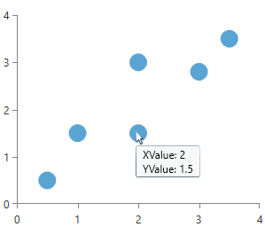
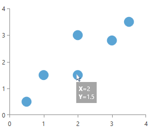

# Tooltip

RadChartView provides a tooltip behavior which can be used to visualize arbitrary information related to a data point. The tooltip is enabled by adding __ChartToolTipBehavior__ in the __Behaviors__ collection of RadCartesianChart. To display it you can position the mouse cursor over a data point visual.


>important By default the tooltips of series are shown for their data points only. Each bar represents a datapoint for Bar series, but for Line, Spline and Area series the datapoints are the points that connect the line segments. You should specify the desired shape, color and size for these points to be visualized using [DefaultVisualStyle or PointTemplate](). Without it practically you won't see a point and respectively there won't be a tooltip for these series.

The user has control over the visualization of the tooltip information and the provided data context. This is done via the __TooltipTemplate__ property which is exposed both by RadCartesianChart and the corresponding series. This allows you to define a custom template on a chart's level for all series and additionally to define different templates for each series. The TooltipTemplate property of the series has a higher priority than the TooltipTemplate of the chart, thus it will override it on a series level.

## Defining Tooltip Behavior

The __ChartToolTipBehavior__ should be added in the __Behaviors__ collection of the chart.

__Example 1: Defining a tooltip behavior__
```XAML
	<telerik:RadCartesianChart>			
		<telerik:RadCartesianChart.VerticalAxis>
			<telerik:LinearAxis/>
		</telerik:RadCartesianChart.VerticalAxis>
		<telerik:RadCartesianChart.HorizontalAxis>
			<telerik:LinearAxis/>
		</telerik:RadCartesianChart.HorizontalAxis>            

		<telerik:RadCartesianChart.Behaviors>
			<telerik:ChartTooltipBehavior/>
		</telerik:RadCartesianChart.Behaviors>  
		
		<telerik:ScatterPointSeries PointSize="20,20">
			<telerik:ScatterPointSeries.DataPoints>
				<telerik:ScatterDataPoint XValue="0.5" YValue="0.5"/>
				<telerik:ScatterDataPoint XValue="1.0" YValue="1.5"/>
				<telerik:ScatterDataPoint XValue="2.0" YValue="1.5"/>
				<telerik:ScatterDataPoint XValue="2.0" YValue="3.0"/>
				<telerik:ScatterDataPoint XValue="3.0" YValue="2.8"/>
				<telerik:ScatterDataPoint XValue="3.5" YValue="3.5"/>
			</telerik:ScatterPointSeries.DataPoints>	
		</telerik:ScatterPointSeries>
	</telerik:RadCartesianChart>
```
	
At this point if you hover a data point visual a tooltip with basic information about the data point is displayed.

#### __Figure 1: Default tooltip example__


## Customizing the Tooltip

To customize the apperance of the tooltip you can use the __TooltipTemplate__ property. The property can be found both on the RadCartesianChart and the chart series classes.

__Example 2: Setting TooltipTemplate of the series__
```XAML
	<telerik:ScatterPointSeries.TooltipTemplate>
		<DataTemplate>
			<Border Background="#5A000000" Padding="5" TextElement.Foreground="White">
				<StackPanel>
					<StackPanel Orientation="Horizontal">
						<TextBlock Text="X=" FontWeight="Bold" />
						<TextBlock Text="{Binding XValue}"  />
					</StackPanel>
					<StackPanel Orientation="Horizontal">
						<TextBlock Text="Y=" FontWeight="Bold" />
						<TextBlock Text="{Binding YValue}"  />
					</StackPanel>
				</StackPanel>
			</Border>
		</DataTemplate>
	</telerik:ScatterPointSeries.TooltipTemplate>
```

#### __Figure 2: Custom tooltip example__

	
The data context passed to the `TooltipTemplate` is an object of type [DataPoint]() which can be `CategoricalDataPoint`, `ScatterDataPoint`, etc. This means that you may need to use different property paths for the bindings, based on the series type and its `DataPoint` implementation.

## Example

This section demonstrates how to create a custom tooltip that displays the growth or shrinking profits of a fictitious company for each quarter over one year. Even though it will be a bar chart and the bars are more than enough to clearly visualize the relative profits, the example is simple and highlights the usage of RadChartView's tooltip API.

First we will need a chart, which is bound to a collection of custom objects (refer to [Create Data-Bound Chart]() for more details on the binding). The objects in the data source will be used directly as values for the data points as well as content for out tooltips. We create several properties like Quarter, Profit, PreviousQuarter, PreviousDifference, NextQuarter and NextDifference properties for the purpose.

__Example 3: Defining the Data Model__
```C#
	public class ProfitDifferenceContext
	{
		public string Quarter
		{
			get;
			set;
		}
		public double Profit
		{
			get;
			set;
		}
		public object PreviousQuarter
		{
			get;
			set;
		}
		public double PreviousDifference
		{
			get;
			set;
		}
		public object NextQuarter
		{
			get;
			set;
		}
		public double NextDifference
		{
			get;
			set;
		}
	}
```
```VB.NET
	Public Class ProfitDifferenceContext
	    Dim _quarter As String
	    Dim _profit As Double
	    Dim _previousQuarter As Object
	    Dim _previousDifference As Double
	    Dim _nextQuarter As Object
	    Dim _nextDifference As Double	
	
	    Public Property Quarter() As String
	        Get
	            Return Me._quarter
	        End Get
	        Set(value As String
	            Me._quarter = value
	        End Set
	    End Property
	   
	    Public Property Profit() As Double
	        Get
	            Return Me._profit
	        End Get
	        Set(value As Double)
	            Me._profit = value
	        End Set
	    End Property
	
	  Public Property PreviousQuarter() As Object
	        Get
	            Return Me._previousQuarter
	        End Get
	        Set(value As Object)
	            Me._previousQuarter = value
	        End Set
	    End Property
	   
	    Public Property Profit() As Double
	        Get
	            Return Me._previousDifference 
	        End Get
	        Set(value As Double)
	            Me._previousDifference = value
	        End Set
	    End Property
	
	  Public Property NextQuarter() As Object
	        Get
	            Return Me._nextQuarter 
	        End Get
	        Set(value As Object)
	            Me._nextQuarter = value
	        End Set
	    End Property
	   
	    Public Property NextDifference() As Double
	        Get
	            Return Me._nextDifference 
	        End Get
	        Set(value As Double)
	            Me._nextDifference = value
	        End Set
	    End Property    
	End Class
```

We should set data to the values so that it will be able to display information about the currently hovered data point via the TooltipTemplate.

__Example 4: Populating and setting the data__
```C#
	public MainPage()
	{
		InitializeComponent();
		List<ProfitDifferenceContext> items = CreateItems();
		this.chart.Series[0].ItemsSource = items;
	}

	private List<ProfitDifferenceContext> CreateItems()
	{
		List<ProfitDifferenceContext> items = new List<ProfitDifferenceContext>();
		Random r = new Random();
		const int itemsCount = 4;
		for (int i = 0; i < itemsCount; i++)
		{
			ProfitDifferenceContext profitDiffContext = new ProfitDifferenceContext()
			{
				Quarter = string.Format("Q{0}", i + 1),
				Profit = r.Next(1, 20),
			};
			items.Add(profitDiffContext);
		}
		for (int i = 0; i < itemsCount; i++)
		{
			ProfitDifferenceContext profitDiffContext = items[i];
			if (i > 0)
			{
				ProfitDifferenceContext prevPoint = items[i - 1];
				profitDiffContext.PreviousDifference = profitDiffContext.Profit - prevPoint.Profit;
				profitDiffContext.PreviousQuarter = prevPoint.Quarter;
			}
			if (i < itemsCount - 1)
			{
				ProfitDifferenceContext nextPoint = items[i + 1];
				profitDiffContext.NextDifference = nextPoint.Profit - nextPoint.Profit;
				profitDiffContext.NextQuarter = nextPoint.Quarter;
			}
		}
		return items;
	}
```

__Example 5: Defining the view__
```XAML
	<telerik:RadCartesianChart x:Name="chart">	
		<telerik:RadCartesianChart.HorizontalAxis>
			<telerik:CategoricalAxis/>
		</telerik:RadCartesianChart.HorizontalAxis>
		<telerik:RadCartesianChart.VerticalAxis>
			<telerik:LinearAxis/>
		</telerik:RadCartesianChart.VerticalAxis>
		<telerik:BarSeries CategoryBinding="Quarter" ValueBinding="Profit"/>
	</telerik:RadCartesianChart>
```

Now we need to define our tooltip behavior and set its tool tip template. It will display the value of the selected data point and also how this value relates to the previous and next quarters.

__Example 6: Defining the tooltip behavior and the tooltip template__
```XAML
	<telerik:RadCartesianChart.Behaviors>
		<telerik:ChartTooltipBehavior Placement="Top" VerticalOffset="20" />
	</telerik:RadCartesianChart.Behaviors>
	<telerik:RadCartesianChart.TooltipTemplate>
		<DataTemplate>
			<Grid>
				<Path Data="M-1236,-441 L-1180,-441 -1180,-424 -1228,-424 -1230.5,-420 -1233,-424 -1236,-424 z"
						  Stretch="Fill" Fill="Beige" Stroke="Gray" StrokeThickness="2"/>
					<StackPanel Margin="5,5,5,18">
						<StackPanel Orientation="Horizontal">
							<TextBlock Text="Profit for "
				  FontWeight="Bold" FontSize="11"/>
							<TextBlock Text="{Binding Path=DataItem.Quarter}" FontWeight="Bold" FontSize="11"/>
							<TextBlock Text=": $" FontWeight="Bold" FontSize="11"/>
							<TextBlock Text="{Binding Path=DataItem.Profit}" FontWeight="Bold" FontSize="11"/>
							<TextBlock Text=" billion" FontWeight="Bold" FontSize="11"/>
						</StackPanel>
						<StackPanel Orientation="Horizontal"
				Visibility="{Binding Path=DataItem.PreviousQuarter, Converter={StaticResource QuarterToVisibilityConverter}}">
							<TextBlock Text="Compared to "/>
							<TextBlock Text="{Binding Path=DataItem.PreviousQuarter}"/>
							<TextBlock Text=": "/>
							<TextBlock Text="$"
				  Foreground="{Binding Path=DataItem.PreviousDifference, Converter={StaticResource ProfitToBrushConverter}}"/>
							<TextBlock Text="{Binding Path=DataItem.PreviousDifference}"
				  Foreground="{Binding Path=DataItem.PreviousDifference, Converter={StaticResource ProfitToBrushConverter}}"/>
							<TextBlock Text=" billion"
				  Foreground="{Binding Path=DataItem.PreviousDifference, Converter={StaticResource ProfitToBrushConverter}}"/>
						</StackPanel>
						<StackPanel Orientation="Horizontal"
				Visibility="{Binding Path=DataItem.NextQuarter, Converter={StaticResource QuarterToVisibilityConverter}}">
							<TextBlock Text="Compared to "/>
							<TextBlock Text="{Binding Path=DataItem.NextQuarter}"/>
							<TextBlock Text=": "/>
							<TextBlock Text="$"
				  Foreground="{Binding Path=DataItem.NextDifference, Converter={StaticResource ProfitToBrushConverter}}"/>
							<TextBlock Text="{Binding Path=DataItem.NextDifference}"
				  Foreground="{Binding Path=DataItem.NextDifference, Converter={StaticResource ProfitToBrushConverter}}"/>
							<TextBlock Text=" billion"
				  Foreground="{Binding Path=DataItem.NextDifference, Converter={StaticResource ProfitToBrushConverter}}"/>
						</StackPanel>
					</StackPanel>
			</Grid>
		</DataTemplate>
	</telerik:RadCartesianChart.TooltipTemplate>
```

The example uses couple of custom binding converters to pretify the visualization. You can find their implementation.

__Example 7: Defining converters in the Resources of the chart__  
```XAML
	<telerik:RadCartesianChart.Resources>
	       <local:ProfitToBrushConverter x:Key="ProfitToBrushConverter"/>
	       <local:QuarterToVisibilityConverter x:Key="QuarterToVisibilityConverter"/>
	</telerik:RadCartesianChart.Resources>
```

__Example 8: Converters implementation__  
```C#
	public class QuarterToVisibilityConverter : IValueConverter
	{
	    public object Convert(object value, Type targetType, object parameter, System.Globalization.CultureInfo culture)
	    {
	        if (value == null)
	        {
	            return Visibility.Collapsed;
	        }
	
	        return Visibility.Visible;
	    }
	    public object ConvertBack(object value, Type targetType, object parameter, System.Globalization.CultureInfo culture)
	    {
	        throw new NotImplementedException();
	    }
	}
	public class ProfitToBrushConverter : IValueConverter
	{
	    public object Convert(object value, Type targetType, object parameter, System.Globalization.CultureInfo culture)
	    {
	        double profitDifference = (double)value;
	        if (profitDifference < 0)
	        {
	            return new SolidColorBrush(Colors.Red);
	        }
	        if (profitDifference > 0)
	        {
	            return new SolidColorBrush(Colors.Green);
	        }
	        return new SolidColorBrush(Colors.Green);
	    }
	    public object ConvertBack(object value, Type targetType, object parameter, System.Globalization.CultureInfo culture)
	    {
	        throw new NotImplementedException();
	    }
	}
```
```VB.NET
	Public Class QuarterToVisibilityConverter
	    Implements IValueConverter
	
	    Public Function Convert(value As Object, targetType As System.Type, parameter As Object, culture As System.Globalization.CultureInfo) As Object Implements System.Windows.Data.IValueConverter.Convert
	
	        If value Is Nothing Then
	            Return Visibility.Collapsed
	        End If
	
	        Return Visibility.Visible
	    End Function
	
	    Public Function ConvertBack(value As Object, targetType As System.Type, parameter As Object, culture As System.Globalization.CultureInfo) As Object Implements System.Windows.Data.IValueConverter.ConvertBack
	        Throw New NotImplementedException
	    End Function
	End Class
	
	Public Class ProfitToBrushConverter
	    Implements IValueConverter
	
	    Public Function Convert(value As Object, targetType As System.Type, parameter As Object, culture As System.Globalization.CultureInfo) As Object Implements System.Windows.Data.IValueConverter.Convert
	
	        Dim profitDifference As Double = DirectCast(value, Double)
	        If (profitDifference < 0) Then
	            Return New SolidColorBrush(Colors.Red)
	        End If
	
	        If (profitDifference > 0) Then
	            Return New SolidColorBrush(Colors.Green)
	        End If
	
	        Return New SolidColorBrush(Colors.Blue)
	    End Function
	
	    Public Function ConvertBack(value As Object, targetType As System.Type, parameter As Object, culture As System.Globalization.CultureInfo) As Object Implements System.Windows.Data.IValueConverter.ConvertBack
	        Throw New NotImplementedException
	    End Function
	End Class
```

#### __Figure 3: Example result__


## See Also
* [Getting Started]()
* [ScatterPointSeries]()
