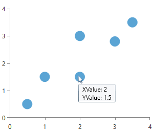
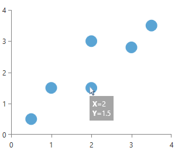
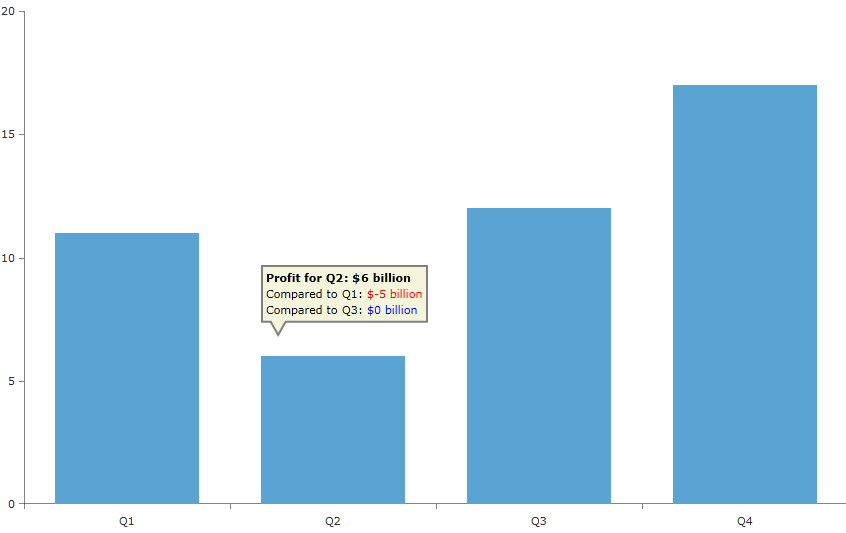

# Tooltip

RadChartView provides a tooltip behavior which can be used to visualize arbitrary information related to a data point. The tooltip is enabled by adding __ChartToolTipBehavior__ in the __Behaviors__ collection of RadCartesianChart. To display it you can position the mouse cursor over a data point visual.

>important By default the tooltips of series are shown for their data points only. Each bar represents a datapoint for Bar series, but for Line, Spline and Area series the datapoints are the points that connect the line segments. You should specify the desired shape, color and size for these points to be visualized using [DefaultVisualStyle or PointTemplate](). Without it practically you won't see a point and respectively there won't be a tooltip for these series.

The user has control over the visualization of the tooltip information and the provided data context. This is done via the __TooltipTemplate__ property which is exposed both by RadCartesianChart and the corresponding series. This allows you to define a custom template on a chart's level for all series and additionally to define different templates for each series. The TooltipTemplate property of the series has a higher priority than the TooltipTemplate of the chart, thus it will override it on a series level.

## Defining Tooltip Behavior

The __ChartToolTipBehavior__ should be added in the __Behaviors__ collection of the chart.

__Example 1: Defining a tooltip behavior__
<snippet id='radchartview-features-behaviors-tooltip-example_1_defining_a_tooltip_behavior-xaml' />

	
At this point if you hover a data point visual a tooltip with basic information about the data point is displayed.

#### __Figure 1: Default tooltip example__

## Customizing the Tooltip

To customize the apperance of the tooltip you can use the __TooltipTemplate__ property. The property can be found both on the RadCartesianChart and the chart series classes.

__Example 2: Setting TooltipTemplate of the series__
<snippet id='radchartview-features-behaviors-tooltip-example_2_setting_tooltiptemplate_of_the_series-xaml' />

#### __Figure 2: Custom tooltip example__

	
The data context passed to the `TooltipTemplate` is an object of type [DataPoint]() which can be `CategoricalDataPoint`, `ScatterDataPoint`, etc. This means that you may need to use different property paths for the bindings, based on the series type and its `DataPoint` implementation.

## Example

This section demonstrates how to create a custom tooltip that displays the growth or shrinking profits of a fictitious company for each quarter over one year. Even though it will be a bar chart and the bars are more than enough to clearly visualize the relative profits, the example is simple and highlights the usage of RadChartView's tooltip API.

First we will need a chart, which is bound to a collection of custom objects (refer to [Create Data-Bound Chart]() for more details on the binding). The objects in the data source will be used directly as values for the data points as well as content for out tooltips. We create several properties like Quarter, Profit, PreviousQuarter, PreviousDifference, NextQuarter and NextDifference properties for the purpose.

__Example 3: Defining the Data Model__
<snippet id='radchartview-features-behaviors-tooltip-example_3_defining_the_data_model-cs' />

<snippet id='radchartview-features-behaviors-tooltip-example_3_defining_the_data_model-vb' />

We should set data to the values so that it will be able to display information about the currently hovered data point via the TooltipTemplate.

__Example 4: Populating and setting the data__
<snippet id='radchartview-features-behaviors-tooltip-example_4_populating_and_setting_the_data-cs' />

__Example 5: Defining the view__
<snippet id='radchartview-features-behaviors-tooltip-example_5_defining_the_view-xaml' />

Now we need to define our tooltip behavior and set its tool tip template. It will display the value of the selected data point and also how this value relates to the previous and next quarters.

__Example 6: Defining the tooltip behavior and the tooltip template__
<snippet id='radchartview-features-behaviors-tooltip-example_6_defining_the_tooltip_behavior_and_the_tooltip_template-xaml' />

The example uses couple of custom binding converters to pretify the visualization. You can find their implementation.

__Example 7: Defining converters in the Resources of the chart__  
<snippet id='radchartview-features-behaviors-tooltip-example_7_defining_converters_in_the_resources_of_the_chart-xaml' />

__Example 8: Converters implementation__  
<snippet id='radchartview-features-behaviors-tooltip-example_8_converters_implementation-cs' />

<snippet id='radchartview-features-behaviors-tooltip-example_8_converters_implementation-vb' />

#### __Figure 3: Example result__

## See Also
* [Getting Started]()
* [ScatterPointSeries]()
