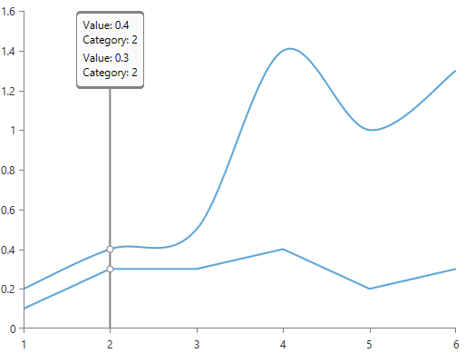
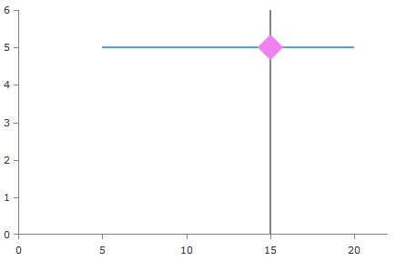
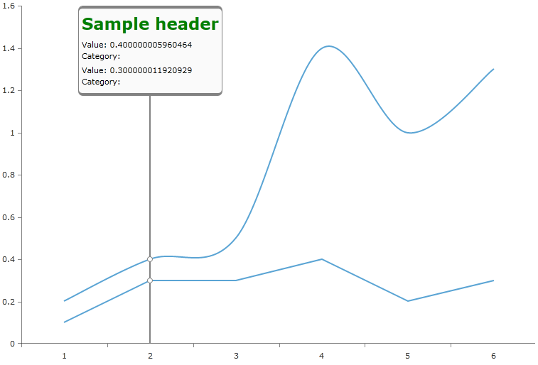
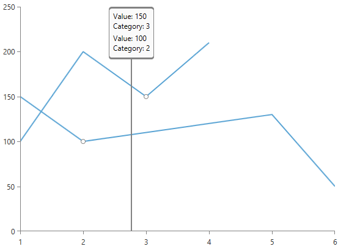
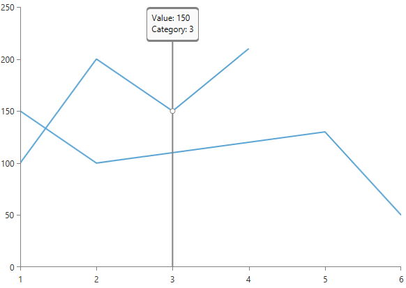
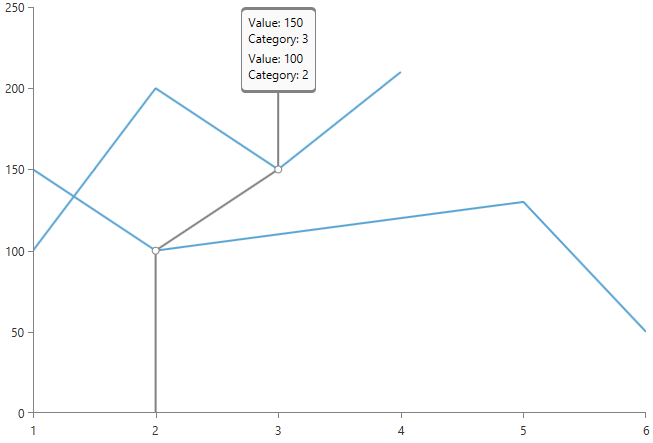

# TrackBall

Along with [tooltip]() and [pan/zoom]() behaviors, RadChartView provides a trackball behavior through the __ChartTrackballBehavior__ class. This behavior can display a vertical line across the chart plot area and it can display little visual indicators (circles by default) at points where the trackball line crosses the visualization of a series object. For example, when the trackball line crosses a line series line segment, a small circle is drawn highlighting the value of the series at this point.

The trackball behavior can also display a small popup, similar to the tooltip, in order to provide more detailed information about the closest points to the trackball line's cross section, as can be seen in the screenshot above.

The ChartTrackballBehavior exposes three properties and an event. These properties are __ShowTrackInfo__, __ShowIntersectionPoints__, __SnapMode__ and the event is called __TrackInfoUpdated__. ShowTrackInfo and ShowIntersectionPoints enable and disable the popup and the intersection circles respectively. Note that the intersection points can be visually modified by the ChartSeries __TrackBallTemplate__ property and can therefore have an arbitrary visualization. The track info can also be specified as a different template using the ChartSeries' __TrackInfoTemplate__ property. The code example below shows how to modify the trackball and track info templates. You can modify the color of the trackball line using the RadChartView's __TrackBallLineStyle__ property. It is of type Style and it must target the PolyLine class because the trackball behavior uses a PolyLine internally.
(COMMENT: In the previous paragraph, should it be TrackInfo templates or track info templates?)
## Specifying a custom TrackBallTemplate

#### __XAML__
{{region radchart-features-trackball_0}}
	<telerik:RadCartesianChart>
	    <telerik:RadCartesianChart.Behaviors>
	        <telerik:ChartTrackBallBehavior ShowIntersectionPoints="True"
	                                             ShowTrackInfo="False"/>
	    </telerik:RadCartesianChart.Behaviors>
	
	    <telerik:RadCartesianChart.HorizontalAxis>
	        <telerik:LinearAxis/>
	    </telerik:RadCartesianChart.HorizontalAxis>
	
	    <telerik:RadCartesianChart.VerticalAxis>
	        <telerik:LinearAxis/>
	    </telerik:RadCartesianChart.VerticalAxis>
	
	    <telerik:ScatterLineSeries>
	        <telerik:ScatterLineSeries.TrackBallTemplate>
	            <DataTemplate>
	                <Rectangle Width="20"
	                           Height="20"
	                           Fill="Violet"
	                           RenderTransformOrigin="0.5,0.5">
	                    <Rectangle.RenderTransform>
	                        <RotateTransform Angle="45"/>
	                    </Rectangle.RenderTransform>
	                </Rectangle>
	            </DataTemplate>
	        </telerik:ScatterLineSeries.TrackBallTemplate>
	
	        <telerik:ScatterDataPoint XValue="5"
	                                             YValue="5"/>
	        <telerik:ScatterDataPoint XValue="15"
	                                             YValue="5"/>
	        <telerik:ScatterDataPoint XValue="20"
	                                             YValue="5"/>
	    </telerik:ScatterLineSeries>
	</telerik:RadCartesianChart>
{{endregion}}

## Specifying a custom TrackBallInfoTemplate        

#### __XAML__

{{region radchart-features-trackball_1}}
	<telerik:ScatterLineSeries>
	    <telerik:ScatterLineSeries.TrackBallInfoTemplate>
	        <DataTemplate>
	            <StackPanel Orientation="Horizontal">
	                <TextBlock Text="{Binding Path=DisplayHeader}" Foreground="Blue" FontWeight="Bold"/>
	                <TextBlock Text="{Binding Path=DisplayContent}" Foreground="Blue" Margin="4,0,0,0"/>
	            </StackPanel>
	        </DataTemplate>
	    </telerik:ScatterLineSeries.TrackBallInfoTemplate>
	</telerik:ScatterLineSeries>
{{endregion}}

## Snap Mode

The __SnapMode__ property of ChartTrackballBehavior determines how the trackball line will be snapped to the chart's data points. Valid property values are __None__, __ClosestPoint__ and __AllClosestPoints__ with None disabling snapping, ClosestPoint snapping to the closest point of all data points in the chart, and AllClosestPoints snapping to the closest point from each series object in the chart. That is, AllClosestPoints snaps to multiple data points at once. A few screenshots will best describe the different values of SnapMode (COMMENT: Is Snap Mode one word or two? In the heading for this section you use two words but at the end of this paragraph you use one. The examples below use one. Please pick one and change the others to be consistent):

__SnapMode: None__

__SnapMode: ClosestPoint__

__SnapMode: AllClosestPoints__

## TrackInfoUpdated

ChartTrackballBehavior provides a __TrackInfoUpdated__ event that fires as the users drag their finger across the chart plot area. On every drag event, TrackInfoUpdated's event arguments provide information related to the current position of the trackball, which is the same ChartDataContext that is provided for the tooltip. The event arguments provide the closest data point for each series in the chart as well as the absolute closest data point. Another property of the event arguments is the Header property (of type object), which allows users to directly specify a header for the track info popup. The following example shows how to use TrackInfoUpdatedEvent:  (COMMENT: Shouldn't the last word be TrackInfoUpdated event?)

#### __XAML__
{{region radchart-features-trackball_2}}
	<telerik:RadCartesianChart>
	   <telerik:RadCartesianChart.TrackBallInfoStyle>
	      
	   </telerik:RadCartesianChart.TrackBallInfoStyle>
	
	   <telerik:RadCartesianChart.Behaviors>
	      <telerik:ChartTrackBallBehavior ShowTrackInfo="True"
	                                           ShowIntersectionPoints="True"
	                                           TrackInfoUpdated="ChartTrackBallBehavior_TrackInfoUpdated"/>
	   </telerik:RadCartesianChart.Behaviors>
	
	   <telerik:RadCartesianChart.VerticalAxis>
	      <telerik:LinearAxis/>
	   </telerik:RadCartesianChart.VerticalAxis>
	
	   <telerik:RadCartesianChart.HorizontalAxis>
	      <telerik:CategoricalAxis/>
	   </telerik:RadCartesianChart.HorizontalAxis>
	
	   <telerik:SplineSeries>
		<telerik:SplineSeries.DataPoints>
			<telerik:CategoricalDataPoint Value="0.2" />
			<telerik:CategoricalDataPoint Value="0.4" />
			<telerik:CategoricalDataPoint Value="0.5" />
			<telerik:CategoricalDataPoint Value="1.4" />
			<telerik:CategoricalDataPoint Value="1.0" />
			<telerik:CategoricalDataPoint Value="1.3" />
		</telerik:SplineSeries.DataPoints>
	   </telerik:SplineSeries>
	
	   <telerik:LineSeries>
		<telerik:LineSeries.DataPoints>
			<telerik:CategoricalDataPoint Value="0.1"/>
			<telerik:CategoricalDataPoint Value="0.3"/>
			<telerik:CategoricalDataPoint Value="0.3"/>
			<telerik:CategoricalDataPoint Value="0.4"/>
			<telerik:CategoricalDataPoint Value="0.2"/>
			<telerik:CategoricalDataPoint Value="0.3"/>
		</telerik:LineSeries.DataPoints>
	   </telerik:LineSeries>
	</telerik:RadCartesianChart>
{{endregion}}

#### __C#__
{{region radchart-features-trackball_3}}
	private void ChartTrackBallBehavior_TrackInfoUpdated(object sender, TrackBallInfoEventArgs e)
	{
	    foreach (DataPointInfo info in e.Context.DataPointInfos)
	    {
	        info.DisplayHeader = "Custom data point header";
	    }
	
	    e.Header = "Sample header";
	}
{{endregion}}

#### __VB.NET__
{{region radchart-features-trackball_4}}
	Private Sub ChartTrackBallBehavior_TrackInfoUpdated(ByVal sender As Object, ByVal e As TrackBallInfoEventArgs)
	   For Each info As DataPointInfo In e.Context.DataPointInfos
	      info.DisplayHeader = "Custom data point header"
	   Next
	
	   e.Header = "Sample header"
	End Sub
{{endregion}}

## Update the TrackBall position

ChartTrackBallBehavior exposes the __Position__ property that can be used to manually change the position of the trackball. The property accepts a value of type __Sytem.Windows.Point__. Setting the Position will display and snap the trackball to the data points that are plotted closest to the set position. The position is defined in pixels relative to the chart. 

For example, if the chart is 500px wide and 300px high, and the Position property is set to new Point(250, 150) the trackball will be placed at the data points plotted closest to the 250th horizontal and 150th vertical pixels of the chart.

#### __C#__
	trackballBehavior.Position = new Point(250, 150);
	
#### __VB.NET__	
	trackballBehavior.Position = New Point(250, 150)

This behavior also provides the __PositionChanging__ event, which is called on each change of the Position property. The event arguments expose a couple of helpful properties:
* __PreviousPosition__: Gets the previous position of the trackball.
* __NewPosition__: Gets or sets the new position of the trackball.

>The PositionChanging event will be called only if the old and the new positions are different.

<!-- -->

> You can find a runnable project that demonstrates manipulating the position of the trackball in the [TrackBallSyncedCharts](https://github.com/telerik/xaml-sdk/tree/master/ChartView/WPF/TrackBallSyncedCharts){{endregion}}
[TrackBallSyncedCharts](https://github.com/telerik/xaml-sdk/tree/master/ChartView/SL/TrackBallSyncedCharts){{endregion}}
 SDK example.
