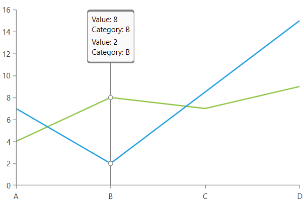
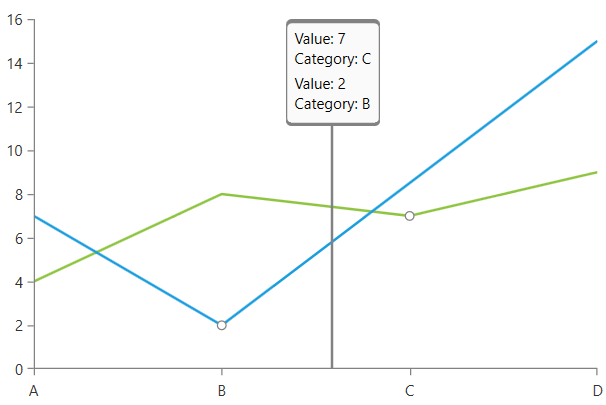
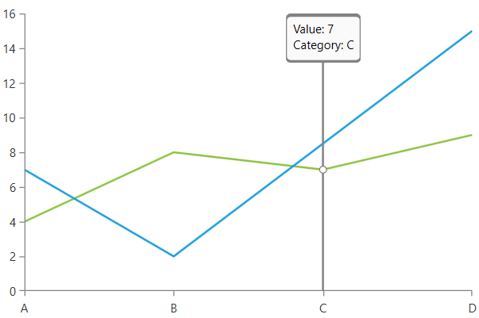
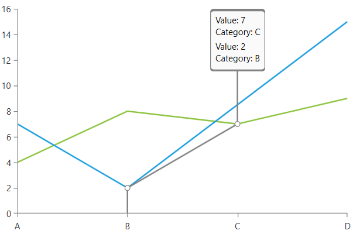
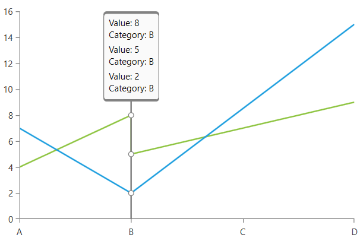
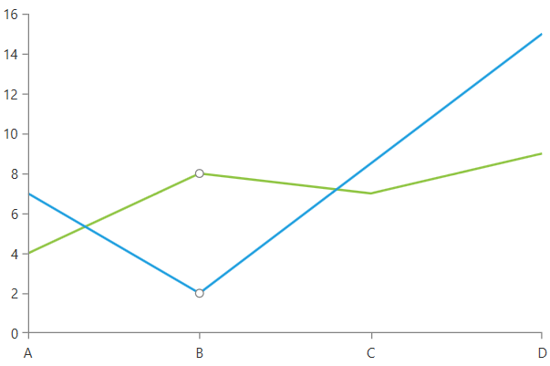
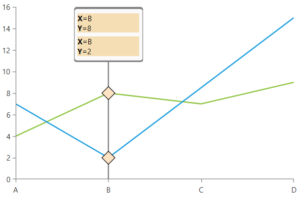

# TrackBall

Along with [tooltip]() and [pan/zoom]() behaviors, RadChartView provides a trackball visualization through the __ChartTrackBallBehavior__ class. 

This behavior can display a vertical line across the chart plot area and little visual indicators (circles by default) at points where the trackball line crosses the visualization of a series object. For example, when the trackball line crosses a line series line segment, a small circle is drawn highlighting the value of the series at this point.

The behavior also displays a small popup (the trackball info), similar to the tooltip, in order to provide more detailed information about the points closest to the trackball line's cross section (see Figure 1).

## Enable the TrackBall

To enable the trackball visualization, add a new __ChartTrackBallBehavior__ instance in the __Behaviors__ collection of the RadCartesianChart control.

__Example 1: Enabling the trackball__
```XAML
	<telerik:RadCartesianChart Palette="Windows8">       
		<telerik:RadCartesianChart.Behaviors>
			<telerik:ChartTrackBallBehavior />
		</telerik:RadCartesianChart.Behaviors>

		<telerik:RadCartesianChart.VerticalAxis>
			<telerik:LinearAxis/>
		</telerik:RadCartesianChart.VerticalAxis>
		<telerik:RadCartesianChart.HorizontalAxis>
			<telerik:CategoricalAxis/>
		</telerik:RadCartesianChart.HorizontalAxis>
		<telerik:RadCartesianChart.Series>
			<telerik:LineSeries>
				<telerik:LineSeries.DataPoints>
					<telerik:CategoricalDataPoint Category="A" Value="4"/>
					<telerik:CategoricalDataPoint Category="B" Value="8"/>
					<telerik:CategoricalDataPoint Category="C" Value="7"/>
					<telerik:CategoricalDataPoint Category="D" Value="9"/>
				</telerik:LineSeries.DataPoints>                
			</telerik:LineSeries>
			<telerik:LineSeries>
				<telerik:LineSeries.DataPoints>
					<telerik:CategoricalDataPoint Category="A" Value="7"/>
					<telerik:CategoricalDataPoint Category="B" Value="2"/>
					<telerik:CategoricalDataPoint Category="C" Value="18"/>
					<telerik:CategoricalDataPoint Category="D" Value="15"/>
				</telerik:LineSeries.DataPoints>
			</telerik:LineSeries>
		</telerik:RadCartesianChart.Series>            
	</telerik:RadCartesianChart>
```

#### __Figure 1: RadCartesianChart with trackball__


> By default the trackball shows the preview line that follows the data points closest to the mouse position and also the track info control (the information tooltip). The ellipses that snap to the data points are not displayed until explicitly enabled. Read more in the [Toggle the TrackBall Visual Elements](#toggle-the-trackball-visual-elements) section of this article.

## Snap Mode

The __SnapMode__ property of ChartTrackBallBehavior determines how the trackball __line__ will be snapped to the data points found by the trackball behavior. The property is enum accepting the following values:

* __None__: This mode disables the snapping of the line.
	
	#### __Figure 2: SnapMode: None__
	

* __ClosestPoint__ (default): This mode snaps the trackball line to the closest point of all data points in the chart.

	#### __Figure 3: SnapMode: ClosestPoint__
	
	
* __AllClosestPoints__: This mode snaps the trackball line to the closest point from each series object in the chart.

	#### __Figure 4: SnapMode: AllClosestPoints__
	

__Example 2: Setting the SnapMode__
```XAML
	<telerik:RadCartesianChart>
	    <telerik:RadCartesianChart.Behaviors>
			<telerik:ChartTrackBallBehavior SnapMode="None"/>
	    </telerik:RadCartesianChart.Behaviors>
	</telerik:RadCartesianChart>
```
	
## Snap Multiple Points Per Series

By default the trackball will display information only for a single data point per series. To change this set the __SnapSinglePointPerSeries__ property to False. This way if you have multiple points in a single series, that are considered close to the mouse, all of them will be shown by the trackball.

__Example 3: Setting the SnapSinglePointPerSeries property__
```XAML
	<telerik:RadCartesianChart Palette="Windows8">    
		<telerik:RadCartesianChart.Behaviors>
			<telerik:ChartTrackBallBehavior ShowIntersectionPoints="True" SnapSinglePointPerSeries="False" />
		</telerik:RadCartesianChart.Behaviors>
		
		<telerik:RadCartesianChart.VerticalAxis>
			<telerik:LinearAxis/>
		</telerik:RadCartesianChart.VerticalAxis>
		<telerik:RadCartesianChart.HorizontalAxis>
			<telerik:CategoricalAxis/>
		</telerik:RadCartesianChart.HorizontalAxis>
		<telerik:RadCartesianChart.Series>
			<telerik:LineSeries>
				<telerik:LineSeries.DataPoints>
					<telerik:CategoricalDataPoint Category="A" Value="4"/>
					<telerik:CategoricalDataPoint Category="B" Value="8"/>
					<telerik:CategoricalDataPoint Category="B" Value="5"/>
					<telerik:CategoricalDataPoint Category="C" Value="7"/>                        
					<telerik:CategoricalDataPoint Category="D" Value="9"/>                        
				</telerik:LineSeries.DataPoints>                
			</telerik:LineSeries>
			<telerik:LineSeries>
				<telerik:LineSeries.DataPoints>
					<telerik:CategoricalDataPoint Category="A" Value="7"/>                        
					<telerik:CategoricalDataPoint Category="B" Value="2"/>
					<telerik:CategoricalDataPoint Category="D" Value="15"/>
				</telerik:LineSeries.DataPoints>
			</telerik:LineSeries>
		</telerik:RadCartesianChart.Series>            
	</telerik:RadCartesianChart>
```

#### __Figure 5: Snap to multiple points series__


## Toggle the TrackBall Visual Elements

The trackball consists of three main visuals - line, info tooltip and intersection points. You can toggle their visibility via few properties.

To show/hide the info tooltip (the trackball info control), set the __ShowTrackInfo__ property.

To show/hide the intersection points, set the __ShowIntersectionPoints__ property.

To show/hide the line set its Visibility via the __TrackBallLineStyle__ property of the RadCartesianChart.

__Example 4: Toggle the trackball visuals__
```XAML
	 <telerik:RadCartesianChart Palette="Windows8">       
		<telerik:RadCartesianChart.TrackBallLineStyle>
			<Style TargetType="Polyline">
				<Setter Property="Visibility" Value="Collapsed" />
			</Style>
		</telerik:RadCartesianChart.TrackBallLineStyle>
		<telerik:RadCartesianChart.Behaviors>
			<telerik:ChartTrackBallBehavior ShowIntersectionPoints="True" ShowTrackInfo="False"/>
		</telerik:RadCartesianChart.Behaviors>
		
		<telerik:RadCartesianChart.VerticalAxis>
			<telerik:LinearAxis/>
		</telerik:RadCartesianChart.VerticalAxis>
		<telerik:RadCartesianChart.HorizontalAxis>
			<telerik:CategoricalAxis/>
		</telerik:RadCartesianChart.HorizontalAxis>
		<telerik:RadCartesianChart.Series>
			<telerik:LineSeries>
				<telerik:LineSeries.DataPoints>
					<telerik:CategoricalDataPoint Category="A" Value="4"/>
					<telerik:CategoricalDataPoint Category="B" Value="8"/>
					<telerik:CategoricalDataPoint Category="C" Value="7"/>                        
					<telerik:CategoricalDataPoint Category="D" Value="9"/>                        
				</telerik:LineSeries.DataPoints>                
			</telerik:LineSeries>
			<telerik:LineSeries>
				<telerik:LineSeries.DataPoints>
					<telerik:CategoricalDataPoint Category="A" Value="7"/>                        
					<telerik:CategoricalDataPoint Category="B" Value="2"/>
					<telerik:CategoricalDataPoint Category="D" Value="15"/>
				</telerik:LineSeries.DataPoints>
			</telerik:LineSeries>
		</telerik:RadCartesianChart.Series>
	</telerik:RadCartesianChart>
```

#### __Figure 6: TrackBall with only intersection points shown__


## Customize the TrackBall Visual Elements

The chart provides several properties that allows customizing the trackball.

To customize the trackball line, set the __TrackBallLineStyle__ property. The property accepts a Style object with its TargetType set to __Polyline__.

To customize the trackball info, set the __TrackBallInfoStyle__ property. The property accepts a Style object with its TargetType set to __TrackBallInfoControl__.

__Example 5: Setting the line and trackball info styles__
```XAML
	<telerik:RadCartesianChart Palette="Windows8">         
		<telerik:RadCartesianChart.TrackBallInfoStyle>
			<Style TargetType="telerik:TrackBallInfoControl">
				<Setter Property="Background" Value="Bisque" />
				<Setter Property="Header" Value="My Trackball Header" />
			</Style>
		</telerik:RadCartesianChart.TrackBallInfoStyle>
		<telerik:RadCartesianChart.TrackBallLineStyle>
			<Style TargetType="Polyline">
				<Setter Property="Stroke" Value="Red" />                    
			</Style>
		</telerik:RadCartesianChart.TrackBallLineStyle>
		<telerik:RadCartesianChart.Behaviors>
			<telerik:ChartTrackBallBehavior />
		</telerik:RadCartesianChart.Behaviors>
		
		<telerik:RadCartesianChart.VerticalAxis>
			<telerik:LinearAxis/>
		</telerik:RadCartesianChart.VerticalAxis>
		<telerik:RadCartesianChart.HorizontalAxis>
			<telerik:CategoricalAxis/>
		</telerik:RadCartesianChart.HorizontalAxis>
		<telerik:RadCartesianChart.Series>
			<telerik:LineSeries>
				<telerik:LineSeries.DataPoints>
					<telerik:CategoricalDataPoint Category="A" Value="4"/>
					<telerik:CategoricalDataPoint Category="B" Value="8"/>
					<telerik:CategoricalDataPoint Category="C" Value="7"/>                        
					<telerik:CategoricalDataPoint Category="D" Value="9"/>                        
				</telerik:LineSeries.DataPoints>                
			</telerik:LineSeries>
			<telerik:LineSeries>
				<telerik:LineSeries.DataPoints>
					<telerik:CategoricalDataPoint Category="A" Value="7"/>                        
					<telerik:CategoricalDataPoint Category="B" Value="2"/>
					<telerik:CategoricalDataPoint Category="D" Value="15"/>
				</telerik:LineSeries.DataPoints>
			</telerik:LineSeries>
		</telerik:RadCartesianChart.Series>		
	</telerik:RadCartesianChart>
```

#### __Figure 7: Customized line and trackball info__


The trackball intersection points can be customized per series via the __TrackBallTemplate__ property of the corresponding chart series.

Additionally, you can customize the information for each series via the __TrackBallInfoTemplate__ property of the corresponding chart series.

__Example 6: Setting the line and trackball templates__
```XAML
	<telerik:RadCartesianChart Palette="Windows8">
		<telerik:RadCartesianChart.Resources>
			<DataTemplate x:Key="trackBallTemplate">
				<Rectangle Width="16" Height="16" Fill="Bisque" Stroke="Black" StrokeThickness="1">
					<Rectangle.LayoutTransform>
						<RotateTransform Angle="45" />
					</Rectangle.LayoutTransform>
				</Rectangle>
			</DataTemplate>
			<DataTemplate x:Key="trackBallInfoTemplate">
				<StackPanel Background="Wheat" Margin="3" Width="100">
					<StackPanel Orientation="Horizontal">
						<TextBlock Text="X=" FontWeight="Bold" />
						<TextBlock Text="{Binding DataPoint.Category}" />
					</StackPanel>
					<StackPanel Orientation="Horizontal">
						<TextBlock Text="Y=" FontWeight="Bold" />
						<TextBlock Text="{Binding DataPoint.Value}" />
					</StackPanel>
				</StackPanel>
			</DataTemplate>
		</telerik:RadCartesianChart.Resources>            
		<telerik:RadCartesianChart.Behaviors>
			<telerik:ChartTrackBallBehavior ShowIntersectionPoints="True" />
		</telerik:RadCartesianChart.Behaviors>            
		<telerik:RadCartesianChart.VerticalAxis>
			<telerik:LinearAxis/>
		</telerik:RadCartesianChart.VerticalAxis>
		<telerik:RadCartesianChart.HorizontalAxis>
			<telerik:CategoricalAxis/>
		</telerik:RadCartesianChart.HorizontalAxis>
		<telerik:RadCartesianChart.Series>
			<telerik:LineSeries TrackBallTemplate="{StaticResource trackBallTemplate}" 
								TrackBallInfoTemplate="{StaticResource trackBallInfoTemplate}">
				<telerik:LineSeries.DataPoints>
					<telerik:CategoricalDataPoint Category="A" Value="4"/>
					<telerik:CategoricalDataPoint Category="B" Value="8"/>
					<telerik:CategoricalDataPoint Category="C" Value="7"/>                        
					<telerik:CategoricalDataPoint Category="D" Value="9"/>                        
				</telerik:LineSeries.DataPoints>                
			</telerik:LineSeries>
			<telerik:LineSeries TrackBallTemplate="{StaticResource trackBallTemplate}" 
								TrackBallInfoTemplate="{StaticResource trackBallInfoTemplate}">
				<telerik:LineSeries.DataPoints>
					<telerik:CategoricalDataPoint Category="A" Value="7"/>                        
					<telerik:CategoricalDataPoint Category="B" Value="2"/>
					<telerik:CategoricalDataPoint Category="D" Value="15"/>
				</telerik:LineSeries.DataPoints>
			</telerik:LineSeries>               
		</telerik:RadCartesianChart.Series>
	</telerik:RadCartesianChart>
```

#### __Figure 8: Customized line and trackball templates__


## Update the TrackBall Position

ChartTrackBallBehavior exposes a __Position__ property that can be used to manually change the position of the trackball. The property accepts a value of type __Sytem.Windows.Point__. Setting the Position will display and snap the trackball to the data points that are plotted closest to the set position. The position is defined in pixels relative to the chart. 

For example, if the chart is 500px wide and 300px high, and the Position property is set to new Point(250, 150) the trackball will be placed at the data points plotted closest to the 250th horizontal and 150th vertical pixels of the chart.

__Example 7: Updating the trackball position__
```C#
	trackballBehavior.Position = new Point(250, 150);
```
```VB.NET
	trackballBehavior.Position = New Point(250, 150)
```

This behavior also provides the __PositionChanging__ event, which is called on each change of the Position property. The event arguments expose a couple of helpful properties:
* __PreviousPosition__: Gets the previous position of the trackball.
* __NewPosition__: Gets or sets the new position of the trackball.

>The PositionChanging event will be called only if the old and the new positions are different.

<!-- -->

> You can find a runnable project that demonstrates manipulating the position of the trackball in the [TrackBallSyncedCharts](https://github.com/telerik/xaml-sdk/tree/master/ChartView/WPF/TrackBallSyncedCharts)
[TrackBallSyncedCharts](https://github.com/telerik/xaml-sdk/tree/master/ChartView/SL/TrackBallSyncedCharts) SDK example.

## Events

The behavior exposes the __TrackInfoUpdated__ event that is useful if you want to modify the trackball info that is displayed in the tooltip. The __TrackBallInfoEventArgs__ contain information about the data points near the mouse position.

__Example 8: Subscribing to the TrackInfoUpdated event__
```XAML
	<telerik:RadCartesianChart>
	    <telerik:RadCartesianChart.Behaviors>
			<telerik:ChartTrackBallBehavior TrackInfoUpdated="ChartTrackBallBehavior_TrackInfoUpdated"/>
	    </telerik:RadCartesianChart.Behaviors>
	</telerik:RadCartesianChart>
```

__Example 9: Canceling the trackball showing when the mouse is close to a specific category__
```C#
	private void ChartTrackBallBehavior_TrackInfoUpdated(object sender, Telerik.Windows.Controls.ChartView.TrackBallInfoEventArgs e)
	{
		var closestDataPoint = (CategoricalDataPoint)e.Context.ClosestDataPoint.DataPoint;
		if (closestDataPoint.Category.Equals("C"))
		{
			e.Context.DataPointInfos.Clear();
		}            
	}
```
```VB.NET
	Private Sub ChartTrackBallBehavior_TrackInfoUpdated(ByVal sender As Object, ByVal e As Telerik.Windows.Controls.ChartView.TrackBallInfoEventArgs)
		Dim closestDataPoint = CType(e.Context.ClosestDataPoint.DataPoint, CategoricalDataPoint)

		If closestDataPoint.Category.Equals("C") Then
			e.Context.DataPointInfos.Clear()
		End If
	End Sub
```

## See Also

* [Tooltip]()
* [Scroll and Zoom]()
