# Chart Grid

In order to improve the readiness of the chart you may want to add grid-like visuals which support horizontal and vertical lines, associated with axis ticks and horizontal and vertical stripes for better readability. Depending on the chart that you use (RadCartesianChart or RadPolarChart) there are two types: __CartesianChartGrid__ and __PolarChartGrid__ that you can play with to add a decoration over the plot area.

## CartesianChartGrid

CartesianChartGrid shows horizontal and vertical lines and strips crossing the chart's plot area. The lines are snapped on the ticks of the axes and the strips is the area between the lines.

The grid allows you to customize its lines and strips via several properties. To use it, set the __Grid__ property of RadCartesianChart to a new instance of __CartesianChartGrid__.

To __display any lines__ in the grid, set the __MajorLinesVisibility__ property. This is an enumeration that allows you to tell which lines to be displayed - vertical (__X__), horizontal (__Y__), both (__XY__) or __None__.

__Example 1: Setting up the grid__
<snippet id='radchartview-features-cartesianchartgrid-and-polarchartgrid-example_1_setting_up_the_grid-xaml' />

#### Figure 1: Grid lines example
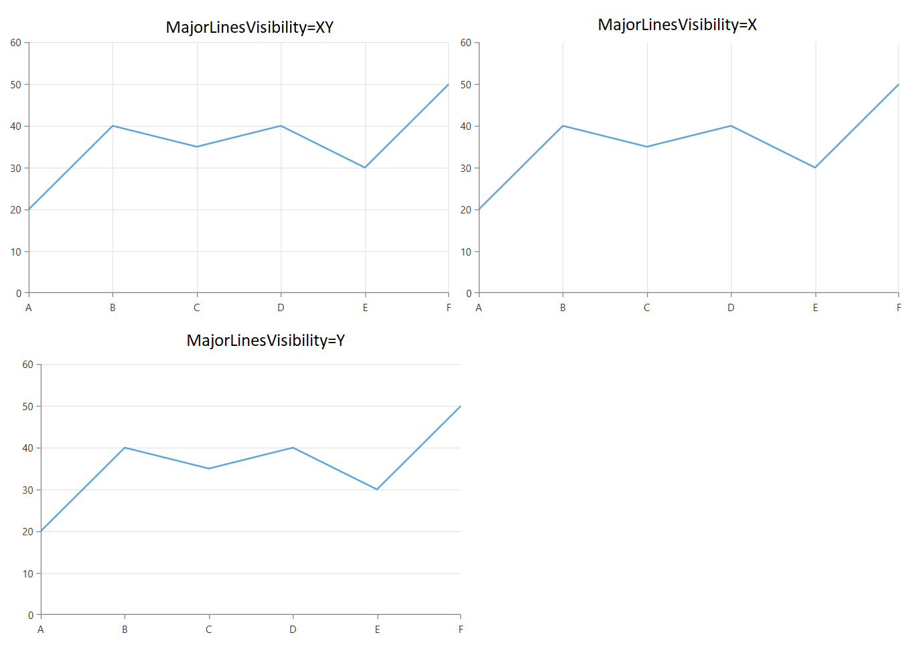

To __display the strip lines__, set the __StripLinesVisibility__ property. This is an enumeration that allows you to tell which strips to be displayed - vertical (__X__), horizontal (__Y__), both (__XY__) or __None__.

__Example 2: Enabling strip lines__
<snippet id='radchartview-features-cartesianchartgrid-and-polarchartgrid-example_2_enabling_strip_lines-xaml' />

#### Figure 2: Strip lines example
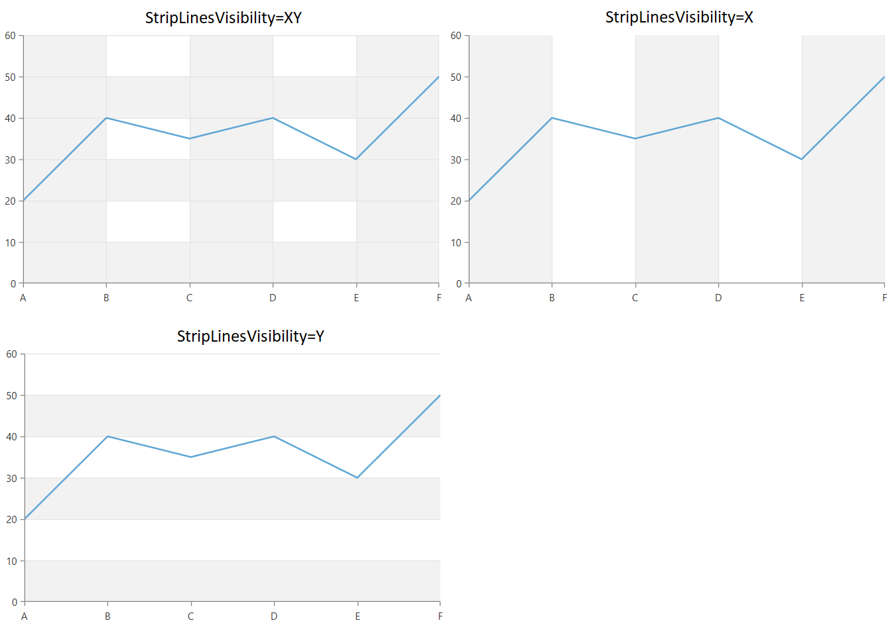

To __show dashed lines__, set the __MajorXLineDashArray__ and __MajorYLineDashArray__ properties. 

__Example 3: Dashing the grid lines__
<snippet id='radchartview-features-cartesianchartgrid-and-polarchartgrid-example_3_dashing_the_grid_lines-xaml' />

#### Figure 3: Dash array example
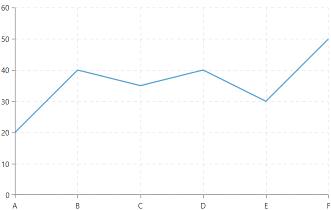

To __define an interval for the grid lines__ to appear, set the __MajorXLineInterval__ and __MajorYLineInterval__ properties.

__Example 4: Setting line interval__
<snippet id='radchartview-features-cartesianchartgrid-and-polarchartgrid-example_4_setting_line_interval-xaml' />

#### Figure 4: Line interval example
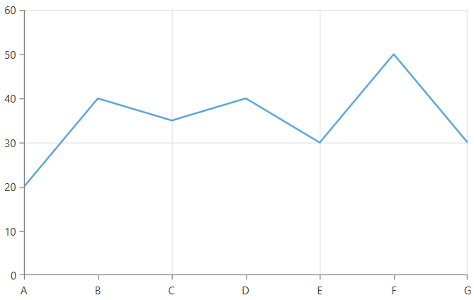

To __change the appearance of the grid lines__, set the __MajorXLineStyle__ and __MajorYLineStyle__ properties.

__Example 5: Styling the grid lines__
<snippet id='radchartview-features-cartesianchartgrid-and-polarchartgrid-example_5_styling_the_grid_lines-xaml' />

#### Figure 5: Grid lines with custom colors
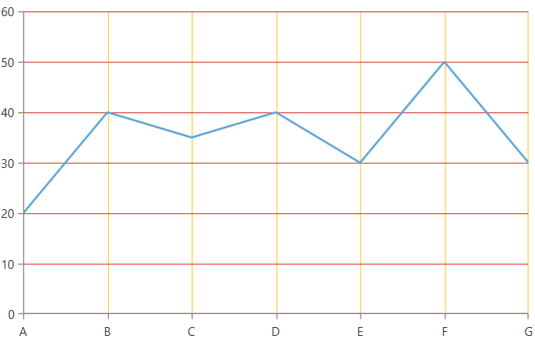

> Setting __StrokeDashArray__ via the Line's Style is not supported. Use the __MajorXLineDashArray__ and __MajorYLineDashArray__ properties of CartesianChartGrid instead. 

To __change the colors of the strip lines__, set the __XStripeBrushes__ and __YStripeBrushes__ properties.

__Example 6: Coloring the strip lines__
<snippet id='radchartview-features-cartesianchartgrid-and-polarchartgrid-example_6_coloring_the_strip_lines-xaml' />

#### Figure 6: Strip lines with custom colors
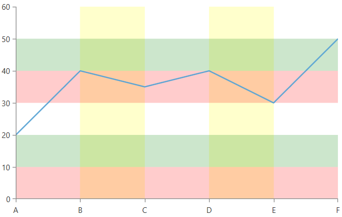

The X brushes are drawn from left to right. And the Y brushes from bottom to top.

> Keep in mind that the horizontal (Y) strip lines are drawn over the vertical (X) strip lines.

To __change the render mode of the grid lines__, set the __MajorXLinesRenderMode__ and __MajorYLinesRenderMode__. This is an enumeration of type __GridLineRenderMode__ and it controls what lines will get rendered. 

__Example 7: Setting the grid lines render mode__
<snippet id='radchartview-features-cartesianchartgrid-and-polarchartgrid-example_7_setting_the_grid_lines_render_mode-xaml' />

The render mode properties allow the following values.

* __First__: Only the first line is drawn.

	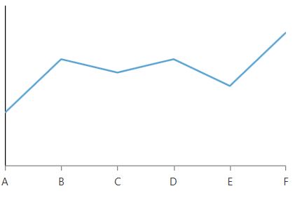

* __Inner__: All lines, except the first and last, are drawn.

	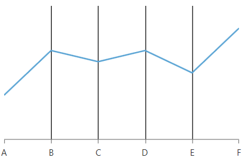

* __FirstAndInner__: All lines, except the last, are rendered.

	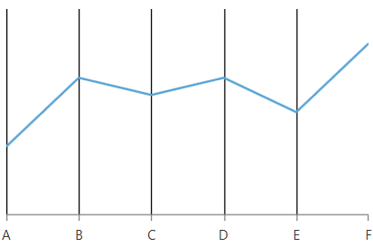

* __Last__: Only the last line is rendered.

	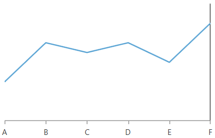
	
* __FirstAndLast__: Only the first and the last lines are rendered.

	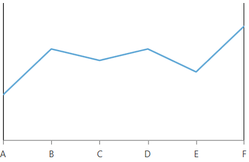

* __InnerAndLast__: All lines, except the first, are rendered.

	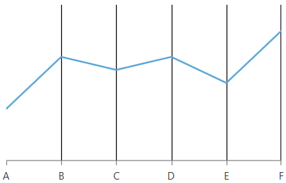

* __All__: All lines are rendered. This is the __default__ value.

	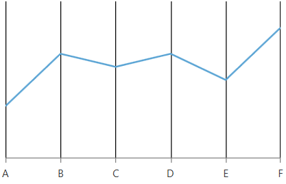

### PolarChartGrid

PolarChartGrid shows polar and radial lines and stripes drawn over the chart's plot area. The lines are snapped on the ticks of the axes and the stripes is the area between the lines.

The grid allows you to customize its lines and strips via several properties. To use it, set the __Grid__ property of RadPolarChart to a new instance of __PolarChartGrid__.

To __display the lines__ in the grid, set the __GridLineVisibility__ property. This is an enumeration that allows you to tell which lines to be displayed - __Polar__, __Radial__, __Both__ or __None__.

__Example 8: Setting up the polar grid__
<snippet id='radchartview-features-cartesianchartgrid-and-polarchartgrid-example_8_setting_up_the_polar_grid-xaml' />

#### Figure 7: Polar grid lines example

To __display the strip lines__, set the __StripesVisibility__ property. This is an enumeration that allows you to tell which strips to be displayed - __Polar__, __Radial__, __Both__ or __None__.

__Example 9: Enabling polar strip lines__
<snippet id='radchartview-features-cartesianchartgrid-and-polarchartgrid-example_9_enabling_polar_strip_lines-xaml' />

#### Figure 8: Polar strip lines example

To __show dashed lines__, set the __PolarLineDashArray__ and __RadialLineDashArray__ properties. 

__Example 10: Dashing the polar grid lines__
<snippet id='radchartview-features-cartesianchartgrid-and-polarchartgrid-example_10_dashing_the_polar_grid_lines-xaml' />

#### Figure 9: Dash array for the polar and radial grid lines example

To __change the appearance of the polar grid lines__, set the __RadialLineStyle__ and __PolarLineStyle__ properties.

__Example 11: Styling the polar grid lines__
<snippet id='radchartview-features-cartesianchartgrid-and-polarchartgrid-example_11_styling_the_polar_grid_lines-xaml' />

#### Figure 10: Polar grid lines with custom colors and thickness

> Setting __StrokeDashArray__ via the Line or Ellipse's Style is not supported. Use the __PolarLineDashArray__ and __RadialLineDashArray__ properties of PolarChartGrid instead.

To __change the colors of the polar strip lines__, set the __PolarStripeBrushes__ and __RadialStripeBrushes__ properties.

__Example 12: Coloring the strip lines__
<snippet id='radchartview-features-cartesianchartgrid-and-polarchartgrid-example_12_coloring_the_strip_lines-xaml' />

#### Figure 11: Strip lines with custom colors

The radial strip lines are drawn from outside to inside. And the polar lines are drawn counter clockwise. 

> Keep in mind that the polar strip lines are drawn over the radial strip lines.
