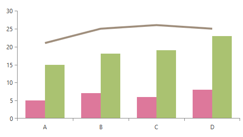

# Dynamic Number of Series (ChartSeriesProvider)

In this help topic, we describe the mechanism for an automatic series generation that ChartView provides.

## Overview

RadCartesianChart and RadPolar chart can create a dynamic number of series that depend on the data (collection of collections). To take advantage of this feature, create a __ChartSeriesProvider__ object. This object receives the data and holds the __ChartSeriesDescriptors__ – objects that define the specific properties of the dynamically generated series.        

The series provider uses descriptor objects to define the type and visual appearance of the series. Depending on the series type that you want to use, you can define different descriptors:
    
|Series|Descriptor|
|------|----------|
|__Categorical Series__ (BarSeries, LineSeries, SplineSeries, AreaSeries, SplineAreaSeries)|CategoricalSeriesDescriptor
|__Financial Series__ (OhlcSeries, CandlestickSeries)|OhlcSeriesDescriptor
|__Scatter Series__ (ScatterPointSeries, ScatterLineSeries, ScatterSplineSeries, ScatterAreaSeries, ScatterSplineAreaSeries)|ScatterSeriesDescriptor
|__Polar Series__ (PolarPointSeries, PolarLineSeries, PolarAreaSeries)|PolarSeriesDescriptor
|__Radar Series__ (RadarPointSeries, RadarLineSeries, RadarAreaSeries)|RadarSeriesDescriptor
|__All Series Types__|[ChartSeriesDescriptor](#chartseriesdescriptor)  

## ChartSeriesDescriptor

The base __ChartSeriesDescriptor__ class is a generic descriptor that provides more flexibility because you can use it with all chart series. The descriptor doesn't expose value properties and it does not expect a specific type of series, so you can define all you need in its style.

#### __[XAML] Example 1: A ChartSeriesDescriptor that describes a RangeSeries__
{{region radchartview-features-chartseriesprovider_01}}
	<telerik:ChartSeriesDescriptor ItemsSourcePath="MyDataPointsCollection">
		<telerik:ChartSeriesDescriptor.Style>
			
		</telerik:ChartSeriesDescriptor.Style>
	</telerik:ChartSeriesDescriptor>
{{endregion}}

The __TargetType__ of the descriptor determines the type of the series that will be created.

>important If you use [NoXaml]() dlls and the [implicit styles theming mechanism](), you must base the Style of the ChartSeriesDescriptor on the default style of the series. For example, set the __BasedOn="{StaticResource RangeSeriesStyle}"__ property of the Style in **Example 1**. The same *&lt;series name&gt;Style* naming convention is applicable for all series types, for example, LineSeriesStyle, BarSeriesStyle, PointSeriesStyle, etc. If you don't set the BasedOn attribute when using NoXaml dlls, the series won't display any data points.

## Properties

### ChartSeriesDescriptor Properties

The following list describes the most important properties of __ChartSeriesDescriptor__:  

* __ItemsSourcePath__: A property of type __string__ that gets or sets the path to the collection property that will feed the generated series.            

* __TypePath__: A property of type __string__ that gets or sets the path to the property that indicates the series type that needs to be created.     

* __TypeConverter__: A property of type __IValueConverter__ that gets or sets a converter that can be used to provide the exact type of the series that must be created. The converter receives a Type object if the __TypePath__ is set and the value can be extracted from the viewmodel of the series. Otherwise, the converter receives the entire viewmodel object. The __Convert__ method returns the series type that needs to be created.

* __Style__: A property of type __Style__ that gets or sets the style that describes the appearance of the series that are to be created. If no __TypePath__ is specified, the TargetType property of the style object is used to generate the desired series.  

* __CollectionIndex__: A property of type __int__ that gets or sets the index within the Source collection of data (view models) for which the current descriptor must be used. This property is useful when, for example, a BarSeries needs to be generated for the first data entry and LineSeries for the rest of the entries.

* __ChartDataSourceStyle__: A property of type __Style__ that gets or sets the style of the [ChartDataSource]() objects that are set as the ItemsSource of the created series. Through that style, you can set the properties of the ChartDataSource, which control the sampling logic as demonstrated in __Example 2__.

#### __[XAML] Example 2: Setting the ChartDataSourceStyle property__
{{region xaml-radchartview-features-chartseriesprovider_2}}

    <telerik:CategoricalSeriesDescriptor>
		<telerik:CategoricalSeriesDescriptor.ChartDataSourceStyle>
			
		</telerik:CategoricalSeriesDescriptor.ChartDataSourceStyle>
	</telerik:CategoricalSeriesDescriptor>
{{endregion}}

### Type-Specific Properties

The following list describes the properties that are specific to each of the available series type:

* __CategoricalSeriesDescriptor__
	* __CategoryPath__: A property of type __string__ that sets or gets the path to the Category property of the data item.
	* __ValuePath__: A property of type __string__ that sets or gets the path to the Value property of the data item.

* __OhlcSeriesDescriptor__
	* __OpenPath__: A property of type __string__ that sets or gets the path to the Open value of the data item.
	* __HighPath__: A property of type __string__ that sets or gets the path to the High value of the data item.
	* __LowPath__: A property of type __string__ that sets or gets the path to the Low value of the data item.
	* __ClosePath__: A property of type __string__ that sets or gets the path to the Close value of the data item.

* __PolarSeriesDescriptor__
	* __ValuePath__: A property of type __string__ that sets or gets the path to the Value of the data item.
	* __Anglepath__: A property of type __string__ that sets or gets the path to the Angle value of the data item.
	
* __RadarSeriesDescriptor__
	* __CategoryPath__:  A property of type __string__ that sets or gets the path to the Category of the data item.
	* __ValuePath__:  A property of type __string__ that sets or gets the path to the Value of the data item.

## Events

__ChartSeriesProvider__ expose a single event - __SeriesCreated__. The event occurs when a series is created. It allows for the series to be additionally set up or completely replaced.  

The event arguments are of type __ChartSeriesCreatedEventArgs__ and expose the following properties:
* __Series__: A property of type __ChartSeries__ that holds the created series.
* __Context__: A property of type __object__ that holds the model of the series.

> This event may be raised with the series being null (for example, in cases when a suitable descriptor was not found). In such a case, this event can still be used to create and set up a new series.
	
## Code Example

In the following example, the chart is populated by a collection of 3 items, thus creating 3 series. There is a CategoricalSeriesDescriptor with CollectionIndex=2 and a style with TargetType="LineSeries". This effectively means that there will be a LineSeries, populated by the third item in the collection. There is another CategoricalSeriesDescriptor, which is responsible for creating BarSeries for the rest of the items in the collection.        

#### __[XAML] Example 3: A sample chart definition with its SeriesProvider set__
{{region xaml-radchartview-features-chartseriesprovider_3}}
	<telerik:RadCartesianChart Palette="Flower">
		<telerik:RadCartesianChart.HorizontalAxis>
			<telerik:CategoricalAxis />
		</telerik:RadCartesianChart.HorizontalAxis>
		<telerik:RadCartesianChart.VerticalAxis>
			<telerik:LinearAxis />
		</telerik:RadCartesianChart.VerticalAxis>

		<telerik:RadCartesianChart.SeriesProvider>
			<telerik:ChartSeriesProvider Source="{Binding Data}">
				<telerik:ChartSeriesProvider.SeriesDescriptors>
					<telerik:CategoricalSeriesDescriptor CategoryPath="Category" 
															ValuePath="Value" 
															ItemsSourcePath="Items" />
					<telerik:CategoricalSeriesDescriptor CategoryPath="Category"
															ValuePath="Value"
															ItemsSourcePath="Items" 
															CollectionIndex="2">
						<telerik:CategoricalSeriesDescriptor.Style>
							
						</telerik:CategoricalSeriesDescriptor.Style>
					</telerik:CategoricalSeriesDescriptor>
				</telerik:ChartSeriesProvider.SeriesDescriptors>
			</telerik:ChartSeriesProvider>
		</telerik:RadCartesianChart.SeriesProvider>
	</telerik:RadCartesianChart>
{{endregion}}

#### __[C#] Example 4: The chart's view models set up__
{{region cs-radchartview-features-chartseriesprovider_4}}
	public class DataItem
    {
        public string Category { get; set; }

        public double Value { get; set; }
    }
	
	public class SeriesViewModel
    {
        public ObservableCollection<DataItem> Items { get; set; }
    }
	
	public class MainViewModel
    {
        public ObservableCollection<SeriesViewModel> Data
        {
            get;
            set;
        }

        public MainViewModel()
        {
            this.Data = new ObservableCollection<SeriesViewModel>()
            {
                new SeriesViewModel()
                {
                    Items = new ObservableCollection<DataItem>()
                    {
                        new DataItem() { Category = "A", Value = 5},
                        new DataItem() { Category = "B", Value = 7},
                        new DataItem() { Category = "C", Value = 6},
                        new DataItem() { Category = "D", Value = 8}
                    }
                },
                new SeriesViewModel()
                {
                    Items = new ObservableCollection<DataItem>()
                    {
                        new DataItem() { Category = "A", Value = 15},
                        new DataItem() { Category = "B", Value = 18},
                        new DataItem() { Category = "C", Value = 19},
                        new DataItem() { Category = "D", Value = 23}
                    }
                },
                new SeriesViewModel()
                {
                    Items = new ObservableCollection<DataItem>()
                    {
                        new DataItem() { Category = "A", Value = 21},
                        new DataItem() { Category = "B", Value = 25},
                        new DataItem() { Category = "C", Value = 26},
                        new DataItem() { Category = "D", Value = 25}
                    }
                }
            };
        }
    }
{{endregion}}

#### __[VB.NET] Example 4: A sample chart definition with its SeriesProvider set__
{{region vb-radchartview-features-chartseriesprovider_04}}
	Public Class DataItem
		Public Property Category() As String

		Public Property Value() As Double
	End Class

	
	Public Class SeriesViewModel
		Public Property SeriesType() As String

		Public Property Items() As ObservableCollection(Of DataItem)
	End Class
	
	Public Class MainViewModel
		Public Property Data() As ObservableCollection(Of SeriesViewModel)

		Public Sub New()
			Me.Data = New ObservableCollection(Of SeriesViewModel)() _
				From {
					New SeriesViewModel() With {
						.Items = New ObservableCollection(Of DataItem)() From {
							New DataItem() With {
								.Category = "A",
								.Value = 5
							},
							New DataItem() With {
								.Category = "B",
								.Value = 7
							},
							New DataItem() With {
								.Category = "C",
								.Value = 6
							},
							New DataItem() With {
								.Category = "D",
								.Value = 8
							}
						}
					},
					New SeriesViewModel() With {
						.Items = New ObservableCollection(Of DataItem)() From {
							New DataItem() With {
								.Category = "A",
								.Value = 15
							},
							New DataItem() With {
								.Category = "B",
								.Value = 18
							},
							New DataItem() With {
								.Category = "C",
								.Value = 19
							},
							New DataItem() With {
								.Category = "D",
								.Value = 23
							}
						}
					},
					New SeriesViewModel() With {
						.Items = New ObservableCollection(Of DataItem)() From {
							New DataItem() With {
								.Category = "A",
								.Value = 21
							},
							New DataItem() With {
								.Category = "B",
								.Value = 25
							},
							New DataItem() With {
								.Category = "C",
								.Value = 26
							},
							New DataItem() With {
								.Category = "D",
								.Value = 25
							}
						}
					}
				}
		End Sub
	End Class
{{endregion}}

#### __Figure 1: Dynamic number of series generated using SeriesProvider__

>tip You can find runnable examples that demonstrate the __SeriesProvider__ in our [GitHub SDK repository](https://github.com/telerik/xaml-sdk). There are a couple examples that you can find under the following directories in the repository - [ChartView/SL/SeriesProvider](https://github.com/telerik/xaml-sdk/tree/master/ChartView/SL/SeriesProvider) and [ChartView/SL/SeriesDescriptorSelector](https://github.com/telerik/xaml-sdk/tree/master/ChartView/SL/SeriesDescriptorSelector)[ChartView/WPF/SeriesProvider](https://github.com/telerik/xaml-sdk/tree/master/ChartView/WPF/SeriesProvider) and [ChartView/WPF/SeriesDescriptorSelector](https://github.com/telerik/xaml-sdk/tree/master/ChartView/WPF/SeriesDescriptorSelector)

## See Also  
* [Getting Started]()
* [Create Data-Bound Chart]()
* [Annotations Provider]()
