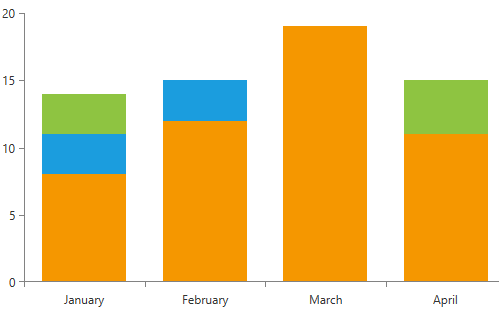
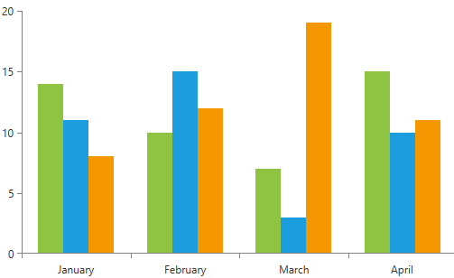
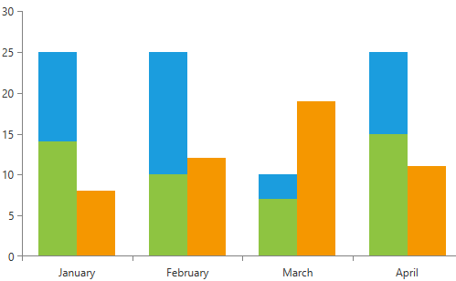
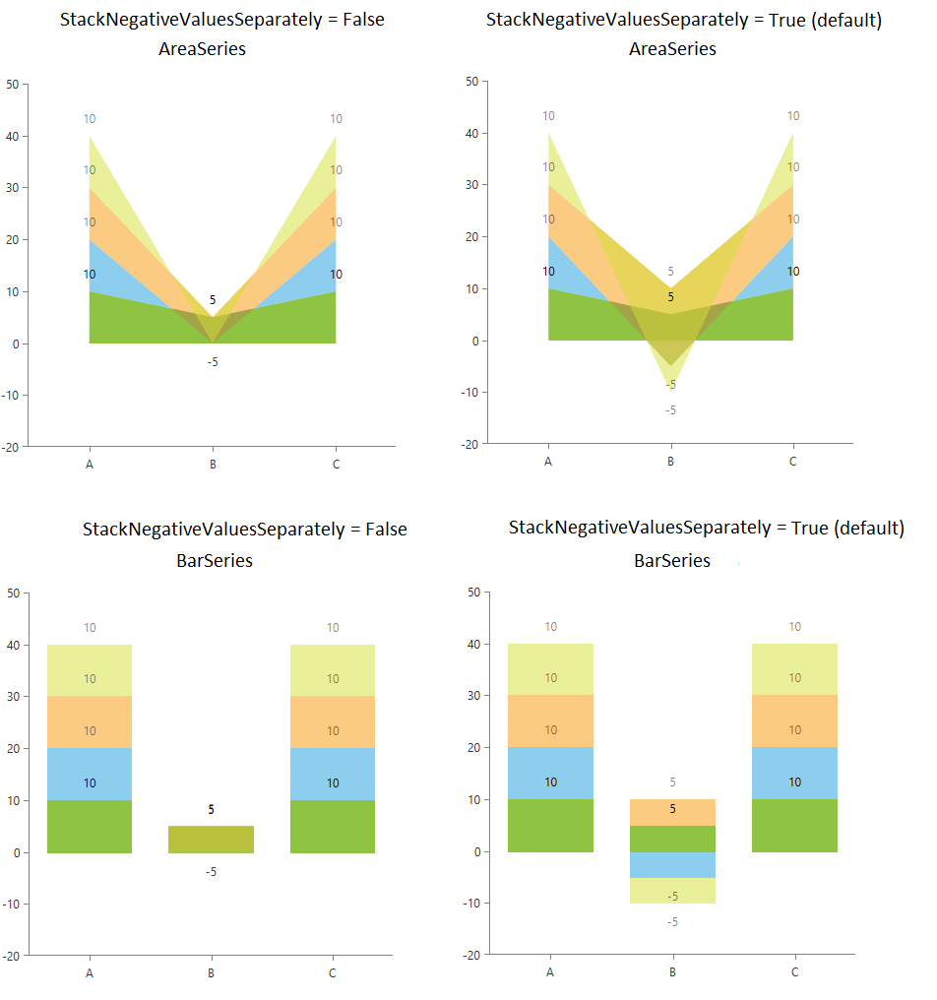

# Combine Mode

Categorical series in RadChartView have a mechanism which can be used for combining data points that reside in different series but have the same category. This mechanism can be triggered by setting the __CombineMode__ property of the series. It is an enumeration and it allows the following values: __None, Cluster, Stack, Stack100__.

>tip Categorical series which supports this mechanism are: __AreaSeries, BarSeries, LineSeries, PointSeries, RangeBarSeries, BoxPlotSeries__. RangeBarSeries and BoxPlotSeries support only None and Cluster modes.

__Example 1: Setting the CombineMode property__
```XAML
	<telerik:RadCartesianChart Palette="Windows8">
		<telerik:RadCartesianChart.HorizontalAxis>
			<telerik:CategoricalAxis />
		</telerik:RadCartesianChart.HorizontalAxis>
		<telerik:RadCartesianChart.VerticalAxis>
			<telerik:LinearAxis />
		</telerik:RadCartesianChart.VerticalAxis>
		<telerik:RadCartesianChart.Series>
			<telerik:BarSeries CombineMode="None">
				<telerik:BarSeries.DataPoints>
					<telerik:CategoricalDataPoint Category="January" Value="14" />
					<telerik:CategoricalDataPoint Category="February" Value="10" />
					<telerik:CategoricalDataPoint Category="March" Value="7" />
					<telerik:CategoricalDataPoint Category="April" Value="15" />
				</telerik:BarSeries.DataPoints>
			</telerik:BarSeries>
			<telerik:BarSeries CombineMode="None">
				<telerik:BarSeries.DataPoints>
					<telerik:CategoricalDataPoint Category="January" Value="11" />
					<telerik:CategoricalDataPoint Category="February" Value="15" />
					<telerik:CategoricalDataPoint Category="March" Value="3" />
					<telerik:CategoricalDataPoint Category="April" Value="10" />
				</telerik:BarSeries.DataPoints>
			</telerik:BarSeries>
			<telerik:BarSeries CombineMode="None">
				<telerik:BarSeries.DataPoints>
					<telerik:CategoricalDataPoint Category="January" Value="8" />
					<telerik:CategoricalDataPoint Category="February" Value="12" />
					<telerik:CategoricalDataPoint Category="March" Value="19" />
					<telerik:CategoricalDataPoint Category="April" Value="11" />
				</telerik:BarSeries.DataPoints>
			</telerik:BarSeries>
		</telerik:RadCartesianChart.Series>
	</telerik:RadCartesianChart>
```

<!-- -->

 * __None__: In this mode each series will be plotted on top of each other. The series that is defined last will be rendered on top. You can change that by setting the **ZIndex** property of the series.

	#### __Figure 1: CombineMode None__  	 
	

 * __Cluster__: In this mode each series will be plotted independently of each other, so that they are not overlapping.

	#### __Figure 2: CombineMode Cluster__  
	
	
 * __Stack__: In this mode all series form stacks. The points of all series are placed on top of each other. The drawing of the next point will start from the value of the previous one. 

	#### __Figure 3: CombineMode Stack__  
	
	
 * __Stack100__: When this mode is set all series form stacks that occupy 100% of the plot area. It shows the combined contribution of values as percentages where the combined total for each category is 100 percent. It's good to use it when the relationship between values in a category is more significant than the amounts.

	#### __Figure 4: CombineMode Stack100__  
	

## Utilizing the StackGroupKey Property

If the **CombineMode** property of the series is either **Stack** or **Stack100**, the **StackGroupKey** property of the series can be set in order to define in which stack group it will be included. **Example 2** demonstrates this property.

__Example 2: Setting the StackGroupKey property__
```XAML
	 <telerik:RadCartesianChart Palette="Windows8">
		<telerik:RadCartesianChart.HorizontalAxis>
			<telerik:CategoricalAxis />
		</telerik:RadCartesianChart.HorizontalAxis>
		<telerik:RadCartesianChart.VerticalAxis>
			<telerik:LinearAxis />
		</telerik:RadCartesianChart.VerticalAxis>
		<telerik:RadCartesianChart.Series>
			<telerik:BarSeries CombineMode="Stack"  StackGroupKey="FirstStackGroup">
				<telerik:BarSeries.DataPoints>
					<telerik:CategoricalDataPoint Category="January" Value="14" />
					<telerik:CategoricalDataPoint Category="February" Value="10" />
					<telerik:CategoricalDataPoint Category="March" Value="7" />
					<telerik:CategoricalDataPoint Category="April" Value="15" />
				</telerik:BarSeries.DataPoints>
			</telerik:BarSeries>
			<telerik:BarSeries CombineMode="Stack" StackGroupKey="FirstStackGroup">
				<telerik:BarSeries.DataPoints>
					<telerik:CategoricalDataPoint Category="January" Value="11" />
					<telerik:CategoricalDataPoint Category="February" Value="15" />
					<telerik:CategoricalDataPoint Category="March" Value="3" />
					<telerik:CategoricalDataPoint Category="April" Value="10" />
				</telerik:BarSeries.DataPoints>
			</telerik:BarSeries>
			<telerik:BarSeries CombineMode="Stack" StackGroupKey="SecondStackGroup" >
				<telerik:BarSeries.DataPoints>
					<telerik:CategoricalDataPoint Category="January" Value="8" />
					<telerik:CategoricalDataPoint Category="February" Value="12" />
					<telerik:CategoricalDataPoint Category="March" Value="19" />
					<telerik:CategoricalDataPoint Category="April" Value="11" />
				</telerik:BarSeries.DataPoints>
			</telerik:BarSeries>
		</telerik:RadCartesianChart.Series>
	</telerik:RadCartesianChart>
```

#### __Figure 5: Result from Example 2__


## Stacking Mixed Values in the Same Stack

By default when you have mixed values (negative and positive) in the same category, those will be added in separate value stacks. This means that all positive values will be combined into one stack and all negative values into another stack.

To change this behavior and use a single stack for all values, set the __ChartViewExtensions.StackNegativeValuesSeparately__ attached property to __False__. The property is applied to the RadCartesianChart control.

__Example 3: Setting the ChartViewExtensions.StackNegativeValuesSeparately property__
```XAML
	<telerik:RadCartesianChart Palette="Windows8" chartView:ChartViewExtensions.StackNegativeValuesSeparately="False">
		<telerik:RadCartesianChart.VerticalAxis>
			<telerik:LinearAxis />
		</telerik:RadCartesianChart.VerticalAxis>
		<telerik:RadCartesianChart.HorizontalAxis>
			<telerik:CategoricalAxis PlotMode="OnTicksPadded" />
		</telerik:RadCartesianChart.HorizontalAxis>
		<telerik:RadCartesianChart.Series>
			<telerik:AreaSeries CombineMode="Stack" ShowLabels="True">
				<telerik:AreaSeries.DataPoints>
					<telerik:CategoricalDataPoint Category="A" Value="10" />
					<telerik:CategoricalDataPoint Category="B" Value="5" />
					<telerik:CategoricalDataPoint Category="C" Value="10" />
				</telerik:AreaSeries.DataPoints>
			</telerik:AreaSeries>
			<telerik:AreaSeries CombineMode="Stack" Opacity="0.5" ShowLabels="True">
				<telerik:AreaSeries.DataPoints>
					<telerik:CategoricalDataPoint Category="A" Value="10" />
					<telerik:CategoricalDataPoint Category="B" Value="-5" />
					<telerik:CategoricalDataPoint Category="C" Value="10" />
				</telerik:AreaSeries.DataPoints>
			</telerik:AreaSeries>
			<telerik:AreaSeries CombineMode="Stack" Opacity="0.5" ShowLabels="True">
				<telerik:AreaSeries.DataPoints>
					<telerik:CategoricalDataPoint Category="A" Value="10" />
					<telerik:CategoricalDataPoint Category="B" Value="5" />
					<telerik:CategoricalDataPoint Category="C" Value="10" />
				</telerik:AreaSeries.DataPoints>
			</telerik:AreaSeries>
			<telerik:AreaSeries CombineMode="Stack" Opacity="0.5" ShowLabels="True">
				<telerik:AreaSeries.DataPoints>
					<telerik:CategoricalDataPoint Category="A" Value="10" />
					<telerik:CategoricalDataPoint Category="B" Value="-5" />
					<telerik:CategoricalDataPoint Category="C" Value="10" />
				</telerik:AreaSeries.DataPoints>
			</telerik:AreaSeries>
		</telerik:RadCartesianChart.Series>
	</telerik:RadCartesianChart>
```

> The "chartView" namespace refers to the following - `xmlns:chartView="clr-namespace:Telerik.Windows.Controls.ChartView;assembly=Telerik.Windows.Controls.Chart"`

#### __Figure 5: Comparison between the stack modes__


## See Also

 * [Getting Started]()
 * [Data Binding]() 
