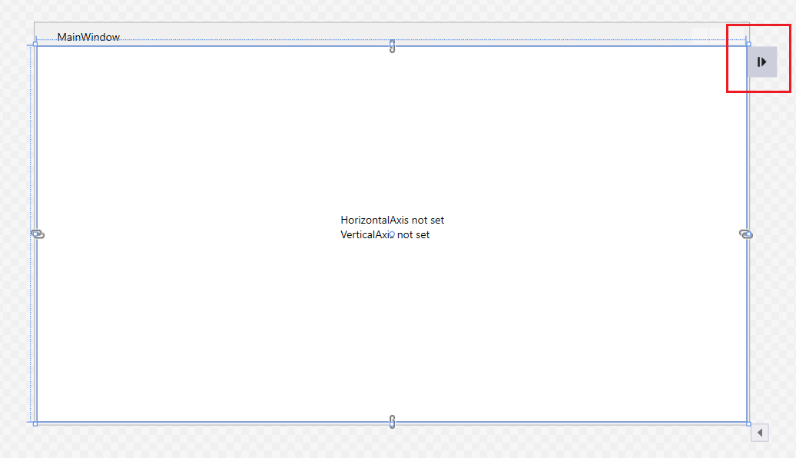
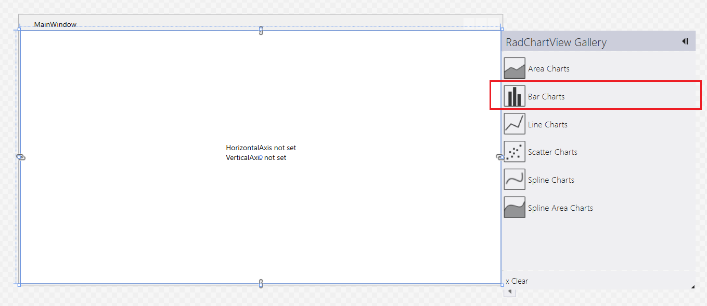
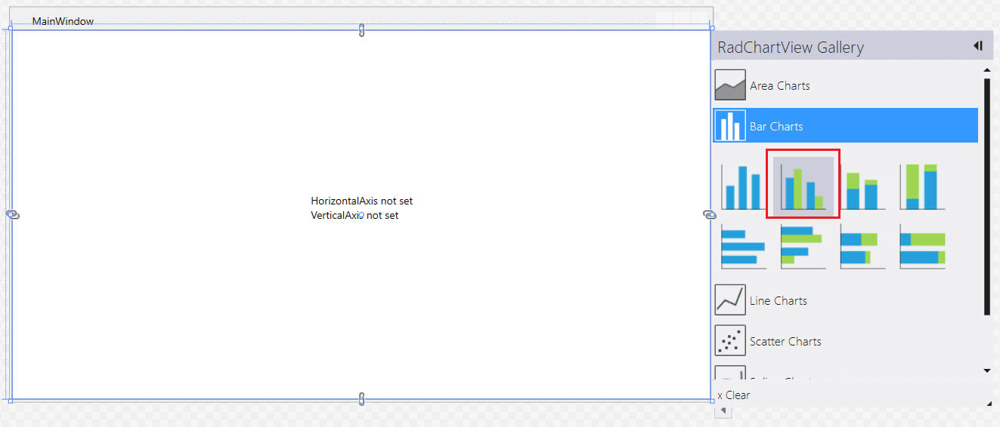
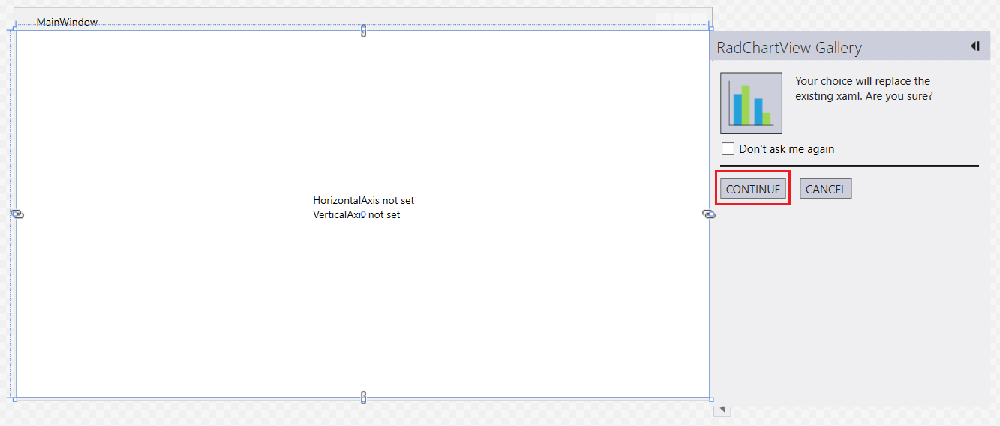
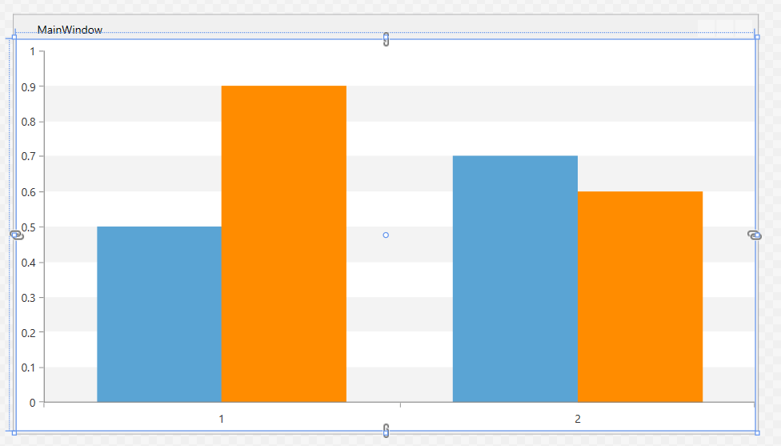
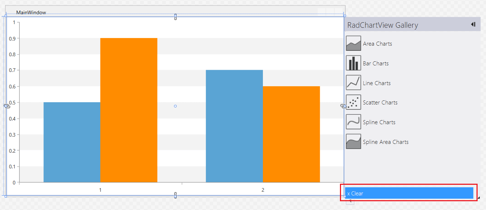

# Design-Time Support

RadChartView comes with an additional design-time feature that helps generating different types of visualizations easily.

The feature allows you to define an empty chart control and automatically generate XAML with some sample contents with few clicks in the Visual Studio designer.

## Supported Charts 

The following controls support the design-time features:

* __RadCartesianChart__
* __RadPieChart__
* __RadPolarChart__

## Setting up the View

To use the feature and generate a sample chart, define an empty chart in XAML or drag/drop it onto the Visual Studio designer. The following example uses RadCartesianChart for the demonstration.

1. Define an empty RadCartesianChart

	__Example 1: Defining an empty chart__
	<snippet id='radchartview-features-design-time-support-example_1_defining_an_empty_chart-xaml' />

2. Click onto the chart in the Visual Studio designer. This will show a small screen tip on the top right part of the chart.

	
	
3. Click on the screen tip. This will open a dropdown with the chart's gallery. Those are the chart visualizations available to be created with the design-time feature. Select one of the gallery items - for example, "Bar Charts".

	
	
4. Select a chart from the gallery. This will show the confirmation view. Click Continue.

	
	
	

This will generate the following Xaml:

__Example 2: The auto-generated Xaml__
<snippet id='radchartview-features-design-time-support-example_2_the_auto_generated_xaml-xaml' />

> Based on the chosen visualization, the Xaml setup will vary.

## Clearing the Setup

The chart's design-time adorner allows you to easily clean up the chart's contents leaving only the control's tag (for example, RadCartesianChart) in Xaml. To do so, open the RadChartView gallery and click the "Clear" button. 

## See Also
* [Chart Series Overview]()
* [Customizing Series Apperance]()
