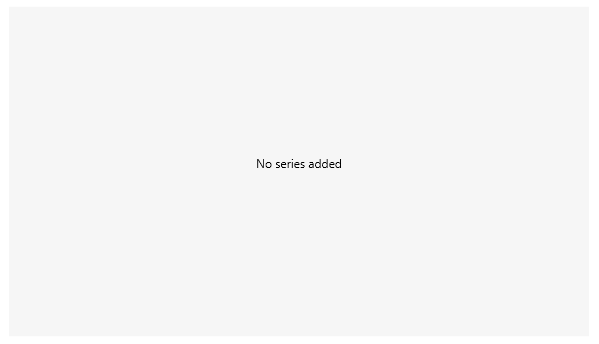
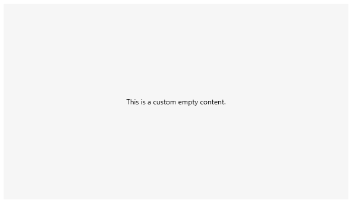
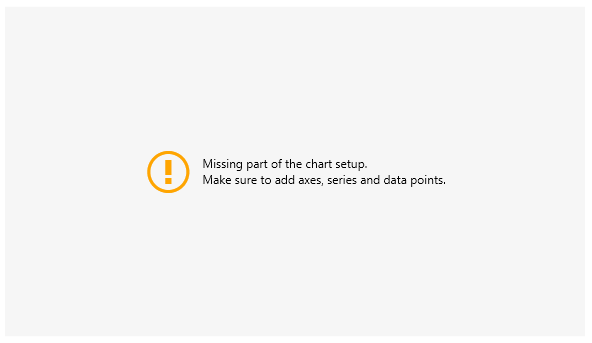
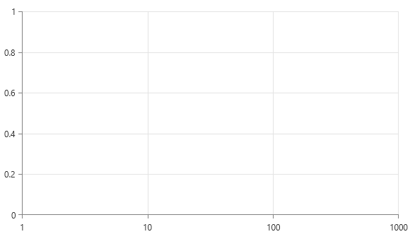

# Empty Content

RadChartView displays a warning message if a main component from the chart's setup is missing. The exact message depends on the specific part that is not set.

The following table describes the situations when the chart is considered empty and it shows what messages are displayed in these cases.

|Message|Reason for displaying|
|-------|---------------------|
|`HorizontalAxis not set`|The corresponding axis is not set|
|`VerticalAxis not set`|The corresponding axis is not set|
|`PolarAxis not set`|The corresponding axis is not set|
|`AngleAxis not set`|The corresponding axis is not set|
|`No series added`|There are no series added to the control|
|`No data to plot`|There is no data added to the defined series|

When the axes are properly set but there is no series defined all charting components notify you with the “No series added” message. If the series are defined but the data of the series is not set, the message is “No data to plot”.

> You can receive a "No data to plot" message, if you are using the [NoXaml]() dlls and you have created a custom series or custom style. In that case, you should make sure to base the style of the custom series on the default one. For example, if you have defined a class named MyBarSeries, which inherits BarSeries, you can add the following style `<Style TargetType="local:MyBarSeries" BasedOn="{StaticResource BarSeriesStyle}" />`.

__Setting up chart without series__
```XAML
	<telerik:RadCartesianChart Background="#F6F6F6">
		<telerik:RadCartesianChart.HorizontalAxis>
			<telerik:CategoricalAxis />
		</telerik:RadCartesianChart.HorizontalAxis>
		<telerik:RadCartesianChart.VerticalAxis>
			<telerik:LinearAxis />
		</telerik:RadCartesianChart.VerticalAxis>            
	</telerik:RadCartesianChart>
```



## Customizing the Content

The default empty content can be replaced using the `EmptyContent` and `EmptyContentTemplate` properties of the chart.

The user defined empty content will be displayed in all of the above mentioned cases.

The `EmptyContent` property is of type `object` and it allows to set the content that will be visualized when the charting component cannot display anything on the screen. 

__Setting the empty content__
```XAML
	<telerik:RadCartesianChart EmptyContent="This is a custom empty content." Background="#F6F6F6">
		<telerik:RadCartesianChart.HorizontalAxis>
			<telerik:CategoricalAxis />
		</telerik:RadCartesianChart.HorizontalAxis>
		<telerik:RadCartesianChart.VerticalAxis>
			<telerik:LinearAxis />
		</telerik:RadCartesianChart.VerticalAxis>            
	</telerik:RadCartesianChart>
```



The `EmptyContentTemplate` property is of type `DataTemplate` and it allows setting a template that will be applied to the empty content presenter. The data context in the template is the object assigned to the `EmptyContent` property.

__Setting the empty content template__
```XAML
	<telerik:RadCartesianChart EmptyContent="Missing part of the chart setup.&#13;&#10;Make sure to add axes, series and data points." 
							   Background="#F6F6F6">
		<telerik:RadCartesianChart.EmptyContentTemplate>
			<DataTemplate>
				<StackPanel Orientation="Horizontal">
					<telerik:RadGlyph Glyph="&#xe403;" Foreground="Orange" FontSize="48"/>
					<TextBlock Text="{Binding}" VerticalAlignment="Center" Margin="10 0 0 0" />
				</StackPanel>
			</DataTemplate>
		</telerik:RadCartesianChart.EmptyContentTemplate>
		<telerik:RadCartesianChart.HorizontalAxis>
			<telerik:CategoricalAxis />
		</telerik:RadCartesianChart.HorizontalAxis>
		<telerik:RadCartesianChart.VerticalAxis>
			<telerik:LinearAxis />
		</telerik:RadCartesianChart.VerticalAxis>            
	</telerik:RadCartesianChart>
```



## Hiding the Empty Content Message

To hide the empty content message, set the `ShowEmptyContent` property of the chart to `false`. This is useful when the chart axes should be displayed even if no data or no series are included.

__Setting the ShowEmptyContent property__
```XAML
	<telerik:RadCartesianChart ShowEmptyContent="False">            
		<telerik:RadCartesianChart.HorizontalAxis>
			<telerik:LogarithmicAxis Minimum="1" Maximum="1000" />
		</telerik:RadCartesianChart.HorizontalAxis>
		<telerik:RadCartesianChart.VerticalAxis>
			<telerik:LinearAxis Minimum="0" Maximum="1" MajorStep="0.2"/>
		</telerik:RadCartesianChart.VerticalAxis>            
		<telerik:RadCartesianChart.Grid>
			<telerik:CartesianChartGrid MajorLinesVisibility="XY" />
		</telerik:RadCartesianChart.Grid>
	</telerik:RadCartesianChart>
```

