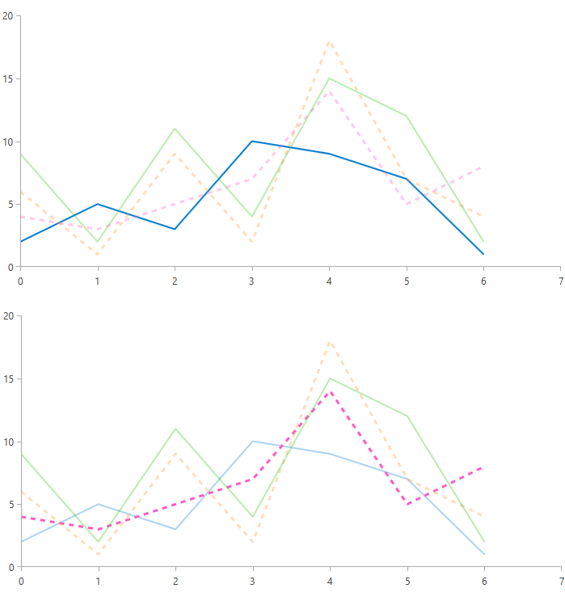

# HoverMode

The different charts from the `RadChartView` suite expose the `HoverMode` property, which controls whether the rest of the series will fade out when a certain series is hovered. It is useful in situations with many overlapping series and has two possible options:

* `None`&mdash;This is the default option of the `HoverMode` property, which will not fade other series when a series is hovered.
* `FadeOtherSeries`&mdash;This option will fade other series when a certain series is hovered.

>important In the case of the RadPieChart, when the HoverMode property is set, all of the slices fade out except the hovered one.

The following example demonstrates how to set up a RadCartesianChart and set its HoverMode.
        
__Define the RadCartesianChart with HoverMode__
<snippet id='radchartview-features-hovermode-define_the_radcartesianchart_with_hovermode-xaml' />

__Result from the above example comparing hovering over different series__

>important For series whose `RenderOptions` property is set to `Bitmap` or `Direct2D`, the `FadeOtherSeries` option will only be supported by hovering the series' associated `RadLegendItem` element. To learn more about the `RadLegend`control integration with RadChartView, check our [RadLegend Support]() article.

## See Also
* [Getting Started]()
* [Chart Types]()