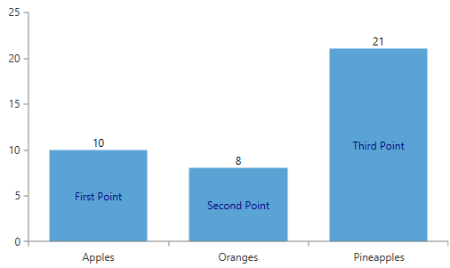

# Label Definition

The series of the __RadChartView__ control expose mechanisum for customizing the visualized labels. This article will introduce it to you.

If you wish to customize the default labels of the chart series, you could use Label Definition.

>To see labels in the series you have to set __ShowLabels="True"__

All the properties of a __ChartSeriesLabelDefinition__ are listed here:

* __Binding__ - Gets or sets the __DataPointBinding__ instance that will retrieve the content of each label.
            

* __Format__ - Gets or sets the string used to format the label content, using the __String.Format__ method.
            

* __Margin__ - Gets or sets the offset of each label from the four box edges.
            

* __HorizontalAlignment__ - Gets or sets the horizontal alignment of each label relative to the __DataPoint__ it is associated with.
            

* __VerticalAlignment__ - Gets or sets the vertical alignmentof each label relative to the __DataPoint__ it is associated with.
            

* __Template__ - Gets or sets the __DataTemplate__ instance that may be used to define custom labels.
            

* __TemplateSelector__ - Gets or sets the __DataTemplateSelector__ instance that may be used to provide context-specific data templates, depending on the provided __DataPoint__.
            

* __DefaultVisualStyle__ - Gets or sets the __Style__ instance that defines the default appearance of the labels. The __Style__ should arget the __TextBlock__ type.
            

* __Strategy__ - Gets or sets a custom __ChartSeriesLabelStrategy__ instance that may be used to override the labels' appearance, content and layout.
            

The example below shows how to bind the label's content to a custom property from your business model. Two Label Definitions are added for each data item.

#### __XAML__
{{region radchartview-label-definition}}
	<telerik:RadCartesianChart x:Name="myChart"
							   Width="500"
							   Height="300">
		<telerik:RadCartesianChart.VerticalAxis>
			<telerik:LinearAxis />
		</telerik:RadCartesianChart.VerticalAxis>
		<telerik:RadCartesianChart.HorizontalAxis>
			<telerik:CategoricalAxis />
		</telerik:RadCartesianChart.HorizontalAxis>
		<telerik:BarSeries ShowLabels="True" CategoryBinding="Category" ValueBinding="Value">
			<telerik:BarSeries.LabelDefinitions>
				<telerik:ChartSeriesLabelDefinition HorizontalAlignment="Center" VerticalAlignment="Center" >
					<telerik:ChartSeriesLabelDefinition.Template>
						<DataTemplate>
							<TextBlock Foreground="DarkBlue" Text="{Binding DataItem.LabelProperty}" />
						</DataTemplate>
					</telerik:ChartSeriesLabelDefinition.Template>
				</telerik:ChartSeriesLabelDefinition>
				<telerik:ChartSeriesLabelDefinition HorizontalAlignment="Center" VerticalAlignment="Top">
					<telerik:ChartSeriesLabelDefinition.Template>
						<DataTemplate>
							<TextBlock Foreground="Black" Text="{Binding DataItem.Value}" />
						</DataTemplate>
					</telerik:ChartSeriesLabelDefinition.Template>
				</telerik:ChartSeriesLabelDefinition>
			</telerik:BarSeries.LabelDefinitions>
		</telerik:BarSeries>
	</telerik:RadCartesianChart>
{{endregion}}

#### __C#__
{{region radchartview-label-definition_2}}
    public class Data
    {
        public string Category { get; set; }

        public double Value { get; set; }

        public string LabelProperty { get; set; }

        public static List<Data> CreateData()
        {
            List<Data> collection = new List<Data>();
            collection.Add(new Data { Category = "Apples", Value = 10, LabelProperty = "First Point" });
            collection.Add(new Data { Category = "Oranges", Value = 8, LabelProperty = "Second Point" });
            collection.Add(new Data { Category = "Pineapples", Value = 21, LabelProperty = "Third Point" });
            return collection;
        }
    }

	this.myChart.Series[0].ItemsSource = Data.CreateData();

{{endregion}}

The final result of this example should look similar to the next picture.

# See Also

 * [Smart Labels]()
