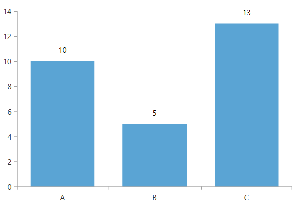
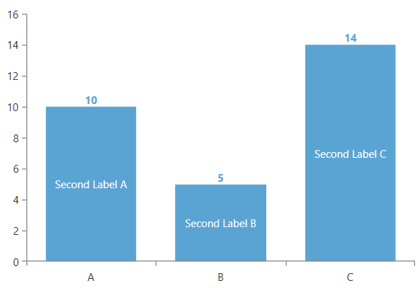
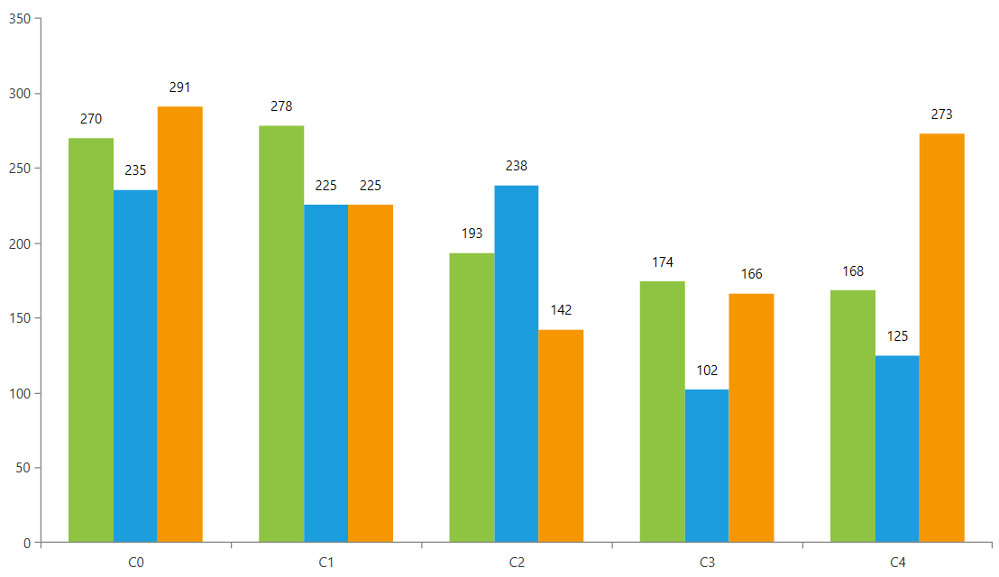

# Series Labels

The __RadChartView__ control exposes a mechanism to display and customize series labels.

To display labels for the data points in the chart series, set the series' __ShowLabels__ property to __True__.

__Example 1: Enabling Labels__
<snippet id='radchartview-features-labels-label-definition-example_1_enabling_labels-xaml' />

#### Figure 1: Series labels

## Customizing Labels

To customize the labels of the chart series, you can use the __ChartSeriesLabelDefinition__ element. The definition describes the label settings and it is used in the __LabelDefinitions__ collection of the chart series. One series can contain multiple definitions. Each data point will get a label for each label definition in the collection. For example, if the collection contains 2 definitions, 2 labels will be displayed per a data point visual.

The following example shows how to setup the chart in a data binding scenario and use ChartSeriesLabelDefinition to display custom labels.

__Example 2: Defining data point model__
<snippet id='radchartview-features-labels-label-definition-example_2_defining_data_point_model-cs' />

__Example 3: Populating with data__
<snippet id='radchartview-features-labels-label-definition-example_3_populating_with_data-cs' />

__Example 4: Defining two label definitions which add two label per data point__
<snippet id='radchartview-features-labels-label-definition-example_4_defining_two_label_definitions_which_add_two_label_per_data_point-xaml' />

#### Figure 2: Customized labels

The following list describes the properties available in the __ChartSeriesLabelDefinition__ class.

* __Binding__: `DataPointBinding` instance that points to a property of the data point underlying data item which gets the content of each label.

* __Format__: Format string used to format the label content, using the `String.Format` method.            

* __Margin__: Determines the offset of each label from the four box edges.

* __HorizontalAlignment__: Determines the horizontal alignment of each label relative to the data point it is associated with.            

* __VerticalAlignment__: Determines the vertical alignment of each label relative to the data point it is associated with.            

* __DefaultVisualStyle__: Sets a `Style` instance that defines the appearance of the default visual element representing the labels. The `TargetType` property of the `Style` should use the `TextBlock` type which is the default visual.

* __Template__: Sets a `DataTemplate` instance that will be used to define the visual element of the labels. If the Template property is set, the DefaultVisualStyle doesn't take effect. This is because in this case the default visual element is replaced by a content presenter with the custom `DataTemplate`.

* __TemplateSelector__: Sets a [DataTemplateSelector](https://docs.microsoft.com/en-us/dotnet/api/system.windows.controls.datatemplateselector?view=netframework-4.5) instance that is used to provide context-specific data templates, depending on the provided data point.

* __Strategy__: Allows you to define and set a custom `ChartSeriesLabelStrategy` instance that determines the labels' appearance, content and layout (size and position). Read more in the [Chart Series Label Strategy]() article.
	
	The chart also support smart labels strategy which is slightly different than the label definition's strategy. Read more in the [Smart Labels]() article.
	
## Using LabelDefinitions and SeriesProvider

In case the chart's [SeriesProvider]() is used, the __LabelDefinitions__ collection is not accessible in XAML. In this case, there are two approaches that can be implemented. This section shows how to use them with a sample data binding setup.

__Example 5: Defining series model (see Example 2 for the PlotInfo definition)__
<snippet id='radchartview-features-labels-label-definition-example_5_defining_series_model_see_example_2_for_the_plotinfo_definition-cs' />

__Example 6: Populating the data__
<snippet id='radchartview-features-labels-label-definition-example_6_populating_the_data-cs' />

* __Using an attached property__

	An attached property implementation will allow you to define a ChartSeriesLabelDefinition in XAML and then add it in code, using the PropertyChangedCallback of the property. The next example shows one way to implement this.
	
	__Example 7: Implementing the attached property__
	<snippet id='radchartview-features-labels-label-definition-example_7_implementing_the_attached_property-cs' />

	
	__Example 8: Adding label definition with an attached property__
	<snippet id='radchartview-features-labels-label-definition-example_8_adding_label_definition_with_an_attached_property-xaml' />

* __Using the SeriesCreated event__

	The [SeriesCreated](#events) event gives access to the generated series, so the event handler can be used to create ChartSeriesLabelDefinition objects in code.
	
	__Example 9: Adding label definition using the SeriesCreated event__
	<snippet id='radchartview-features-labels-label-definition-example_9_adding_label_definition_using_the_seriescreated_event-xaml' />

	
	__Example 10: Implement the SeriesCreated event handler__
	<snippet id='radchartview-features-labels-label-definition-example_10_implement_the_seriescreated_event_handler-cs' />

	
#### Figure 3: Customized labels with SeriesProvider

## See Also  
 * [Smart Labels]()
