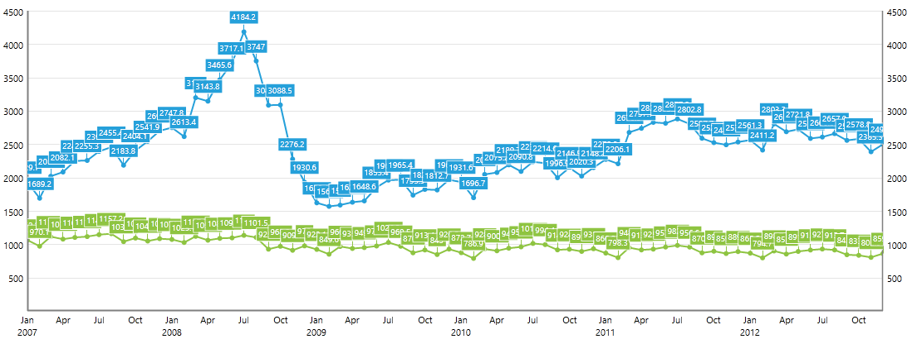
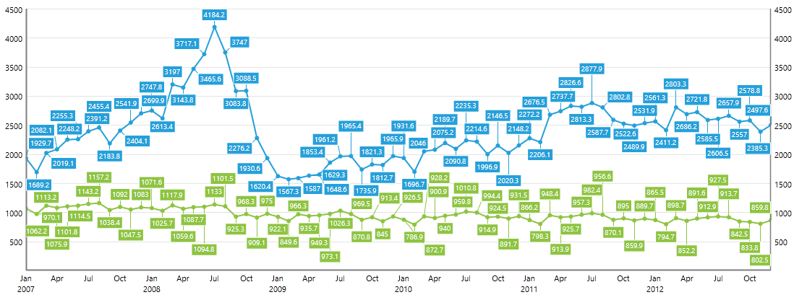
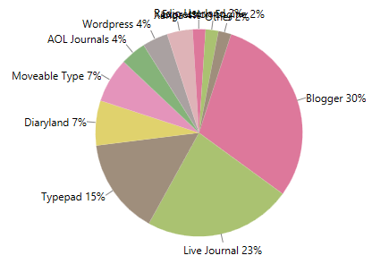
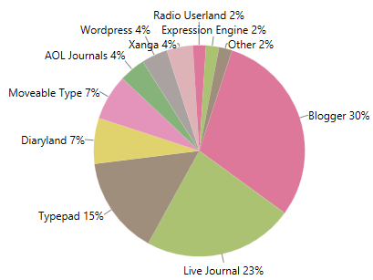
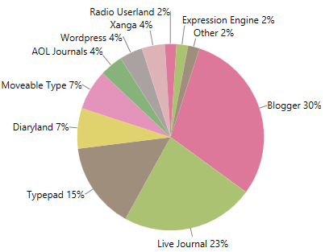
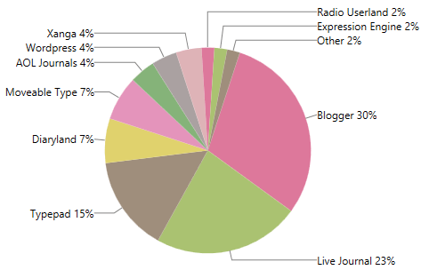
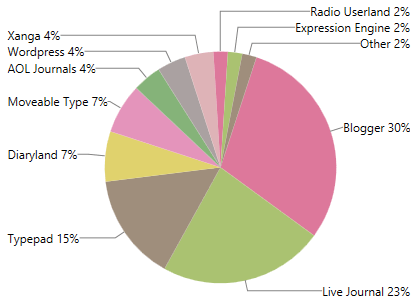
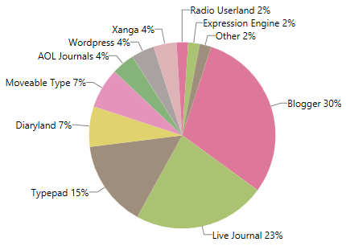

# Smart Labels

Since the official __Q1 2014__ release all series exposed by the __RadCartesianChart__ and the __RadPieChart__ controls support smart labels. The term "smart labels" refers to labels positioned in such a way that they do not overlap one another. This positioning strategy is helpful when the series has large number of data points with visualized labels. You can take advantage of this functionality through the __SmartLabelsStrategy__ property of the charting components. It is of type __ChartSmartLabelsStrategyBase__ and gets or sets the object that controls the positioning of the labels.      

## Using Smart Labels in RadCartesianChart

In order to enable a smart label strategy in a __RadCartesianChart__ you can utilize the __ChartSmartLabelsStrategy__.


```XAML
     <telerik:RadCartesianChart.SmartLabelsStrategy>
          <telerik:ChartSmartLabelsStrategy />
      </telerik:RadCartesianChart.SmartLabelsStrategy>
```

Let's say that you have line series with large number of data points and visualized labels

As you can see the labels are hard to read in such cases. The smart label strategy is designed to improve the readability of the labels. Once enabled, the labels will be rearranged so that each label is clearly visible.



You can find this feature demonstrated in our online [SmartLabels](https://demos.telerik.com/silverlight/#ChartView/SmartLabels) demo[WPFdemos](https://demos.telerik.com/wpf/) ChartView -> SmartLabels example.        

## Using Smart Labels in RadPieChart

In order to enable a smart label strategy in a __RadPieChart__ you can utilize the __PieChartSmartLabelsStrategy__.


```XAML
    <telerik:RadPieChart.SmartLabelsStrategy>
      <telerik:PieChartSmartLabelsStrategy/>
    </telerik:RadPieChart.SmartLabelsStrategy>
```

Let's say that you have __PieSeries__ with small slices and visualized labels



This smart labels strategy exposes the __DisplayMode__ property. It is an enumeration of type __PieChartLabelsDisplayMode__ and adjusts the positioning algorithm of the labels. It provides the following members:

* __Basic__ - this is the default value and it positions the labels inside the __PieSeries__ so that they do not overlap one another.
	

* __Outside__ - this value positions the labels outside the slices.
	

* __Spider__ - this value positions the labels outside the slices and aligns them by the first symbol of the labels.
	

* __SpiderAlignedOutwards__ - this value positions the labels outside the slices and aligns them by the last symbol of the labels.
	

* __SpiderUnaligned__ - this value positions the labels outside the slices and does not align them.
	

>important In order to visualize the connections between the labels and the corresponding data points, you can take advantage of the __LabelConnectorsSettings__ property of the chart series. 
