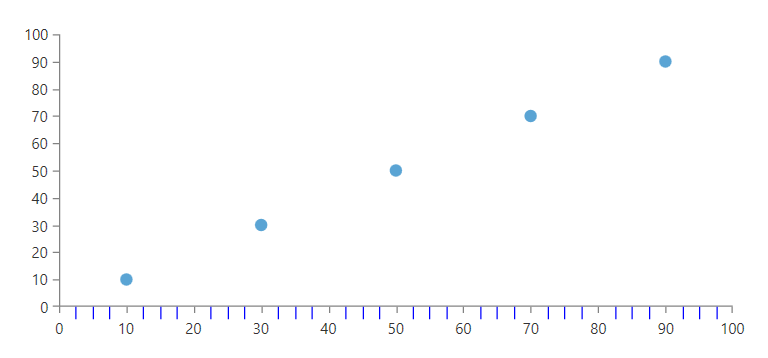
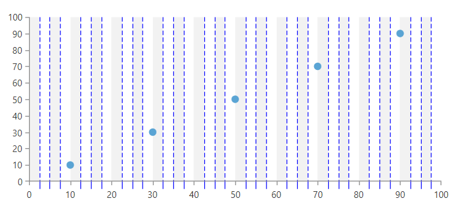
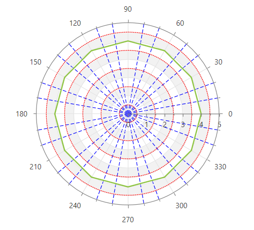

# Minor Ticks and Stripes

As of **R2 2022** the RadChartView control allows you to display **minor ticks and stripes** in addition to the major ticks and stripes.

## Minor Ticks

The minor ticks functionality is supported by the following types of axes:

* `NumericalAxis` (`LinearAxis` and `LogarithmicAxis`)
* `DateTimeContinuousAxis`
* `PolarAxis`
* `NumericRadialAxis`

The visibility and appearance of the minor ticks can be controlled via the following properties of these axes:

* `MinorTicksPerMajor`&mdash;The number of minor ticks per major interval.
* `MinorTickLength`&mdash;The length of the minor tick.
* `MinorTickOffset`&mdash;Index-based offset of the first tick to be displayed.
* `MinorTickTemplate`&mdash;The template that defines the appearance of all minor ticks present on the axis.
* `MinorTickStyle`&mdash;The style for each `Rectangle` instance created to represent a minor tick when no `MinorTickTemplate` is specified.

__Cartesian Chart with customized minor ticks__
<snippet id='radchartview-features-minor-ticks-and-stripes-cartesian_chart_with_customized_minor_ticks-xaml' />

## Stripes

In addition to the new minor tick functionality, both the [CartesianChartGrid](#cartesianchartgrid) and [PolarChartGrid](#polarchartgrid) now expose properties to control the visibility and appearance of the minor grid and strip lines.

### CartesianChartGrid

The CartesianChartGrid provides the following properties for customization of the grid and strip lines:

* `MinorLinesVisibility`&mdash;The visibility of minor grid lines. A value of type `GridLineVisibility` which can be either `None`, `X`, `Y` or `XY`.
* `MinorStripLinesVisibility`&mdash;The visibility of the grid's stripes. A value of type `GridLineVisibility` which can be either `None`, `X`, `Y` or `XY`.
* `MinorXLineStyle`&mdash;The style that defines the appearance of the minor lines along the X-axis.
* `MinorYLineStyle`&mdash;The style that defines the appearance of the minor lines along the Y-axis.
* `MinorXLineDashArray`&mdash;The dash array used to define each minor X-line StrokeDashArray
* `MinorYLineDashArray`&mdash;The dash array used to define each minor X-line StrokeDashArray

__Cartesian Chart with customized CartesianChartGrid__
<snippet id='radchartview-features-minor-ticks-and-stripes-cartesian_chart_with_customized_cartesianchartgrid-xaml' />

### PolarChartGrid

The PolarChartGrid provides the following properties for customization of the grid and strip lines:

* `MinorGridLineVisibility`&mdash;The visibility of minor grid lines. A value of type `PolarGridLineVisibility` which can be either `None`, `Radial`, `Polar` or `Both`.
* `MinorStripesVisibility`&mdash;The visibility of the grid's stripes. A value of type `PolarGridLineVisibility` which can be either `None`, `Radial`, `Polar` or `Both`.
* `MinorPolarLineStyle`&mdash;The style that defines the appearance of the minor polar (radius) lines within the grid.
* `MinorPolarLineDashArray`&mdash;The `DoubleCollection` that defines the pattern of the minor polar (radius) lines within the grid.
* `MinorRadialLineStyle`&mdash;The style that defines the appearance of the minor radial (angle) lines within the grid.
* `MinorRadialDashArray`&mdash;The `DoubleCollection` that defines the pattern of the minor radial (angle) lines within the grid.

__Polar Chart with customized PolarChartGrid__
<snippet id='radchartview-features-minor-ticks-and-stripes-polar_chart_with_customized_polarchartgrid-xaml' />

## See Also
* [Chart Grid]()
* [Axis]()
