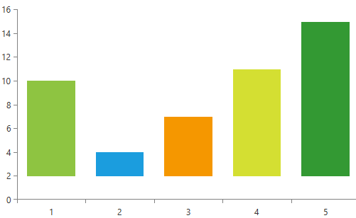

# OriginValue

Some series in the RadChartView suite have a mechanism which allows for determining from where the data points start drawing. This can be utilized by setting the **OriginValue** property of the series. **Example 1** demonstrates this property.

>tip The series which support this property are: **AreaSeries**, **ScatterAreaSeries**, **ScatterSplineAreaSeries**, **SplineAreaSeries**, **StepAreaSeries** and **BarSeries**.

__Example 1: BarSeries with OriginValue__
```XAML
		<telerik:RadCartesianChart Palette="Windows8">
			<telerik:RadCartesianChart.HorizontalAxis>
				<telerik:CategoricalAxis/>
			</telerik:RadCartesianChart.HorizontalAxis>

			<telerik:RadCartesianChart.VerticalAxis>
				<telerik:LinearAxis/>
			</telerik:RadCartesianChart.VerticalAxis>

			<telerik:RadCartesianChart.Series>
                <telerik:BarSeries OriginValue="2" PaletteMode="DataPoint">
                    <telerik:BarSeries.DataPoints>
						<telerik:CategoricalDataPoint Category="1" Value="10"/>
						<telerik:CategoricalDataPoint Category="2" Value="4"/>
						<telerik:CategoricalDataPoint Category="3" Value="7"/>
						<telerik:CategoricalDataPoint Category="4" Value="11"/>
						<telerik:CategoricalDataPoint Category="5" Value="15"/>
					</telerik:BarSeries.DataPoints>
				</telerik:BarSeries>
			</telerik:RadCartesianChart.Series>
		</telerik:RadCartesianChart>
```


#### Figure 1: Result from Example 1 


> For a demonstration in a different scenario, you can check out the [OriginValue](https://github.com/telerik/xaml-sdk/tree/master/ChartView/WPF/OriginValue) RadChartView SDK example.

## See also

* [Getting Started]()
* [Chart Types]()