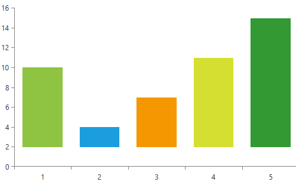

# OriginValue

Some series in the RadChartView suite have a mechanism which allows for determining from where the data points start drawing. This can be utilized by setting the **OriginValue** property of the series. **Example 1** demonstrates this property.

>tip The series which support this property are: **AreaSeries**, **ScatterAreaSeries**, **ScatterSplineAreaSeries**, **SplineAreaSeries**, **StepAreaSeries** and **BarSeries**.

__Example 1: BarSeries with OriginValue__
<snippet id='radchartview-features-originvalue-example_1_barseries_with_originvalue-xaml' />

#### Figure 1: Result from Example 1 

> For a demonstration in a different scenario, you can check out the [OriginValue](https://github.com/telerik/xaml-sdk/tree/master/ChartView/WPF/OriginValue) RadChartView SDK example.

## See also

* [Getting Started]()
* [Chart Types]()