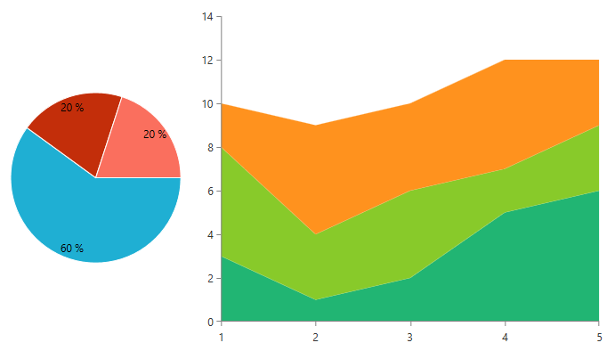

# Creating Custom Palettes

Here you can learn how you can create your own chart palette.
      

## Global Entries vs. Series Entries

You can create a custom palette by instantiating an object of type __ChartPalette__. There are two collections which we can use to set the colors in our palette. The first is the __GlobalEntries__ and the other is __SeriesEntries__. The GlobalEntries is a collection of PaletteEntries, which will be used for all types of chart series. The SeriesEntries allows us to specify different collections of PaletteEntries for each type of chart series. For example, if we want to have one behavior for the pie series and another for the bar series, here is how we can achieve it:

<snippet id='radchartview-features-palettes-custom-palettes-block_1-xaml' />

Notice the __SeriesFamily__ property, which is available for the collections in the SeriesEntries. If we have this palette in a chart, the first collection will be used for the pie series, the second - for the bar series and for all other types of series - the __GlobalEntries__ collection.

>Note that defining GlobalEntries or SeriesEntries is not mandatory - you can use either one of the two or you can combine them as in the current example.          

<snippet id='radchartview-features-palettes-custom-palettes-block_2-xaml' />

__Example showing the custom palette__  

In the above example there two charts - a Pie chart and a Cartesian chart. The PieSeries of the Pie chart are using the colors from the __PaletteEntryCollection__  with __SeriesFamily__ set to "Pie". Since we did not set a specific __PaletteEntryCollection__ for the area series of the second chart, they use the colors from the __GlobalEntries__ collection.
        

