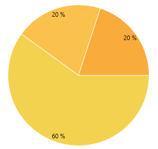

# Introduction

This series of articles will give an overview of the Palette colorization mechanism of RadChartView.

The __palette__ is a set of predefined Fills and Strokes which can be used to set the coloring of a chart much easier then setting explicitly the colors for each bar or slice. RadChartView brings you the options to define your own palettes and to use the ones we have prepared for you as well.

__RadPieChart with Warm Pallete__ 
```XAML	
	<telerik:RadPieChart Palette="Warm">
		<telerik:PieSeries>
		  <telerik:PieSeries.DataPoints/>
			<telerik:PieDataPoint Value="9" />
			<telerik:PieDataPoint Value="3" />
			<telerik:PieDataPoint Value="3" />
		  </telerik:PieSeries.DataPoints>
		</telerik:PieSeries>
	</telerik:RadPieChart>
```

__Pie chart with the built-in Warm palette__  



The palette coloring is index based, which means that each next chart item (series or data point) will get the next [palette entry]() from the palette collection. When the palette entries are exhausted, they will start repeating. For example, the built-in palettes have 8 colors defined. The first chart series will take the first palette color, the second series the second color, and so on. If you end up with, lets say, 9 series, the palette entries will start repeating and the first entry will be used for the 9th chart series.

By default the coloring is applied based on the series index, but few of the chart series (like `BarSeries`) allow you to change this behavior via their [PaletteMode]() property.

## Built In Palettes

Here are all of the predefined chart palettes:

<table>
  <tr>
    <th>Name</th>
    <th>Pallete</th>
  </tr>
  <tr>
    <td>Arctic</td>
		<td>
			<div style="width:20px;height:20px;background: #8FCAEE;display: inline-block;"></div> 
			<div style="width:20px;height:20px;background: #4CA9D7;display: inline-block;"></div>
			<div style="width:20px;height:20px;background: #1E7BA9;display: inline-block;"></div>
			<div style="width:20px;height:20px;background: #BDC1C5;display: inline-block;"></div>
			<div style="width:20px;height:20px;background: #8C8C8C;display: inline-block;"></div>
			<div style="width:20px;height:20px;background: #CF1C1F;display: inline-block;"></div>
			<div style="width:20px;height:20px;background: #F0484B;display: inline-block;"></div>
			<div style="width:20px;height:20px;background: #FF867F;display: inline-block;"></div>
		</td>
  </tr>
  <tr>
    <td>Autumn</td>
    <td>
			<div style="width:20px;height:20px;background: #97A035;display: inline-block;"></div> 
			<div style="width:20px;height:20px;background: #BFAD61;display: inline-block;"></div>
			<div style="width:20px;height:20px;background: #E2CB70;display: inline-block;"></div>
			<div style="width:20px;height:20px;background: #ECB552;display: inline-block;"></div>
			<div style="width:20px;height:20px;background: #DD7F33;display: inline-block;"></div>
			<div style="width:20px;height:20px;background: #D15B27;display: inline-block;"></div>
			<div style="width:20px;height:20px;background: #B54824;display: inline-block;"></div>
			<div style="width:20px;height:20px;background: #7D3B25;display: inline-block;"></div>
		</td>
  </tr>
  <tr>
    <td>Cold</td>
    <td>
			<div style="width:20px;height:20px;background: #83D4F1;display: inline-block;"></div> 
			<div style="width:20px;height:20px;background: #4BAEDB;display: inline-block;"></div>
			<div style="width:20px;height:20px;background: #288DBA;display: inline-block;"></div>
			<div style="width:20px;height:20px;background: #7CCCD6;display: inline-block;"></div>
			<div style="width:20px;height:20px;background: #4BADB9;display: inline-block;"></div>
			<div style="width:20px;height:20px;background: #97CFE5;display: inline-block;"></div>
			<div style="width:20px;height:20px;background: #63B2CF;display: inline-block;"></div>
			<div style="width:20px;height:20px;background: #4593AC;display: inline-block;"></div>
		</td>
  </tr>
  <tr>
    <td>Flower</td>
    <td>
			<div style="width:20px;height:20px;background: #DD789B;display: inline-block;"></div> 
			<div style="width:20px;height:20px;background: #AAC271;display: inline-block;"></div>
			<div style="width:20px;height:20px;background: #9F8E7C;display: inline-block;"></div>
			<div style="width:20px;height:20px;background: #E0D26D;display: inline-block;"></div>
			<div style="width:20px;height:20px;background: #E494BB;display: inline-block;"></div>
			<div style="width:20px;height:20px;background: #85B379;display: inline-block;"></div>
			<div style="width:20px;height:20px;background: #AAA1A1;display: inline-block;"></div>
			<div style="width:20px;height:20px;background: #DEB3B7;display: inline-block;"></div>
		</td>
  </tr>
  <tr>
    <td>Forest</td>
    <td>
			<div style="width:20px;height:20px;background: #ADB827;display: inline-block;"></div> 
			<div style="width:20px;height:20px;background: #F1A54C;display: inline-block;"></div>
			<div style="width:20px;height:20px;background: #A66940;display: inline-block;"></div>
			<div style="width:20px;height:20px;background: #DB6340;display: inline-block;"></div>
			<div style="width:20px;height:20px;background: #DCA063;display: inline-block;"></div>
			<div style="width:20px;height:20px;background: #8BA041;display: inline-block;"></div>
			<div style="width:20px;height:20px;background: #C09366;display: inline-block;"></div>
			<div style="width:20px;height:20px;background: #F2BE4B;display: inline-block;"></div>
		</td>
  </tr>
  <tr>
    <td>Grayscale</td>
    <td>
			<div style="width:20px;height:20px;background: #404040;display: inline-block;"></div> 
			<div style="width:20px;height:20px;background: #808080;display: inline-block;"></div>
			<div style="width:20px;height:20px;background: #B3B3B3;display: inline-block;"></div>
			<div style="width:20px;height:20px;background: #595959;display: inline-block;"></div>
			<div style="width:20px;height:20px;background: #999999;display: inline-block;"></div>
			<div style="width:20px;height:20px;background: #C0C0C0;display: inline-block;"></div>
			<div style="width:20px;height:20px;background: #666666;display: inline-block;"></div>
			<div style="width:20px;height:20px;background: #A6A6A6;display: inline-block;"></div>
		</td>
  </tr>
	<tr>
    <td>Ground</td>
    <td>
			<div style="width:20px;height:20px;background: #FFBE8C;display: inline-block;"></div> 
			<div style="width:20px;height:20px;background: #F2875A;display: inline-block;"></div>
			<div style="width:20px;height:20px;background: #CC4343;display: inline-block;"></div>
			<div style="width:20px;height:20px;background: #6C524E;display: inline-block;"></div>
			<div style="width:20px;height:20px;background: #8A7161;display: inline-block;"></div>
			<div style="width:20px;height:20px;background: #B09176;display: inline-block;"></div>
			<div style="width:20px;height:20px;background: #DAB89B;display: inline-block;"></div>
			<div style="width:20px;height:20px;background: #B65845;display: inline-block;"></div>
		</td>
  </tr>
	<tr>
    <td>Lilac</td>
    <td>
			<div style="width:20px;height:20px;background: #88C97F;display: inline-block;"></div> 
			<div style="width:20px;height:20px;background: #80D5CF;display: inline-block;"></div>
			<div style="width:20px;height:20px;background: #C3AAEF;display: inline-block;"></div>
			<div style="width:20px;height:20px;background: #6E8FD4;display: inline-block;"></div>
			<div style="width:20px;height:20px;background: #A4D386;display: inline-block;"></div>
			<div style="width:20px;height:20px;background: #A4B5EF;display: inline-block;"></div>
			<div style="width:20px;height:20px;background: #61BBD1;display: inline-block;"></div>
			<div style="width:20px;height:20px;background: #A0A0D2;display: inline-block;"></div>
		</td>
  </tr>
	<tr>
    <td>Natural</td>
    <td>
			<div style="width:20px;height:20px;background: #EF7513;display: inline-block;"></div> 
			<div style="width:20px;height:20px;background: #F0A13F;display: inline-block;"></div>
			<div style="width:20px;height:20px;background: #EFD159;display: inline-block;"></div>
			<div style="width:20px;height:20px;background: #C1CA5F;display: inline-block;"></div>
			<div style="width:20px;height:20px;background: #97A031;display: inline-block;"></div>
			<div style="width:20px;height:20px;background: #ADA17E;display: inline-block;"></div>
			<div style="width:20px;height:20px;background: #8B473A;display: inline-block;"></div>
			<div style="width:20px;height:20px;background: #CE4226;display: inline-block;"></div>
		</td>
  </tr>
	<tr>
    <td>Pastel</td>
    <td>
			<div style="width:20px;height:20px;background: #C9A2C8;display: inline-block;"></div> 
			<div style="width:20px;height:20px;background: #98BED9;display: inline-block;"></div>
			<div style="width:20px;height:20px;background: #9CD084;display: inline-block;"></div>
			<div style="width:20px;height:20px;background: #719BAE;display: inline-block;"></div>
			<div style="width:20px;height:20px;background: #80C4B2;display: inline-block;"></div>
			<div style="width:20px;height:20px;background: #94A0BC;display: inline-block;"></div>
			<div style="width:20px;height:20px;background: #A0CBD3;display: inline-block;"></div>
			<div style="width:20px;height:20px;background: #D9CAD1;display: inline-block;"></div>
		</td>
  </tr>
	<tr>
    <td>Rainbow</td>
    <td>
			<div style="width:20px;height:20px;background: #1171CA;display: inline-block;"></div> 
			<div style="width:20px;height:20px;background: #3294DA;display: inline-block;"></div>
			<div style="width:20px;height:20px;background: #45B5B2;display: inline-block;"></div>
			<div style="width:20px;height:20px;background: #8CC221;display: inline-block;"></div>
			<div style="width:20px;height:20px;background: #AFDA3D;display: inline-block;"></div>
			<div style="width:20px;height:20px;background: #E3DA20;display: inline-block;"></div>
			<div style="width:20px;height:20px;background: #F58E13;display: inline-block;"></div>
			<div style="width:20px;height:20px;background: #E03D0B;display: inline-block;"></div>
		</td>
  </tr>
		<tr>
    <td>Spring</td>
    <td>
			<div style="width:20px;height:20px;background: #BED781;display: inline-block;"></div> 
			<div style="width:20px;height:20px;background: #F8A6C4;display: inline-block;"></div>
			<div style="width:20px;height:20px;background: #84C3BA;display: inline-block;"></div>
			<div style="width:20px;height:20px;background: #C0B2B2;display: inline-block;"></div>
			<div style="width:20px;height:20px;background: #9DCE67;display: inline-block;"></div>
			<div style="width:20px;height:20px;background: #F48EAD;display: inline-block;"></div>
			<div style="width:20px;height:20px;background: #E0CCCA;display: inline-block;"></div>
			<div style="width:20px;height:20px;background: #A0CBDA;display: inline-block;"></div>
		</td>
  </tr>
		<tr>
    <td>Summer</td>
    <td>
			<div style="width:20px;height:20px;background: #3FA7C4;display: inline-block;"></div> 
			<div style="width:20px;height:20px;background: #9ED552;display: inline-block;"></div>
			<div style="width:20px;height:20px;background: #E1DB63;display: inline-block;"></div>
			<div style="width:20px;height:20px;background: #C49FD9;display: inline-block;"></div>
			<div style="width:20px;height:20px;background: #C5DF5E;display: inline-block;"></div>
			<div style="width:20px;height:20px;background: #55C0CD;display: inline-block;"></div>
			<div style="width:20px;height:20px;background: #86D8A6;display: inline-block;"></div>
			<div style="width:20px;height:20px;background: #ADADD7;display: inline-block;"></div>
		</td>
  </tr>
		<tr>
    <td>Warm</td>
    <td>
			<div style="width:20px;height:20px;background: #F3D24F;display: inline-block;"></div> 
			<div style="width:20px;height:20px;background: #FAC24D;display: inline-block;"></div>
			<div style="width:20px;height:20px;background: #F9AC3B;display: inline-block;"></div>
			<div style="width:20px;height:20px;background: #F58E13;display: inline-block;"></div>
			<div style="width:20px;height:20px;background: #FA6800;display: inline-block;"></div>
			<div style="width:20px;height:20px;background: #F04600;display: inline-block;"></div>
			<div style="width:20px;height:20px;background: #DE2E05;display: inline-block;"></div>
			<div style="width:20px;height:20px;background: #CB0C0C;display: inline-block;"></div>
		</td>
  </tr>
	<tr>
    <td>Windows8</td>
    <td>
			<div style="width:20px;height:20px;background: #8EC441;display: inline-block;"></div> 
			<div style="width:20px;height:20px;background: #1B9DDE;display: inline-block;"></div>
			<div style="width:20px;height:20px;background: #F59700;display: inline-block;"></div>
			<div style="width:20px;height:20px;background: #D4DF32;display: inline-block;"></div>
			<div style="width:20px;height:20px;background: #339933;display: inline-block;"></div>
			<div style="width:20px;height:20px;background: #00ABA9;display: inline-block;"></div>
			<div style="width:20px;height:20px;background: #DC5B20;display: inline-block;"></div>
			<div style="width:20px;height:20px;background: #E8BC34;display: inline-block;"></div>
		</td>
  </tr>
	<tr>
    <td>Office2013</td>
    <td>
			<div style="width:20px;height:20px;background: #0072C6;display: inline-block;"></div> 
			<div style="width:20px;height:20px;background: #007133;display: inline-block;"></div>
			<div style="width:20px;height:20px;background: #DD5800;display: inline-block;"></div>
			<div style="width:20px;height:20px;background: #00178F;display: inline-block;"></div>
			<div style="width:20px;height:20px;background: #682079;display: inline-block;"></div>
			<div style="width:20px;height:20px;background: #A13B39;display: inline-block;"></div>
			<div style="width:20px;height:20px;background: #087669;display: inline-block;"></div>
			<div style="width:20px;height:20px;background: #1B9DDE;display: inline-block;"></div>
		</td>
  </tr>
	<tr>
    <td>VisualStudio2013</td>
    <td>
			<div style="width:20px;height:20px;background: #3399FF;display: inline-block;"></div> 
			<div style="width:20px;height:20px;background: #014358;display: inline-block;"></div>
			<div style="width:20px;height:20px;background: #1F8A71;display: inline-block;"></div>
			<div style="width:20px;height:20px;background: #BDD63B;display: inline-block;"></div>
			<div style="width:20px;height:20px;background: #FFE00B;display: inline-block;"></div>
			<div style="width:20px;height:20px;background: #F27421;display: inline-block;"></div>
			<div style="width:20px;height:20px;background: #BB0000;display: inline-block;"></div>
			<div style="width:20px;height:20px;background: #550033;display: inline-block;"></div>
		</td>
  </tr>
	<tr>
    <td>Green</td>
    <td>
			<div style="width:20px;height:20px;background: #7FBC41;display: inline-block;"></div> 
			<div style="width:20px;height:20px;background: #4D9221;display: inline-block;"></div>
			<div style="width:20px;height:20px;background: #276419;display: inline-block;"></div>
			<div style="width:20px;height:20px;background: #114605;display: inline-block;"></div>
			<div style="width:20px;height:20px;background: #004F3F;display: inline-block;"></div>
			<div style="width:20px;height:20px;background: #005F66;display: inline-block;"></div>
			<div style="width:20px;height:20px;background: #017351;display: inline-block;"></div>
			<div style="width:20px;height:20px;background: #03C383;display: inline-block;"></div>
		</td>
  </tr>
	<tr>
    <td>Office2016</td>
    <td>
			<div style="width:20px;height:20px;background: #5B9BD5;display: inline-block;"></div> 
			<div style="width:20px;height:20px;background: #ED7D31;display: inline-block;"></div>
			<div style="width:20px;height:20px;background: #A5A5A5;display: inline-block;"></div>
			<div style="width:20px;height:20px;background: #FFC000;display: inline-block;"></div>
			<div style="width:20px;height:20px;background: #4472C4;display: inline-block;"></div>
			<div style="width:20px;height:20px;background: #70AD47;display: inline-block;"></div>
			<div style="width:20px;height:20px;background: #255E91;display: inline-block;"></div>
			<div style="width:20px;height:20px;background: #9E480E;display: inline-block;"></div>
		</td>
  </tr>
	<tr>
    <td>Material</td>
    <td>
			<div style="width:20px;height:20px;background: #3F51B5;display: inline-block;"></div> 
			<div style="width:20px;height:20px;background: #E91E63;display: inline-block;"></div>
			<div style="width:20px;height:20px;background: #FFC107;display: inline-block;"></div>
			<div style="width:20px;height:20px;background: #009688;display: inline-block;"></div>
			<div style="width:20px;height:20px;background: #9C27B0;display: inline-block;"></div>
			<div style="width:20px;height:20px;background: #2196F3;display: inline-block;"></div>
			<div style="width:20px;height:20px;background: #8BC34A;display: inline-block;"></div>
			<div style="width:20px;height:20px;background: #795548;display: inline-block;"></div>
		</td>
  </tr>
	<tr>
    <td>Fluent</td>
    <td>
			<div style="width:20px;height:20px;background: #0099BC;display: inline-block;"></div> 
			<div style="width:20px;height:20px;background: #E74856;display: inline-block;"></div>
			<div style="width:20px;height:20px;background: #FFB900;display: inline-block;"></div>
			<div style="width:20px;height:20px;background: #0078D7;display: inline-block;"></div>
			<div style="width:20px;height:20px;background: #8764B8;display: inline-block;"></div>
			<div style="width:20px;height:20px;background: #00CC6A;display: inline-block;"></div>
			<div style="width:20px;height:20px;background: #00B7C3;display: inline-block;"></div>
			<div style="width:20px;height:20px;background: #CA5010;display: inline-block;"></div>
		</td>
  </tr>
  <tr>
    <td>Crystal</td>
    <td>
			<div style="width:20px;height:20px;background: #3366FF;display: inline-block;"></div> 
			<div style="width:20px;height:20px;background: #CC3366;display: inline-block;"></div>
			<div style="width:20px;height:20px;background: #FFCC00;display: inline-block;"></div>
			<div style="width:20px;height:20px;background: #0099FF;display: inline-block;"></div>
			<div style="width:20px;height:20px;background: #6633CC;display: inline-block;"></div>
			<div style="width:20px;height:20px;background: #00CC99;display: inline-block;"></div>
			<div style="width:20px;height:20px;background: #00CCFF;display: inline-block;"></div>
			<div style="width:20px;height:20px;background: #FF9933;display: inline-block;"></div>
		</td>
  </tr>
  <tr>
    <td>VisualStudio2019</td>
    <td>
			<div style="width:20px;height:20px;background: #40508D;display: inline-block;"></div> 
			<div style="width:20px;height:20px;background: #40778D;display: inline-block;"></div>
			<div style="width:20px;height:20px;background: #508D40;display: inline-block;"></div>
			<div style="width:20px;height:20px;background: #B3CD2B;display: inline-block;"></div>
			<div style="width:20px;height:20px;background: #E5C909;display: inline-block;"></div>
			<div style="width:20px;height:20px;background: #8D7D40;display: inline-block;"></div>
			<div style="width:20px;height:20px;background: #8D4077;display: inline-block;"></div>
			<div style="width:20px;height:20px;background: #57408D;display: inline-block;"></div>
		</td>
  </tr>
 <tr>
    <td>Office2019</td>
    <td>
			<div style="width:20px;height:20px;background: #106EBE;display: inline-block;"></div> 
			<div style="width:20px;height:20px;background: #F55C69;display: inline-block;"></div>
			<div style="width:20px;height:20px;background: #F1E132;display: inline-block;"></div>
			<div style="width:20px;height:20px;background: #2F96ED;display: inline-block;"></div>
			<div style="width:20px;height:20px;background: #A16FE8;display: inline-block;"></div>
			<div style="width:20px;height:20px;background: #3EEC98;display: inline-block;"></div>
			<div style="width:20px;height:20px;background: #37DBE6;display: inline-block;"></div>
			<div style="width:20px;height:20px;background: #F08034;display: inline-block;"></div>
		</td>
  </tr>
 <tr>
    <td>Windows11</td>
    <td>
	<div style="width:20px;height:20px;background: #0078D4;display: inline-block;"></div> 
	<div style="width:20px;height:20px;background: #EA005E;display: inline-block;"></div>
	<div style="width:20px;height:20px;background: #60CCFE;display: inline-block;"></div>
	<div style="width:20px;height:20px;background: #0093F9;display: inline-block;"></div>
	<div style="width:20px;height:20px;background: #00B7C3;display: inline-block;"></div>
	<div style="width:20px;height:20px;background: #FFB900;display: inline-block;"></div>
	<div style="width:20px;height:20px;background: #C239B3;display: inline-block;"></div>
	<div style="width:20px;height:20px;background: #6B69D6;display: inline-block;"></div>
     </td>
  </tr>
</table>

## See also 

* [Creating Custom palettes]()
* [Palette Entry]()
