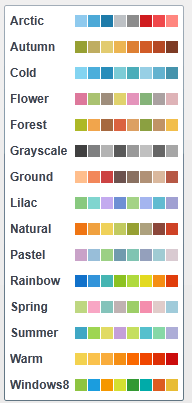

# Introduction

This series of articles will give an overview of the Palette colorization mechanism of RadChartView.
      

## Overview

The __palette__ is a set of predefined Fills and Strokes which can be used to set
          the coloring of a chart much easier then setting explicitly the colors for each bar or slice.
          RadChartView brings you the options to define your own palettes and to use the
          ones we have prepared for you as well. This is how the "Warm" palette can be
          used for a simple PieChart:
        

	
          <telerik:RadPieChart Palette="Warm">
            <telerik:PieSeries>
              <telerik:PieSeries.DataPoints/>
                <telerik:PieDataPoint Value="9" />
                <telerik:PieDataPoint Value="3" />
                <telerik:PieDataPoint Value="3" />
              </telerik:PieSeries.DataPoints>
            </telerik:PieSeries>
          </telerik:RadPieChart>
        

Here is a snapshot of the example:
        

## Built In Palettes

Currently RadChartView has 15 predefined palettes, each with 8 colors:
        

# See Also
