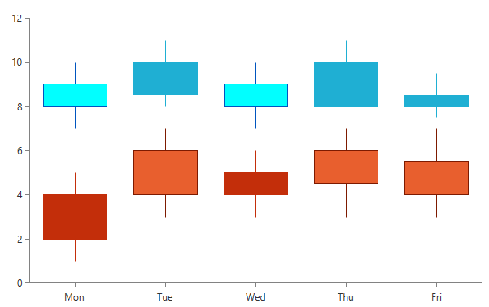

# Palette Entry

Each palette contains PaletteEntry objects which expose the following properties:        

* Fill
* Stroke
* AdditionalFill
* AdditionalStroke

__Fill__ and __Stroke__ are the most commonly used properties which affect most of the series in RadChartView. __AdditionalFill__ and __AdditionalStroke__ are more specific and are not relevant for all types of series. 

> The AdditionalStroke property, for example, is relevant in the OhlcSeries, where the properties OpenBinding and CloseBinding define two types of sticks, depending on which of these properties has a bigger value. One of these types takes its color from Stroke and the other - from AdditionalStroke. Similarly, the AdditionalFill property affects the CandlestickSeries.     

__Example 1: Creating a custom palette__
```XAML
	<telerik:RadCartesianChart>
	    <telerik:RadCartesianChart.Palette>
	        <telerik:ChartPalette>
	            <telerik:ChartPalette.GlobalEntries>
	                <telerik:PaletteEntry Fill="#FF1FAFD3" Stroke="#FF1FAFD3" AdditionalFill="#FF01FFFF" AdditionalStroke="#0055BF"/>
	                <telerik:PaletteEntry Fill="#FFC32E0A" Stroke="#FFC32E0A" AdditionalFill="#FFE85F2E" AdditionalStroke="#7D1A00"/>
	            </telerik:ChartPalette.GlobalEntries>
	        </telerik:ChartPalette>
	    </telerik:RadCartesianChart.Palette>
	
	    <telerik:RadCartesianChart.HorizontalAxis>
	        <telerik:CategoricalAxis/>
	    </telerik:RadCartesianChart.HorizontalAxis>
	    <telerik:RadCartesianChart.VerticalAxis>
	        <telerik:LinearAxis/>
	    </telerik:RadCartesianChart.VerticalAxis>
	
	    <telerik:CandlestickSeries>
	        <telerik:CandlestickSeries.DataPoints>
	            <telerik:OhlcDataPoint Category="Mon" Open="9" High="10" Low="7" Close="8"/>
	            <telerik:OhlcDataPoint Category="Tue" Open="8.5" High="11" Low="8" Close="10"/>
	            <telerik:OhlcDataPoint Category="Wed" Open="9" High="10" Low="7" Close="8"/>
	            <telerik:OhlcDataPoint Category="Thu" Open="8" High="11" Low="8" Close="10"/>
	            <telerik:OhlcDataPoint Category="Fri" Open="8" High="9.5" Low="7.5" Close="8.5"/>
	        </telerik:CandlestickSeries.DataPoints>
	    </telerik:CandlestickSeries>
	
	    <telerik:CandlestickSeries>
	        <telerik:CandlestickSeries.DataPoints>
	            <telerik:OhlcDataPoint Category="Mon" Low="1" High="5" Open="2" Close="4"/>
	            <telerik:OhlcDataPoint Category="Tue" Low="3" High="7" Open="6" Close="4"/>
	            <telerik:OhlcDataPoint Category="Wed" Low="3" High="6" Open="4" Close="5"/>
	            <telerik:OhlcDataPoint Category="Thu" Low="3" High="7" Open="6" Close="4.5"/>
	            <telerik:OhlcDataPoint Category="Fri" Low="3" High="7" Open="5.5" Close="4"/>
	        </telerik:CandlestickSeries.DataPoints>
	    </telerik:CandlestickSeries>	
	</telerik:RadCartesianChart>
```

#### __Figure 1: OhlcSeries with Custom Palette__


## Getting a PaletteEntry of a Series

 You can get the PaletteEntry of a series using the **Palette** property of the chart through its **GetEntry** method. 

 > When you are working with BarSeries with its property **PaletteMode** set to **DataPoint** you can also get the PaletteEntry per data point.

__Example 2: Getting the palette entry of a series__
```C#
	int index = chart.Series.IndexOf(series);
	PaletteEntry? paletteEntry = this.chart.Palette.GetEntry(series, index);
```
```VB.NET
	Dim index As Integer = chart.Series.IndexOf(series)
	Dim paletteEntry As System.Nullable(Of PaletteEntry) = Me.chart.Palette.GetEntry(series, index)
```

## See Also
* [Palettes]()
* [Creating Custom palettes]()