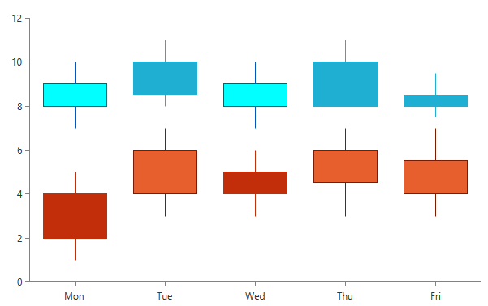

# Palette Entry

Each palette contains PaletteEntry objects which expose the following properties:        

* Fill
* Stroke
* AdditionalFill
* AdditionalStroke

__Fill__ and __Stroke__ are the most commonly used properties which affect most of the series in RadChartView. __AdditionalFill__ and __AdditionalStroke__ are more specific and are not relevant for all types of series. 

> The AdditionalStroke property, for example, is relevant in the OhlcSeries, where the properties OpenBinding and CloseBinding define two types of sticks, depending on which of these properties has a bigger value. One of these types takes its color from Stroke and the other - from AdditionalStroke. Similarly, the AdditionalFill property affects the CandlestickSeries.     

__Example 1: Creating a custom palette__
<snippet id='radchartview-features-palettes-paletteentry-example_1_creating_a_custom_palette-xaml' />

#### __Figure 1: OhlcSeries with Custom Palette__

## Getting a PaletteEntry of a Series

 You can get the PaletteEntry of a series using the **Palette** property of the chart through its **GetEntry** method. 

 > When you are working with BarSeries with its property **PaletteMode** set to **DataPoint** you can also get the PaletteEntry per data point.

__Example 2: Getting the palette entry of a series__
<snippet id='radchartview-features-palettes-paletteentry-example_2_getting_the_palette_entry_of_a_series-cs' />

<snippet id='radchartview-features-palettes-paletteentry-example_2_getting_the_palette_entry_of_a_series-vb' />

## See Also
* [Palettes]()
* [Creating Custom palettes]()