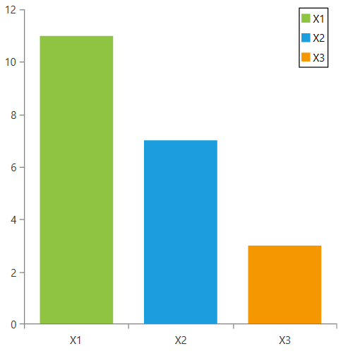

# RadLegend Support

This topic will give you an overview of the RadLegend support that RadChartView provides.
      

## 

The chart exposes a LegendItems property which is to be passed to the RadLegend.
          The LegendItems collection is empty by default and no legend items will be generated for a
          series unless the LegendSettings property of the series is set.
          The chart, as it is the legend items provider, sets the Title, MarkerStroke, MarkerFill and
          MarkerGeometry internally in correspondance to the legend settings of the series.
        

The example below demonstrates the cooperation between the RadLegend and RadCartesianChart.
          In this example the chart uses a palette to color its series and it uses the same palette to color the legend items.
          Note that no legend item is present for the last series as the LegendSettings property has not been set.
          The BarSeries is set up to use DataPointLegendSettings and this is why a legend item is created for each DataPoint.
          If a SeriesLegendSettings was used instead - only a single item would have been generated for the BarSeries.
        

#### __XAML__

{{region radchartview-features-radlegend-support_0}}
	<Grid>
	    <telerik:RadCartesianChart x:Name="chart1" Palette="Summer">
	        <telerik:RadCartesianChart.HorizontalAxis>
	            <telerik:CategoricalAxis />
	        </telerik:RadCartesianChart.HorizontalAxis>
	        <telerik:RadCartesianChart.VerticalAxis>
	            <telerik:LinearAxis />
	        </telerik:RadCartesianChart.VerticalAxis>
	        <telerik:RadCartesianChart.Series>
	            <telerik:BarSeries x:Name="series1">
	                <telerik:BarSeries.DataPoints>
	                    <telerik:CategoricalDataPoint Category="X1" Value="11" />
	                    <telerik:CategoricalDataPoint Category="X2" Value="7" />
	                    <telerik:CategoricalDataPoint Category="X3" Value="3" />
	                </telerik:BarSeries.DataPoints>
	                <telerik:BarSeries.LegendSettings>
	                    <telerik:DataPointLegendSettings />
	                </telerik:BarSeries.LegendSettings>
	            </telerik:BarSeries>
	            <telerik:LineSeries x:Name="series2">
	                <telerik:LineSeries.DataPoints>
	                    <telerik:CategoricalDataPoint Category="X1" Value="15" />
	                    <telerik:CategoricalDataPoint Category="X2" Value="14" />
	                    <telerik:CategoricalDataPoint Category="X3" Value="13" />
	                </telerik:LineSeries.DataPoints>
	                <telerik:LineSeries.LegendSettings>
	                    <telerik:SeriesLegendSettings Title="Line Series" />
	                </telerik:LineSeries.LegendSettings>
	            </telerik:LineSeries>
	            <telerik:LineSeries x:Name="series3">
	                <telerik:LineSeries.DataPoints>
	                    <telerik:CategoricalDataPoint Category="X1" Value="14" />
	                    <telerik:CategoricalDataPoint Category="X2" Value="13" />
	                    <telerik:CategoricalDataPoint Category="X3" Value="10" />
	                </telerik:LineSeries.DataPoints>
	            </telerik:LineSeries>
	        </telerik:RadCartesianChart.Series>
	    </telerik:RadCartesianChart>
		
	    <telerik:RadLegend Background="White" 
	                       BorderBrush="Black" 
	                       BorderThickness="1" 
	                       Items="{Binding LegendItems, ElementName=chart1}" 
	                       HorizontalAlignment="Right" 
	                       VerticalAlignment="Top" />
	</Grid>
	{{endregion}}

# See Also
