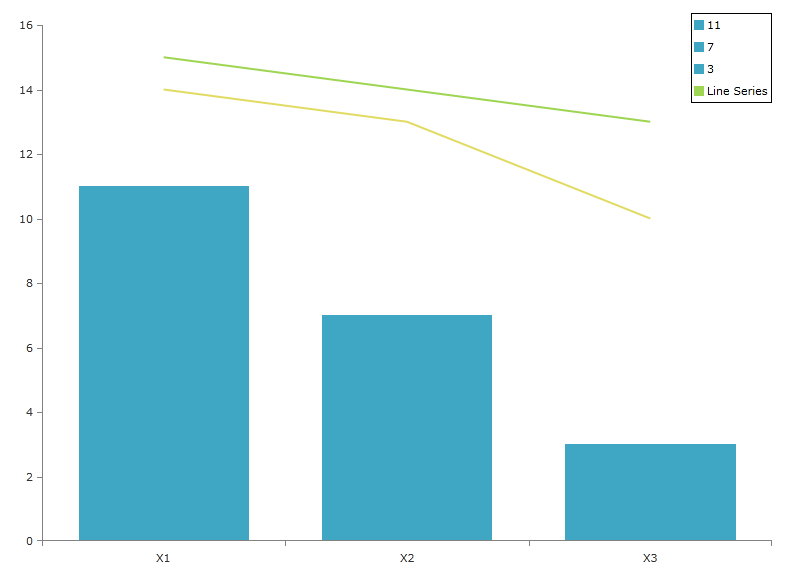
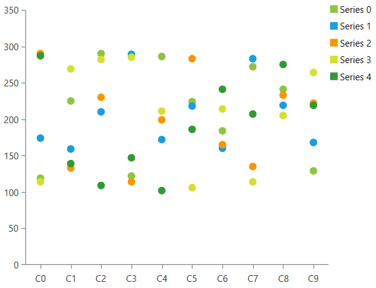

# RadLegend Support

This topic will give you an overview of the RadLegend support that RadChartView provides.

> Read more about the RadLegend control in its [documentation section]().

The chart exposes a __LegendItems__ property which is to be passed to the RadLegend's Items property. The LegendItems collection is empty by default and no legend items will be generated for a series unless the __LegendSettings__ property of the series is set. This will generate and add [LegendItem](#defining-radlegend-and-adding-items) objects in the LegendItems collection of the chart. The chart will automatically set the Title, MarkerStroke, MarkerFill and MarkerGeometry properties of the LegendItem object, based on the LegendSettings and the default visuals of the chart series.

## LegendSetting

Each [chart series]() expose a __LegendSettings__ property that allows you to determine the legend items appearance. There are two types of legend settings supported by the chart series.

* __SeriesLegendSettings__: This is supported by all chart series. A single LegendItem will be generated  for the series that uses the settings.

	The settings object allows you to set the title of the LegendItem via its __Title__ property (see Example 2).

* __DataPointLegendSettings__: This is supported only by the [BarSeries]() and [BubbleSeries](). A LegendItem will be generated for each data point in the series that uses the settings.

	The settings allow you to bind the title to a property from the data point model. You can do that via the __TitleBinding__ property. The property expects a string value that corresponds to the name of a property in the [DataPoint]() object.
	
	__Example 1: Binding legend items title to the Category property of the CategoricalDataPoint object__
	<snippet id='radchartview-features-radlegend-support-example_1_binding_legend_items_title_to_the_category_property_of_the_categoricaldatapoint_object-xaml' />

	
	

Both legend settings allow you to set the geometry of the legend item's marker. You can do that via the __MarkerGeometry__ property of the settings.

## Code Example

The example below demonstrates the cooperation between the RadLegend and RadCartesianChart. In this example the chart uses a palette to color its series and it uses the same palette to color the legend items. Note that no legend item is present for the last series as the LegendSettings property has not been set. The BarSeries is set up to use DataPointLegendSettings and this is why a legend item is created for each DataPoint.If a SeriesLegendSettings was used instead - only a single item would have been generated for the BarSeries.

__Example 2: Legend Settings Code Example__  
<snippet id='radchartview-features-radlegend-support-example_2_legend_settings_code_example-xaml' />

> If the default LegendItem objects created by the chart doesn't work for your scenario, you can manually populate the legend instead of using the __LegendItems__ collection. Read the [Getting Started]() article of RadLegend to see how to populate the control with LegendItem objects manually.

## Using RadLegend with SeriesProvider

When using SeriesProvider, you can define the legend settings object via the Style of the series or the [SeriesCreated](#events) event. The following example shows how to set up a SeriesProvider and add SeriesLegendSettings for each series.

__Example 3: Defining the view__  
<snippet id='radchartview-features-radlegend-support-example_3_defining_the_view-xaml' />

__Example 4: Defining the models__  
<snippet id='radchartview-features-radlegend-support-example_4_defining_the_models-cs' />

__Example 5: Populating with data__  
<snippet id='radchartview-features-radlegend-support-example_5_populating_with_data-cs' />

__Example 6: Setting the SeriesProvider Source__  
<snippet id='radchartview-features-radlegend-support-example_6_setting_the_seriesprovider_source-cs' />

