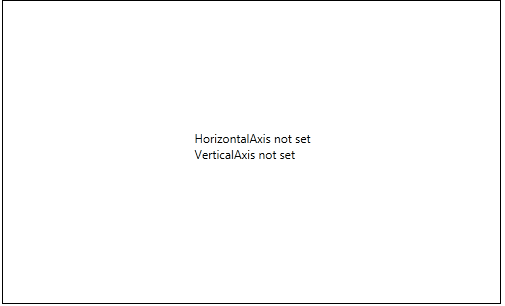
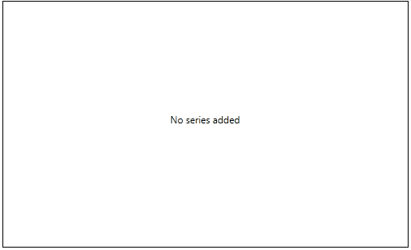
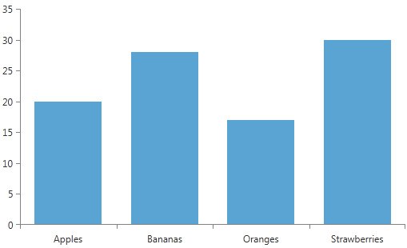

# Getting Started

__RadChartView__ is essentially a toolset of charting components designed to help you create a variety of rich data-visualization applications. This tutorial will walk you through the creation of a sample application that contains a RadChartView component.

* [Chart Types](#chart-types)
* [Assembly References](#assembly-references)
* [Defining a Chart](#defining-a-chart)
* [Defining a Series](#defining-a-series)
* [Bind the Chart](#bind-the-chart)

## Chart Types 

The RadChartView suite provides three different chart types.

* __RadCartesianChart__
* __RadPieChart__
* __RadPolarChart__

Each of these charting components is designed to best fit specific use cases. You can read more about the charts in the [ChartTypes]() help article.        

## Assembly References

In order to use the controls from the RadChartView suite, you will need to add references to the following assemblies:
* __Telerik.Windows.Controls__
* __Telerik.Windows.Controls.Chart__
* __Telerik.Windows.Data__

You can find the required assemblies for each control from the UI for WPF suite in [Controls Dependencies]()[Controls Dependencies]() help article.

## Defining a Chart

For demonstration purposes, this tutorial will use the __RadCartesianChart__ component. It uses a Cartesian coordiante system to display different series and it is the most commonly used charting component. __Example 1__ demonstrates how to define the RadCartesianChart in XAML.  

#### __[XAML] Example 1: Chart definition__
{{region radchart-introduction_1}}
	<telerik:RadCartesianChart></telerik:RadCartesianChart>
{{endregion}}

> The `telerik` namespace points to the telerik schema. 
> `xmlns:telerik=http://schemas.telerik.com/2008/xaml/presentation`

If you run the project at this stage, __RadCartesianChart__ will inform you that there are no axes defined, as seen in __Figure 1__.

#### __Figure 1: RadCartesianChart without its axes set__

The Cartesian coordinate system is constructed using horizontal and vertical axes. __RadChartView__ exposes different types of axes that can be combined horizontally and vertically in different ways based on the scenario. You can find more information about them in our [Axis]() article.

This example will demonstrate a common scenario with a LinearAxis as the vertical axis of the chart and a CategoricalAxis as horizontal axis. __Example 2__ demonstrates how to define them in XAML.  

#### __[XAML] Example 2: Chart axes definition__
{{region radchart-introduction_2}}
	<telerik:RadCartesianChart>
		<telerik:RadCartesianChart.HorizontalAxis>
			<telerik:CategoricalAxis />
		</telerik:RadCartesianChart.HorizontalAxis>
		<telerik:RadCartesianChart.VerticalAxis>
			<telerik:LinearAxis/>
		</telerik:RadCartesianChart.VerticalAxis>
	</telerik:RadCartesianChart>
{{endregion}}

In the cases where no series are defined in the definition of the charting components, a message will be displayed to prompt you to enter a series.

#### __Figure 2: RadCartesianChart without any series added in its Series collection__

## Defining a Series

__RadChartView__ exposes a large variety of series that can be used in different scenarios. Please take a look at the [Series]() article to find out more about the available types.

To complete the task of this tutorial, you need to define series with data points that will be rendered inside the charting component. You can do this by manually populating the __Series__ collection of the __RadCartesianChart__ control.         

#### __[XAML] Example 3: Sample BarSeries definition__
{{region radchart-introduction_3}}
	<telerik:RadCartesianChart>
		<telerik:RadCartesianChart.HorizontalAxis>
			<telerik:CategoricalAxis />
		</telerik:RadCartesianChart.HorizontalAxis>
		<telerik:RadCartesianChart.VerticalAxis>
			<telerik:LinearAxis/>
		</telerik:RadCartesianChart.VerticalAxis>
		
		<telerik:RadCartesianChart.Series>
			<telerik:BarSeries>
				<telerik:BarSeries.DataPoints>
					<telerik:CategoricalDataPoint Category="Apples" Value="20"/>
					<telerik:CategoricalDataPoint Category="Bananas" Value="28"/>
					<telerik:CategoricalDataPoint Category="Oranges" Value="17"/>
					<telerik:CategoricalDataPoint Category="Strawberries" Value="30"/>
				</telerik:BarSeries.DataPoints>
			</telerik:BarSeries>
		</telerik:RadCartesianChart.Series>
	</telerik:RadCartesianChart>
{{endregion}}

This chart definition will be rendered on the screen as demonstrated in __Figure 3__.

#### __Figure 3: RadCartesianChart displaying a BarSeries__

If you feel more confident working with code than with markup, you can achieve the same layout with the snippet from __Example 4__.

#### __[C#] Example 4: Sample chart definition in code__
{{region radchart-introduction_4}}
	RadCartesianChart chart = new RadCartesianChart();
	CategoricalAxis catAxis = new CategoricalAxis();
	LinearAxis lineAxis = new LinearAxis();
	chart.HorizontalAxis = catAxis;
	chart.VerticalAxis = lineAxis;

	BarSeries barSeries = new BarSeries();
	barSeries.DataPoints.Add(new CategoricalDataPoint() { Category = "Apples", Value = 20 });
	barSeries.DataPoints.Add(new CategoricalDataPoint() { Category = "Bananas", Value = 28 });
	barSeries.DataPoints.Add(new CategoricalDataPoint() { Category = "Oranges", Value = 17 });
	barSeries.DataPoints.Add(new CategoricalDataPoint() { Category = "Strawberries", Value = 30 });
	chart.Series.Add(barSeries);

	this.LayoutRoot.Children.Add(chart);
{{endregion}}

#### __[VB.NET] Example 4: Sample chart definition in code__
{{region radchart-introduction_4vb}}
	Dim chart As New RadCartesianChart()
	Dim catAxis As New CategoricalAxis()
	Dim lineAxis As New LinearAxis()
	chart.HorizontalAxis = catAxis
	chart.VerticalAxis = lineAxis

	Dim barSeries As New BarSeries()
	barSeries.DataPoints.Add(New CategoricalDataPoint() With { Key .Category = "Apples", Key .Value = 20 })
	barSeries.DataPoints.Add(New CategoricalDataPoint() With { Key .Category = "Bananas", Key .Value = 28 })
	barSeries.DataPoints.Add(New CategoricalDataPoint() With { Key .Category = "Oranges", Key .Value = 17 })
	barSeries.DataPoints.Add(New CategoricalDataPoint() With { Key .Category = "Strawberries", Key .Value = 30 })
	chart.Series.Add(barSeries)

	Me.LayoutRoot.Children.Add(chart)
{{endregion}}

In order to use the chartview components in code, you will need to add the required *using* directives that point to the Telerik namespaces.

#### __[C#] Example 5: Required usings for the chartview components__
{{region radchart-introduction_5}}
	using Telerik.Charting;
	using Telerik.Windows.Controls;
	using Telerik.Windows.Controls.ChartView;
{{endregion}}

#### __[VB.NET] Example 5: Required usings for the chartview components__
{{region radchart-introduction_5vb}}
	Imports Telerik.Charting
	Imports Telerik.Windows.Controls
	Imports Telerik.Windows.Controls.ChartView
{{endregion}}

## Bind the Chart

Although you can easily populate the __RadCartesianChart Series__ directly with DataPoint objects, in most real-life applications, you will populate the series with business data. This is why all series types expose an __ItemsSource__ property. You can bind that property to a collection of business items. And if you use a collection that implements the __INotifyCollectionChanged__ interface, then any changes within the business data will be immediately reflected in the appropriate __RadChartView__ components and vice versa. You can find more information in the [Populating with Data]() section of our documentation.

## See Also
* [Overview]()
* [Series and Axes]()
* [Rendering]()
* [RadLegend Support]()
* [Dynamic Number of Series]()
* [Empty Content]()
