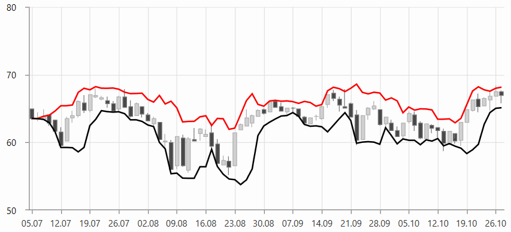

# BollingerBandsIndicator

BollingerBandsIndicator is used to define the prevailing high and low values in the data.

To set up the indicator you can set its __CategoryBinding, ValueBinding and ItemsSource__ properties. Additionally, you can control the period (in days) over which the indicator will be applied. To do this set the __Period__ property. 

To set the number of standard deviations used to calculate the indicator values you can use the __StandardDeviations__ property. And the stroke of the lower band is set via __LowerBandStroke__ property.

__Example 1: Defining BollingerBandsIndicator__
```XAML
	 <telerik:RadCartesianChart.Indicators>
		  <telerik:BollingerBandsIndicator Period="5" 
                                           StandardDeviations="2"
                                           LowerBandStroke="Black"
                                           CategoryBinding="Date"                                             
                                           ValueBinding="Close"
                                           ItemsSource="{Binding Data}"/>
	</telerik:RadCartesianChart.Indicators>
```

#### Figure 1: BollingerBandsIndicator


>tip The indicator can be set up the same way as a normal [chart series](). This is why you can populate it using the same approach as shown in the [Data Bind to Data-Object]() article. You can set the corresponding value binding properties - for example, ValueBinding, CategoryBinding, HighBinding, CloseBinding, etc, and also the ItemsSource.

## See Also
* [Indicators Overview]()
* [Getting Started]()