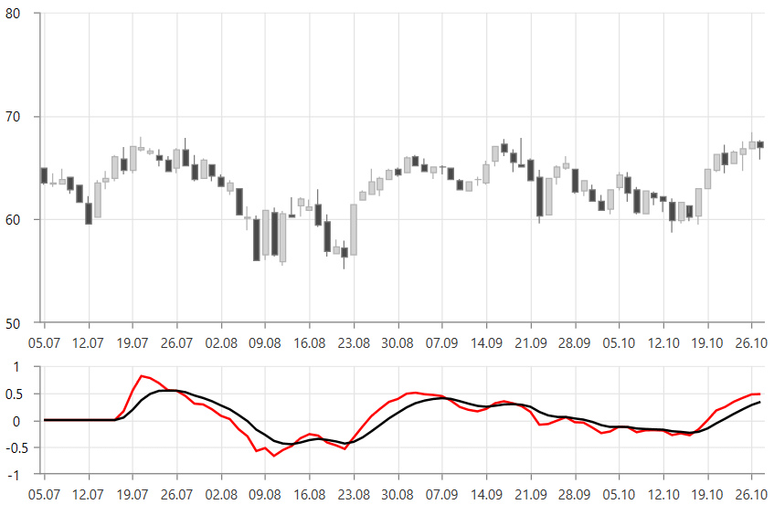

# MacdIndicator

MacdIndicator is a trend following indicator which displays the relationship between two moving averages of data.

To set up the indicator you can set its __CategoryBinding, ValueBinding and ItemsSource__ properties. Additionally, you can control the period (in days) over the which the indicator will be applied. To do this set the __ShortPeriod__, __LongPeriod__ and __SignalPeriod__ properties. 

To display the signal period you will need to set the __SignalStroke__ property.

__Example 1: Defining MacdhIndicator__
```XAML
	 <telerik:RadCartesianChart.Indicators>
		<telerik:MacdIndicator ShortPeriod="9" 
							   LongPeriod="12"
							   SignalPeriod="6"                                        
							   CategoryBinding="Date"                                             
							   ValueBinding="Close"
							   SignalStroke="Black"
							   ItemsSource="{Binding Data}"/>
	</telerik:RadCartesianChart.Indicators>
```

#### Figure 1: MacdIndicator


> __Figure 1__ shows 2 instances of RadCartesianChart. The top one shows only the candlestick series that displays the original data. The chart on the bottom shows the indicator.

>tip The indicator can be set up the same way as a normal [chart series](). This is why you can populate it using the same approach as shown in the [Data Bind to Data-Object]() article. You can set the corresponding value binding properties - for example, ValueBinding, CategoryBinding, HighBinding, CloseBinding, etc, and also the ItemsSource.

## See Also
* [Indicators Overview]()
* [Getting Started]()