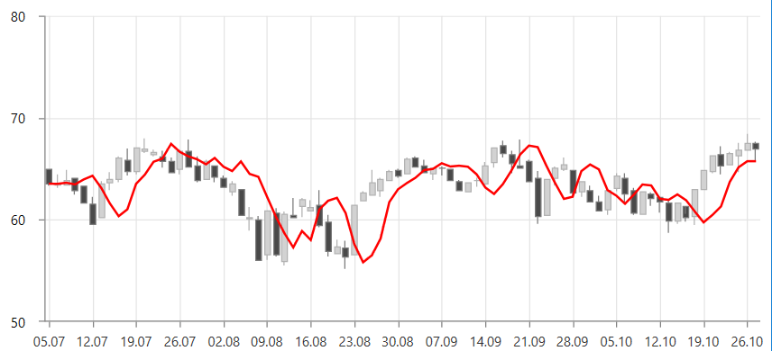

# ModifiedMovingAverageIndicator

ModifiedMovingAverageIndicator measures and shows the average for a period of past data, thus smoothing the data to form a trend following.

To set up the indicator you can set its __CategoryBinding, ValueBinding and ItemsSource__ properties. Additionally, you can control the period (in days) over which the indicator will be applied. To do this set the __Period__ property.

__Example 1: ModifiedMovingAverageIndicator__
```XAML
	 <telerik:RadCartesianChart.Indicators>
		<telerik:ModifiedMovingAverageIndicator Period="5" 													
											    CategoryBinding="Date"                                             
											    ValueBinding="Close"
											    ItemsSource="{Binding Data}"/>
	</telerik:RadCartesianChart.Indicators>
```

#### Figure 1: ModifiedMovingAverageIndicator


>tip The indicator can be set up the same way as a normal [chart series](). This is why you can populate it using the same approach as shown in the [Data Bind to Data-Object]() article. You can set the corresponding value binding properties - for example, ValueBinding, CategoryBinding, HighBinding, CloseBinding, etc, and also the ItemsSource.

## See Also
* [Indicators Overview]()
* [Getting Started]()