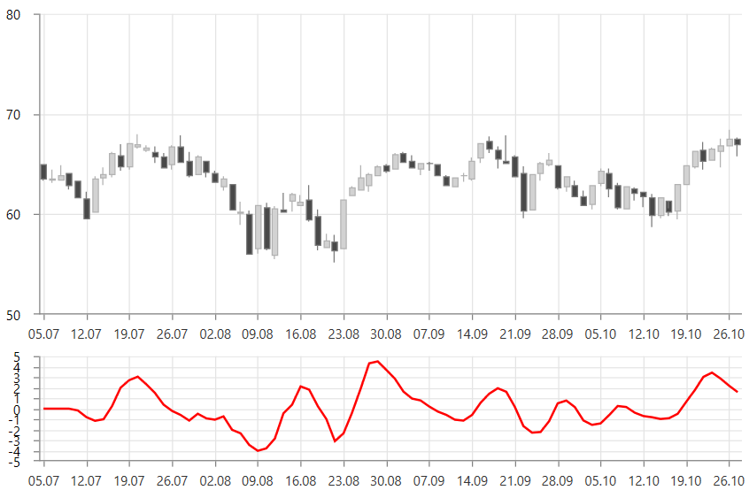

# OscillatorIndicator

OscillatorIndicator is an indicator that varies over time within a values range - between set levels.

To set up the indicator you can set its __CategoryBinding, ValueBinding and ItemsSource__ properties. Additionally, you can control the periods (in days) over which the indicator will be applied. To do this set the __LongPeriod__ and __ShortPeriod__ properties.

__Example 1: OscillatorIndicator__
```XAML
	 <telerik:RadCartesianChart.Indicators>
		<telerik:OscillatorIndicator LongPeriod="8" 													
									 ShortPeriod="4"
								     CategoryBinding="Date"                                             
								     ValueBinding="Close"
								     ItemsSource="{Binding Data}"/>
	</telerik:RadCartesianChart.Indicators>
```

#### Figure 1: OscillatorIndicator


> __Figure 1__ shows 2 instances of RadCartesianChart. The top one shows only the candlestick series that displays the original data. The chart on the bottom shows the indicator.

>tip The indicator can be set up the same way as a normal [chart series](). This is why you can populate it using the same approach as shown in the [Data Bind to Data-Object]() article. You can set the corresponding value binding properties - for example, ValueBinding, CategoryBinding, HighBinding, CloseBinding, etc, and also the ItemsSource.

## See Also
* [Indicators Overview]()
* [Getting Started]()