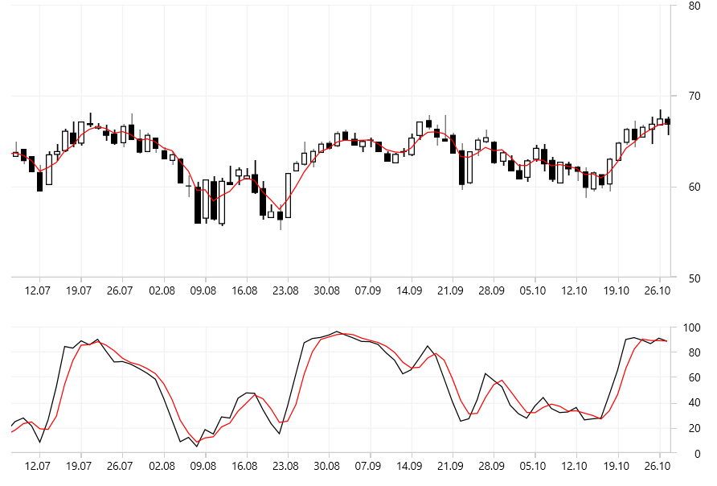

# Indicators Overview

RadChartView provides a rich set of __financial indicators__ which can be used to display a certain overlay on the data. The indicators are used to measure and visualize summarised information or a trend based on the provided data.

> The financial indicators are applicable only in the context of __RadCartesianChart__.

#### __Figure 1: Financial indicators__


## Setting Up an Indicator

The indicator itself is a [chart series]() but with some additional sampling applied over the data before it gets plotted on the chart. The indicators are added in the __Indicators__ collection of RadCartesianChart.

__Example 1: Defining TrueRangeIndicator__
```XAML
	<telerik:RadCartesianChart.Indicators>
		<telerik:TrueRangeIndicator CategoryBinding="Date" 
                                    HighBinding="High"
                                    LowBinding="Low"
                                    CloseBinding="Close" 
									ItemsSource="{Binding Data}"/>
	</telerik:RadCartesianChart.Indicators>
```

The indicator is populate using the same approach as shown in the [Data Bind to Data-Object]() article. You can set the corresponding value binding properties - for example, ValueBinding, CategoryBinding, HighBinding, CloseBinding, etc. Additionally, you can apply different options based on the concrete indicator's implementation. 

>tip See the __Financial__ and __Stock Series/Indicators__ examples in the [demos application]() for a demonstration of the indicators.

## List of Indicators 

This section provides a full list with the chart's indicators.

* [AverageTrueRangeIndicator]()
* [AdaptiveMovingAverageKaufmanIndicator]()
* [BollingerBandsIndicator]()
* [CommodityChannelIndexIndicator]()
* [ExponentialMovingAverageIndicator]()
* [MacdhIndicator]()
* [MacdIndicator]()
* [ModifiedExponentialMovingAverageIndicator]()
* [ModifiedMovingAverageIndicator]()
* [MomentumIndicator]()
* [MovingAverageIndicator]()
* [OscillatorIndicator]()
* [RateOfChangeIndicator]()
* [RaviIndicator]()
* [RelativeMomentumIndexIndicator]()
* [RelativeStrengthIndexIndicator]()
* [StochasticFastIndicator]()
* [StochasticSlowIndicator]()
* [TrixIndicator]()
* [TrueRangeIndicator]()
* [UltimateOscillatorIndicator]()
* [WeightedMovingAverageIndicator]()

## See Also
* [Getting Started]()
* [ChartSelectionBehaviors]()
* [AnnotationsProvider]()
* [Dynamic Number Of Series]()
