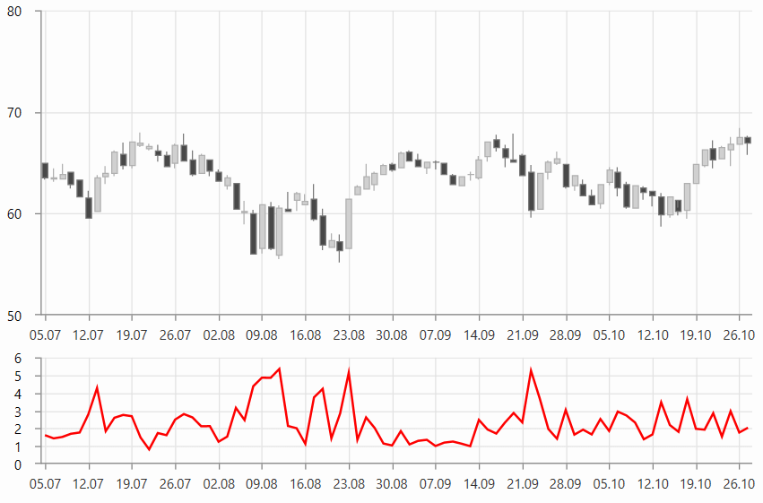

# TrueRangeIndicator

TrueRangeIndicator measures the daily range with addition to any gap from the closing price of the preceding day.

To set up the indicator you can set its __CategoryBinding, HighBinding, LowBinding, CloseBinding, and ItemsSource__ properties. 

__Example 1: Defining TrueRangeIndicator__
```XAML
	<telerik:RadCartesianChart.Indicators>
		<telerik:TrueRangeIndicator CategoryBinding="Date" 
                                    HighBinding="High"
                                    LowBinding="Low"
                                    CloseBinding="Close" 
									ItemsSource="{Binding Data}"/>
	</telerik:RadCartesianChart.Indicators>
```

#### Figure 1: TrueRangeIndicator


> __Figure 1__ shows 2 instances of RadCartesianChart. The top one shows only the candlestick series that displays the original data. The chart on the bottom shows the indicator.

>tip The indicator can be set up the same way as a normal [chart series](). This is why you can populate it using the same approach as shown in the [Data Bind to Data-Object]() article. You can set the corresponding value binding properties - for example, ValueBinding, CategoryBinding, HighBinding, CloseBinding, etc, and also the ItemsSource.

## See Also
* [Indicators Overview]()
* [Getting Started]()