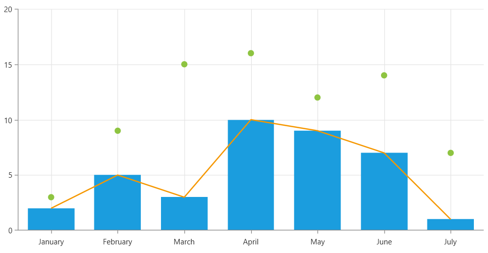

# Multiple Chart Series

The [chart controls]() allow you to add multiple [series]() into the same chart instance. This way you can create multi-line, multi-bar charts, or any other combination of visualizations.

The following article discusses the `RadCartesianChart` control, but the same API can be used also in the other chart types.

To add multiple series instances, use the `Series` property of the chart.

__Defining chart with multiple visualizations__
```C#
	<telerik:RadCartesianChart Palette="Windows8">
		<telerik:RadCartesianChart.HorizontalAxis>
			<telerik:CategoricalAxis/>
		</telerik:RadCartesianChart.HorizontalAxis>
		<telerik:RadCartesianChart.VerticalAxis>
			<telerik:LinearAxis />
		</telerik:RadCartesianChart.VerticalAxis>
		<telerik:RadCartesianChart.Grid>
			<telerik:CartesianChartGrid MajorLinesVisibility="XY" />
		</telerik:RadCartesianChart.Grid>
		<telerik:RadCartesianChart.Series>
			<telerik:PointSeries>
				<telerik:PointSeries.DataPoints>                       
					<telerik:CategoricalDataPoint Category="January" Value="3" />
					<telerik:CategoricalDataPoint Category="February" Value="9" />
					<telerik:CategoricalDataPoint Category="March" Value="15" />
					<telerik:CategoricalDataPoint Category="April" Value="16" />
					<telerik:CategoricalDataPoint Category="May" Value="12" />
					<telerik:CategoricalDataPoint Category="June" Value="14" />
					<telerik:CategoricalDataPoint Category="July" Value="7" />
				</telerik:PointSeries.DataPoints>
			</telerik:PointSeries>
			<telerik:BarSeries>
				<telerik:BarSeries.DataPoints>
					<telerik:CategoricalDataPoint Category="January" Value="2" />
					<telerik:CategoricalDataPoint Category="February" Value="5" />
					<telerik:CategoricalDataPoint Category="March" Value="3" />
					<telerik:CategoricalDataPoint Category="April" Value="10" />
					<telerik:CategoricalDataPoint Category="May" Value="9" />
					<telerik:CategoricalDataPoint Category="June" Value="7" />
					<telerik:CategoricalDataPoint Category="July" Value="1" />
				</telerik:BarSeries.DataPoints>
			</telerik:BarSeries>
			<telerik:LineSeries>
				<telerik:LineSeries.DataPoints>
					<telerik:CategoricalDataPoint Category="January" Value="2" />
					<telerik:CategoricalDataPoint Category="February" Value="5" />
					<telerik:CategoricalDataPoint Category="March" Value="3" />
					<telerik:CategoricalDataPoint Category="April" Value="10" />
					<telerik:CategoricalDataPoint Category="May" Value="9" />
					<telerik:CategoricalDataPoint Category="June" Value="7" />
					<telerik:CategoricalDataPoint Category="July" Value="1" />
				</telerik:LineSeries.DataPoints>
			</telerik:LineSeries>
		</telerik:RadCartesianChart.Series>
	</telerik:RadCartesianChart>
```



The different chart series work with different [axis combinations](). Keep that in mind when defining multiple series. 

The previous example shows how to define a chart with static data. To add the data dynamically, you can populate the `DataPoints` collection in code, or you can use the [data binding capabilities]() of the chart series.

## Adding Multiple Series in MVVM Setup

In case an unknown number of series should be added dynamically, based on information defined in data models, the [SeriesProvider]() feature of the chart can be used.
	
## See Also
* [Getting Started]()
* [Create Data-Bound Chart]()
