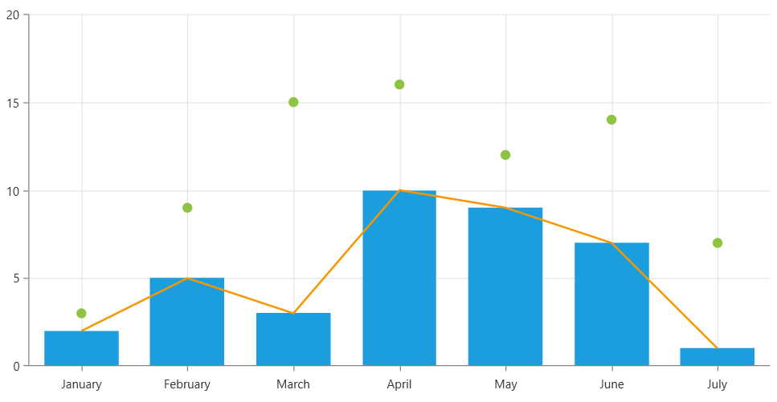

# Multiple Chart Series

The [chart controls]() allow you to add multiple [series]() into the same chart instance. This way you can create multi-line, multi-bar charts, or any other combination of visualizations.

The following article discusses the `RadCartesianChart` control, but the same API can be used also in the other chart types.

To add multiple series instances, use the `Series` property of the chart.

__Defining chart with multiple visualizations__
<snippet id='radchartview-multiple-chart-series-defining_chart_with_multiple_visualizations-cs' />

The different chart series work with different [axis combinations](). Keep that in mind when defining multiple series. 

The previous example shows how to define a chart with static data. To add the data dynamically, you can populate the `DataPoints` collection in code, or you can use the [data binding capabilities]() of the chart series.

## Adding Multiple Series in MVVM Setup

In case an unknown number of series should be added dynamically, based on information defined in data models, the [SeriesProvider]() feature of the chart can be used.
	
## See Also
* [Getting Started]()
* [Create Data-Bound Chart]()
