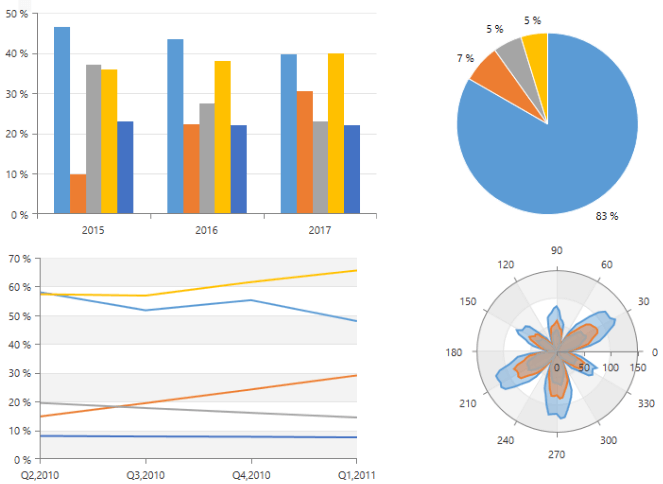

# Overview








RadChartView is a set of versatile charting components that offer unmatched performance regarding loading time, drawing capabilities and real-time updates. Its intuitive object model and public API allow complex charts to be easily setup either in XAML or through code. The control is completely data aware and may work in bound or unbound mode, depending on the requirements. Chart types (or series) are organized in hierarchies, depending on the coordinate system, used to plot data points – for example we have RadCartesianChart (using Cartesian coordinate system) and RadPieChart (using radial coordinate system).

A charting component in general is used to visualize (or plot) some data in a human-readable way through different representations like lines, areas, bars pies, etc. Each series has a collection of data points – the data equivalent of a 2D point – and knows how to visualize them. Different series types may process certain types of data points – for example categorical series may contain categorical data points. Data points may be added directly to series or a data binding mechanism may be used to create the appropriate data points from the raw data.

## Key Features

* __Different chart types__: RadChartView provides few different chart types which can be used for different data visualizations. __RadCartesianChart__, __RadPieChart__ and __RadPolarChart__.

* __Rich set of series visualizations__: There is a list of chart visualizations, as pie, bar, line, point, area, financial sticks and candles, spline, etc. For the full list check the [Series]() section in the documentation.

* __Variety of axes__: The chart supports several axes types which can be used with the charts. There are axes specialized for numeric, categorical, date-time, radial and polar scenarios. Read more about this in the [Axis]() section in the documentation.

* __Chart Grid__: The chart may be optionally decorated with grid-like visuals which support horizontal and vertical lines, associated with axis ticks and horizontal and vertical stripes – the area between two adjacent ticks. Such visuals are available for both Cartesian and Polar coordinates via Cartesian Grid and Polar Grid respectively. Read more in the [CartesianChartGrid and PolarChartGrid]() article. A runnable example can be found in [Create Chart With Static Data]().

* __Behaviors__: The charts have a behaviors collection that accepts ChartBehavior objects. Each object represents a special interaction behavior such as [Scroll and Zoom]() or [TrackBall]().

* __Annotations__: The chart components support different annotations. Those are visual elements that can be used to highlight certain areas on the plo area and denote statistical significance. Read more about this in the [Annotations]() section in the documentation.

* __Light rendering modes__: RadChartView allows you to specify the series rendering surface for some series. This way you can adjust the overall performance of the chart. Read more about this in [Rendering]() article.

* __Dynamic number of series__: You can create a dynamic number of chart series based on a collection of custom business objects. Read more abou this in the [ChartSeriesProvider]() article.

* __Easy label customization__: The chart series allows you to easily customize the axis and item labels. Read more about the series item labels customization in the [Label Definition]() help article. About axis labels check the [Axis]() article.

* __Smart labels__: The RadCartesianChart and the RadPieChart controls support smart labels. The term "smart labels" refers to labels positioned in such a way that they do not overlap one another. Read more about this in the [Smart Labels]() article.

* __Series combine mode__: Most RadChartView series can be combined either in __stacks__ or __clusters__. Combinations are formed when more than one data point from different series falls within a same category. The “Cluster” combine mode will position such points next to each other while the “Stack” one will arrange such points in a stack-like structure. When stacks are formed, the numerical axis (if present) will consider each stack as a single entity and its sum will be the actual value used rather than each point’s one. The bar series of the chart also supports a __Stack100__ mode. It shows the combined contribution of values as percentages where the combined total for each category is 100 percent. It's good to use it when the relationship between values in a category is more significant than the amounts. The mode is set via the CombineMode property of the series.

* __Palettes__: The charts can be easily colorized using palettes. You can use the rich variety of built-in palettes, or create a custom one. Read more about this in the [Palettes]() section.

> You can also check the [RadChartView3D]() for 3D visualization.

>tip Get started with the control with its [Getting Started]() help article that shows how to use it in a basic scenario.

<!-- -->
> Check out the control demos at [demos.telerik.com](http://demos.telerik.com/silverlight/#ChartView/FirstLook)[demos.telerik.com](http://demos.telerik.com/wpf/)

## See Also  
* [Populating with data]()
* [Sampling]()
* [Series and axes]()
* [Export]()
* [Legend support]()
