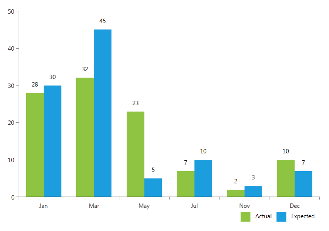

# Binding to a DataTable

In this section we will demonstrated how to bind a ChartView to a DataTable.

For the basis of this article we will declare a Bar Chart which is represented by the RadCartesianChart class. Here is the XAML declaration:        


```XAML
	<Grid>
	    <Grid.RowDefinitions>
	        <RowDefinition Height="7\*"/>
	        <RowDefinition Height="1\*"/>
	    </Grid.RowDefinitions>
	    
		<!--ChartView-->
	    <telerik:RadCartesianChart x:Name="chartView" Palette="Metro" Grid.Row="0">
	        <telerik:RadCartesianChart.VerticalAxis>
	            <telerik:LinearAxis/>
	        </telerik:RadCartesianChart.VerticalAxis>
	        <telerik:RadCartesianChart.HorizontalAxis>
	            <telerik:DateTimeCategoricalAxis LabelFormat="MMM"/>
	        </telerik:RadCartesianChart.HorizontalAxis>
	        <telerik:RadCartesianChart.Series>
	            <telerik:BarSeries x:Name="barSeries1" ItemsSource="{Binding}" ShowLabels="True" />
	            <telerik:BarSeries x:Name="barSeries2" ItemsSource="{Binding}" ShowLabels="True"/>
	        </telerik:RadCartesianChart.Series>
	    </telerik:RadCartesianChart>
	    
		<!--Legend-->	
	    <StackPanel Grid.Row="1" HorizontalAlignment="Right" Orientation="Horizontal">
	        <Rectangle Fill="#FF8EC441" Width="20" Height="20" VerticalAlignment="Top"/>
	        <TextBlock Text="Actual" Margin="10, 0, 10, 0"/>
	        <Rectangle Fill="#FF1B9DDE" Width="20" Height="20" VerticalAlignment="Top"/>
	        <TextBlock Text="Expected" Margin="10, 0, 10, 0"/>
	    </StackPanel>
	</Grid>
```

Next we will decalare a sample DataTable, containing 3 columns - actual (of type double), expected(of type double), month(of type DateTime). The "Actual" column will be the value source for the barSeries1 and the "Expected" - respectively for barSeries2. The values of the "Month" column will serve as the categories for both of these series.        


```C#
	DataTable dt = new DataTable();
	dt.Columns.Add("Expected", typeof(double));
	dt.Columns.Add("Actual", typeof(double));
	dt.Columns.Add("Month", typeof(DateTime));
	
	dt.Rows.Add(30, 28, new DateTime(2013, 1, 1));
	dt.Rows.Add(45, 32, new DateTime(2013, 3, 1));
	dt.Rows.Add(5, 23, new DateTime(2013, 5, 1));
	dt.Rows.Add(10, 7, new DateTime(2013, 7, 1));
	dt.Rows.Add(3, 2, new DateTime(2013, 11, 1));
	dt.Rows.Add(7, 10, new DateTime(2013, 12, 1));
	
	this.DataContext = dt.Rows;
```
```VB.NET
	Dim dt As New DataTable()
	dt.Columns.Add("Expected", GetType(Double))
	dt.Columns.Add("Actual", GetType(Double))
	dt.Columns.Add("Month", GetType(DateTime))
	
	dt.Rows.Add(30, 28, New DateTime(2013, 1, 1))
	dt.Rows.Add(45, 32, New DateTime(2013, 3, 1))
	dt.Rows.Add(5, 23, New DateTime(2013, 5, 1))
	dt.Rows.Add(10, 7, New DateTime(2013, 7, 1))
	dt.Rows.Add(3, 2, New DateTime(2013, 11, 1))
	dt.Rows.Add(7, 10, New DateTime(2013, 12, 1))
	
	Me.DataContext = dt.Rows
```

Using the traditional PropertyNameBinding the ChartView can only be bound to objects of type IEnumerable. In order for the binding to work with our DataTable we must use GenericDataPointBinding. It allows a lot more flexibility because it gives the control to user by allowing him to specify exactly how he wants to retrieve the data.        

We need to tell the barSeries1 to use the values in column "Actual" for the YValues of its data points and to use the values in the "Month" column for their categories. Also the barSeries2 should use the "Expected" column for YValues, and again the "Month" for categories.        

To do so, we have to set for each of our bar series bindings to a new instance of the GenericDataPointBinding <TElement, TResult> class. "TElement" is the type that is passed to the binding function, and "TResult" is the type of the value that is bound to the data point element.         

The ChartView will automatically traverse the the DataRowsCollection of the DataTable and will expect the binding function to extract the needed information from each DataRow. So the the type of TElement is DataRow, and the return type of the fuction is double for ValueBindings and string for the CategoryBindgings respectively.        

Using lambda syntax (as shown below) we set the path to the values in the DataTable for the bar series to use.        


```C#
	this.barSeries1.ValueBinding = new Telerik.Windows.Controls.ChartView.GenericDataPointBinding<DataRow, double>() 
	{
	    ValueSelector = row => (double)row["Actual"]
	};
	
	this.barSeries1.CategoryBinding = new Telerik.Windows.Controls.ChartView.GenericDataPointBinding<DataRow, DateTime>()
	{
	    ValueSelector = row => (DateTime)row["Month"]
	};
	
	this.barSeries2.ValueBinding = new Telerik.Windows.Controls.ChartView.GenericDataPointBinding<DataRow, double>()
	{
	    ValueSelector = row => (double)row["Expected"]
	};
	
	this.barSeries2.CategoryBinding = new Telerik.Windows.Controls.ChartView.GenericDataPointBinding<DataRow, DateTime>()
	{
	    ValueSelector = row => (DateTime)row["Month"]
	};
```
```VB.NET
	Me.barSeries1.ValueBinding = New Telerik.Windows.Controls.ChartView.GenericDataPointBinding(Of DataRow, Double)() With { _
		.ValueSelector = Function(row) CDbl(row("Actual")) _
	}
	
	Me.barSeries1.CategoryBinding = New Telerik.Windows.Controls.ChartView.GenericDataPointBinding(Of DataRow, DateTime)() With { _
		.ValueSelector = Function(row) DirectCast(row("Month"), DateTime) _
	}
	
	Me.barSeries2.ValueBinding = New Telerik.Windows.Controls.ChartView.GenericDataPointBinding(Of DataRow, Double)() With { _
		.ValueSelector = Function(row) CDbl(row("Expected")) _
	}
	
	Me.barSeries2.CategoryBinding = New Telerik.Windows.Controls.ChartView.GenericDataPointBinding(Of DataRow, DateTime)() With { _
		.ValueSelector = Function(row) DirectCast(row("Month"), DateTime) _
	}
```

The final result:


## See Also
 * [Create Data-Bound Chart]()
