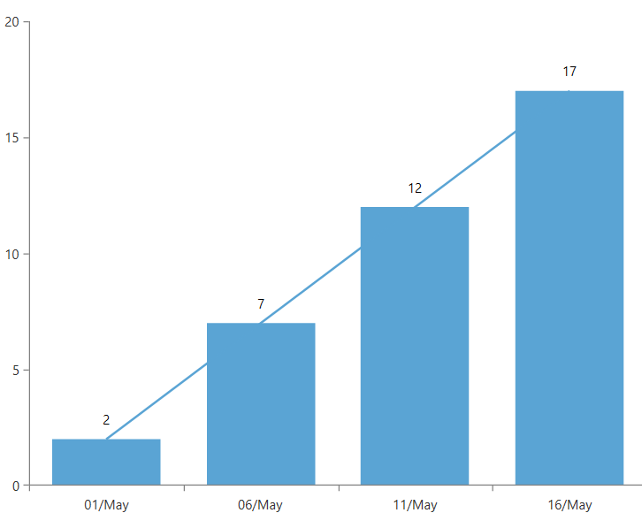
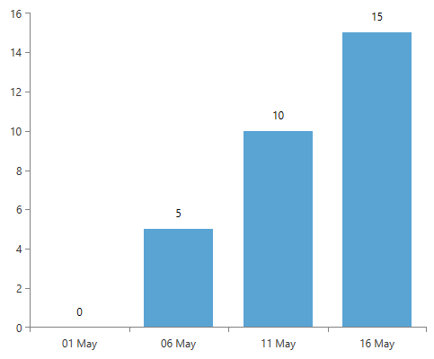

# ChartDataSource

The __ChartDataSource__ object is used in sampling scenarios. Aside from binding to a collection of business objects as shown in the [Create Data-Bound Chart topic]() the __RadChartView__ component supports a more complex way of binding which allows you to combine the data items into a single data point (known as sampling) before plotting them. When the chart is populated with thousands of items, the visual representation might not be that clear. It is possible that there are two or more DataPoints shown with very close Y and X values. This is when sampling comes in handy.

You can either have an Index-based or DateTime sampling.

* [Index-based Sampling](#index-based-sampling)
* [DateTime sampling](#datetime-sampling)
* [Use custom aggregate function](#use-custom-aggregate-function)
* [DataPointSamplingInfo](#datapointsamplinginfo)

## Index-based Sampling

The sampling engine does not detect/determine whether the datapoints will be on similar pixel coordinates. Instead, it visualizes a subset of the original data. Determining the number of DataPoints to be displayed is done by setting the __SamplingThreshold__ property of the ChartDataSource. For example, if you have 1000 points, 95% of which are clustered together, and you choose a sampling threshold of 300 points, 95% of these 300 points will be clustered as well.                

__Example 1: Defining ChartDataSource__
```XAML
	<telerik:ChartDataSource x:Name="ChartDataSource1" ItemsSource="{Binding Data}" SamplingThreshold="300"/>
```

## DateTime sampling

There are scenarios where you have DateTime axes with many data points. ChartDataSource exposes two properties to combine the data points in such cases: __SamplingUnit__ and __SamplingUnitInterval__. The SamplingUnit property is an enumeration, which you may choose from, to specify whether you would like your data to be combined by Day, Hour, Minute, Month, NONE (the default one), Quarter, Second, Week, Year. The SamplingInterval property as its name implies, allows you to provide an interval for the chosen SamplingUnit. The default interval is 1 and if you want aggregation to be applied you will need to set bigger interval.

The following example demonstrates both properties in action. 

We'll create BarSeries and SplineSeries with DateTimeCategorical Horizontal Axis, bound via the ChartDataSource control:

__Example 2: Defining the chart and binding the sampling source__
```XAML
	<telerik:ChartDataSource x:Name="ChartDataSource1"
								ItemsSource="{Binding Data}"
								SamplingUnit="Day" 
								SamplingUnitInterval="5"/>
	
	<telerik:RadCartesianChart x:Name="RadChart1">
		<telerik:RadCartesianChart.HorizontalAxis>
			<telerik:DateTimeCategoricalAxis LabelFormat="dd/MMM"
												DateTimeComponent="Ticks"/>
		</telerik:RadCartesianChart.HorizontalAxis>
		<telerik:RadCartesianChart.VerticalAxis>
			<telerik:LinearAxis/>
		</telerik:RadCartesianChart.VerticalAxis>
		<telerik:BarSeries ShowLabels="True"
							CategoryBinding="Time"
							ValueBinding="Value"
							ItemsSource="{Binding ElementName=ChartDataSource1}">
		</telerik:BarSeries>
		<telerik:SplineSeries CategoryBinding="Time" ValueBinding="Value"  ItemsSource="{Binding ElementName=ChartDataSource1}" />
	</telerik:RadCartesianChart>
```

Note how the ItemsSource property of the series is bound to the ChartDataSource and not to the collection of business objects so called Data directly. 

In code-behind create the collection of business objects and register it as DependencyProperty by inheriting the DependencyObject class:

__Example 3: Creating the models__
```C#
	 public class SimpleViewModel : DependencyObject
	{
		   Random r = new Random();
		/// <summary>
		/// Identifies the <see cref="Data"/> dependency property.
		/// </summary>
		public static readonly DependencyProperty DataProperty = DependencyProperty.Register("Data",
			typeof(ObservableCollection<SalesInfo>),
			typeof(SimpleViewModel),
			new PropertyMetadata(null));

		public RadObservableCollection<SalesInfo> Data
		{
			get
			{
				return (RadObservableCollection<SalesInfo>)this.GetValue(DataProperty);
			}
			set
			{
				this.SetValue(DataProperty, value);
			}
		}

		public SimpleViewModel()
		{
			var data = new RadObservableCollection<SalesInfo>();

			DateTime startDate = new DateTime(2013, 5, 1);
			
			for (int i = 0; i < 20; i += 1)
			{
				data.Add(new SalesInfo() { Time = startDate.AddDays(i), Value = i });
			}

			this.Data = data;
		}
	}

	public class SalesInfo
	{
		public DateTime Time { get; set; }
		public int Value { get; set; }
	}
```
```VB.NET
	Public Class SimpleViewModel
	 Inherits DependencyObject
		   Private r As New Random()
		''' <summary> '''
		''' Identifies the <see cref="Data"/> dependency property. '''
		''' </summary> '''
		Public Shared ReadOnly DataProperty As DependencyProperty = DependencyProperty.Register("Data", GetType(ObservableCollection(Of SalesInfo)), GetType(SimpleViewModel), New PropertyMetadata(Nothing))

		Public Property Data() As RadObservableCollection(Of SalesInfo)
			Get
				Return CType(Me.GetValue(DataProperty), RadObservableCollection(Of SalesInfo))
			End Get
			Set(ByVal value As RadObservableCollection(Of SalesInfo))
				Me.SetValue(DataProperty, value)
			End Set
		End Property

		Public Sub New()
			Dim data = New RadObservableCollection(Of SalesInfo)()

			Dim startDate As New DateTime(2013, 5, 1)

			For i As Integer = 0 To 19
				data.Add(New SalesInfo() With {.Time = startDate.AddDays(i), .Value = i })
			Next

			Me.Data = data
		End Sub
	End Class
		
	Public Class SalesInfo
		Dim _time As Date
		Dim _value As Int

		Public Property [Time]() As DateTime
			Get
				Return Me._time
			End Get
			Set(value As DateTime)
				Me._time = value
			End Set
		End Property

		Public Property Value() As Int
			Get
				Return Me._value
			End Get
			Set(value As Double)
				Me._value = value
			End Set
		End Property
	End Class
```

By setting the SamplingUnit to Day and the SamplingUnitInterval to 5 you'll see 4 categories, where each category represents a period of 5 days. The result is shown on the image below:


## Use custom aggregate function

By default, RadChartView calculates an __average__ of the given values when sampling is used. You can, however use different aggregate functions like Sum, Min, Max and etc.                

For that purpose you should inherit from the specific ChartSeries class that you are using and override the following protected methods to use different aggregate functions:
                
|Series|Methods to override|
|------|-------------------|
|Categorical Series (BarSeries, PointSeries, LineSeries, SplineSeries, AreaSeries and SplineAreaSeries)|GetCategoryAggregateFunction GetValueAggregateFunction
|Range Series (RangeSeries and RangeBarSeries)|GetCategoryAggregateFunction GetHighAggregateFunction GetLowAggregateFunction
|Financial Series (OhlcSeries and CandlestickSeries)|GetCategoryAggregateFunction GetOpenAggregateFunction GetHighAggregateFunction GetLowAggregateFunction GetCloseAggregateFunction
|Scatter* Series (ScatterPointSeries, ScatterLineSeries, ScatterSplineSeries, ScatterAreaSeries and ScatterSplineAreaSeries)|GetXValueAggregateFunction GetYValueAggregateFunction
|Polar* Series (PolarPointSeries, PolarLineSeries and PolarAreaSeries)|GetAngleAggregateFunction GetValueAggregateFunction
|Radar* Series (RadarPointSeries, RadarLineSeries and RadarAreaSeries)|GetCategoryAggregateFunction GetValueAggregateFunction
|PieChart Series (PieSeries and DoughnutSeries|GetValueAggregateFunction

Below you'll find a sample where this is demonstrated. Note that the datasource is the same as the one used in the previous example.                

__Example 4: Defining the chart and binding the sampling source__
```XAML
	<telerik:ChartDataSource x:Name="ChartDataSource1"
								ItemsSource="{Binding Data}"
								SamplingUnit="Day" 
								SamplingUnitInterval="5"/>
	
	<telerik:RadCartesianChart x:Name="RadChart1">
		<telerik:RadCartesianChart.HorizontalAxis>
			<telerik:DateTimeCategoricalAxis LabelFormat="dd/MMM"
												DateTimeComponent="Ticks"/>
		</telerik:RadCartesianChart.HorizontalAxis>
		<telerik:RadCartesianChart.VerticalAxis>
			<telerik:LinearAxis/>
		</telerik:RadCartesianChart.VerticalAxis>
	    <local:MyBarSeries ShowLabels="True"
							CategoryBinding="Time"
							ValueBinding="Value"
							ItemsSource="{Binding ElementName=ChartDataSource1}">
	    </local:MyBarSeries>
	</telerik:RadCartesianChart>
```

__Example 5: Create custom series and override its aggregate function__
```C#
	public class MyBarSeries : BarSeries
	{
	    protected override ChartAggregateFunction GetValueAggregateFunction()
	    {
	        return new ChartMinFunction();
	    }
	}
```
```VB.NET
	Public Class MyBarSeries
		Inherits BarSeries
		Protected Overrides Function GetValueAggregateFunction() As ChartAggregateFunction
			Return New ChartMinFunction()
		End Function
	End Class
```

> If you are using the [NoXaml]() dlls, you should base the style of the custom series on the default one like so `<Style TargetType="local:MyBarSeries" BasedOn="{StaticResource BarSeriesStyle}" />`, otherwise a "No data to plot" message will be shown.

The result is below:


## DataPointSamplingInfo

The chart's [DataPoint]() models which are used to plot the data items in the control, expose a __DataItem__ property which holds a reference to view model behind the point. However, when sampling (ChartDataSource) is used, several data point view models (data items) are combined into a single DataPoint. In this case the __DataItem__ property contains an object of type __DataPointSamplingInfo__. This object has information about the data items that are combined and the results returned by the aggregate function. 

__DataPointSamplingInfo__ is IEnumerable and you can get the aggregated data items using its indexer.

__Example 6: Getting data item from the sampling result__
```C#
	DataPointSamplingInfo samplingInfo = (DataPointSamplingInfo)dataPoint.DataItem;
	object dataItem = samplingInfo[0];
```

You can also get the aggregated values of the DataPoint for each axis using the __AggregateResultCollection__ property of DataPointSamplingInfo. 

## See Also
* [Getting Started]()
* [Series]()
* [Data Point]()
