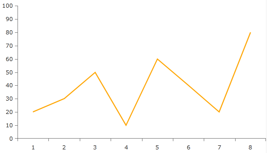
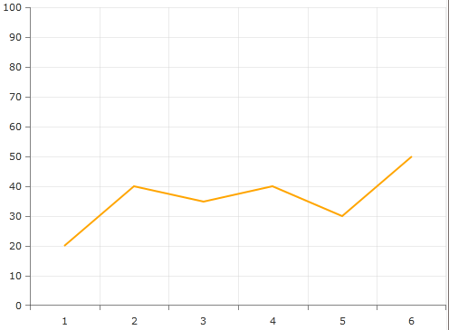
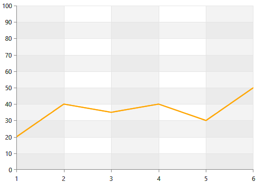

# Create Chart With Static Data

In this sample you are going to create and visualize your data using simple line chart. This line chart will be based on some predefined static data declared in XAML or code-behind.

First we'll declare our chart which is represented by the __RadCartesianChart__ class. See __Example 1__.        

__Example 1: Declare a chart in XAML__

<snippet id='radchartview-populating-with-data-static-data-example_1_declare_a_chart_in_xaml-xaml' />

The next thing that needs to be done is to define the chart’s axes. We need to set a horizontal axis and a vertical axis. They can differ from each other. For example the horizontal axis might be a plain numerical axis while the vertical axis can be logarithmic or some other fancy type. See __Example 2__.        

__Example 2: Define chart's axes__

<snippet id='radchartview-populating-with-data-static-data-example_2_define_chart_s_axes-xaml' />

Now we have a chart with two axes but no data. In order to visualize data we will need to have some visualization for it. The presentation of the data itself is achieved by declaring chart series inside our chart and filling these series with data points. Each chart series visualizes its data point collection in a different way. RadChart supports a few series out of the box the simplest of which is the line series. See __Example 3__.        

__Example 3: Define LineSeries__

<snippet id='radchartview-populating-with-data-static-data-example_3_define_lineseries-xaml' />

Now with this XAML things don’t look exactly right. There is nothing on screen. This is normal, we have not filled the series with data points yet. In __Example 4__ you can see how we can fill the series with data points.        

__Example 4: Populate the LineSeries with DataPoints__

<snippet id='radchartview-populating-with-data-static-data-example_4_populate_the_lineseries_with_datapoints-xaml' />

The same can be achieved in code-behind only. See __Example 5__.

__Example 5: Declare a chart in code-behind__

<snippet id='radchartview-populating-with-data-static-data-example_5_declare_a_chart_in_code_behind-cs' />

<snippet id='radchartview-populating-with-data-static-data-example_5_declare_a_chart_in_code_behind-vb' />

This is all we need - a chart object with axes specifically chosen to provide an intuitive coordinate system. Then we add a series object to visualize our set of data points and finally we fill the series with data. Check __Figure 1__.

#### __Figure 1: RadCharView with static data__

The chart can be further customized. For example you may want to add a grid-like visuals which support horizontal and vertical lines, associated with axis ticks and horizontal and vertical stripes for better readability. This can be achieved with the __RadCartesianGrid__ and his properties __MajorLinesVisibility__ and __StripLinesVisibility__. Both properties can be set to XY, X , Y or None (the default one).
        

__Example 6: Declare grid lines in chart__

<snippet id='radchartview-populating-with-data-static-data-example_6_declare_grid_lines_in_chart-xaml' />

The example in __Figure 2__ demonstrates how the line chart will look like with its MajorLinesVisibility set to XY.

#### __Figure 2: Setting the MajorLinesVisibility property__

To enable striplines you should set some brushes. See __Example 7__.
        
__Example 7: Stylize the grid lines__

<snippet id='radchartview-populating-with-data-static-data-example_7_stylize_the_grid_lines-xaml' />

#### __Figure 3: Stylized grid lines__

## See Also
 * [Introduction] ()
 * [Create Data-Bound Chart]()
 * [ChartDataSource]()
 * [Binding to a DataTable] ()
 * [Binding the Color of Series Items] ()
