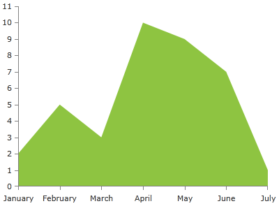

# AreaSeries

The AreaSeries behave like the LineSeries but it also allows the area between the line and the axis to be colored in an arbitrary way. By default the colors of the line and the area are the same.

## Declaratively defined series

          You can use the following definition to display a simple AreaSeries:
        

	
            <telerik:RadCartesianChart Palette="Windows8">
            <telerik:RadCartesianChart.HorizontalAxis>
                <telerik:CategoricalAxis/>
            </telerik:RadCartesianChart.HorizontalAxis>
            <telerik:RadCartesianChart.VerticalAxis>
                <telerik:LinearAxis />
            </telerik:RadCartesianChart.VerticalAxis>
            <telerik:RadCartesianChart.Series>
                <telerik:AreaSeries>
                    <telerik:AreaSeries.DataPoints>
                        <telerik:CategoricalDataPoint Category="January" Value="2" />
                        <telerik:CategoricalDataPoint Category="February" Value="5" />
                        <telerik:CategoricalDataPoint Category="March" Value="3" />
                        <telerik:CategoricalDataPoint Category="April" Value="10" />
                        <telerik:CategoricalDataPoint Category="May" Value="9" />
                        <telerik:CategoricalDataPoint Category="June" Value="7" />
                        <telerik:CategoricalDataPoint Category="July" Value="1" />
                    </telerik:AreaSeries.DataPoints>
                </telerik:AreaSeries>
            </telerik:RadCartesianChart.Series>
            </telerik:RadCartesianChart>

# See Also

 * [Chart Series Overview]()
