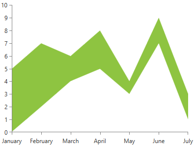

# RangeSeries

__RangeSeries__ displays a range of data by plotting two numeric values per data point. Additionally, you need to specify a minimum and maximum value for each data point. The high data points, as well as the low data points, are connected with straight line segments and the area enclosed the two lines is colored in an arbitrary way. 

* [Declaratively Defined Series](#declaratively-defined-series)
* [Properties](#properties)
* [Data Binding](#data-binding)
* [Styling the Series](#styling-the-series)

## Declaratively Defined Series

You can use the definition from __Example 1__ to display a RangeSeries.

__Example 1: Declaring a RangeSeries in XAML__
```XAML
	<telerik:RadCartesianChart Palette="Windows8">
		<telerik:RadCartesianChart.HorizontalAxis>
			<telerik:CategoricalAxis />
		</telerik:RadCartesianChart.HorizontalAxis>
		<telerik:RadCartesianChart.VerticalAxis>
			<telerik:LinearAxis />
		</telerik:RadCartesianChart.VerticalAxis>
		<telerik:RadCartesianChart.Series>
			<telerik:RangeSeries>
				<telerik:RangeSeries.DataPoints>
					<telerik:RangeDataPoint Category="January" High="5" Low="0"/>
					<telerik:RangeDataPoint Category="February" High="7" Low="2"/>
					<telerik:RangeDataPoint Category="March" High="6" Low="4"/>
					<telerik:RangeDataPoint Category="April" High="8" Low="5"/>
					<telerik:RangeDataPoint Category="May" High="4" Low="3"/>
					<telerik:RangeDataPoint Category="June" High="9" Low="7"/>
					<telerik:RangeDataPoint Category="July" High="3" Low="1"/>
				</telerik:RangeSeries.DataPoints>
			</telerik:RangeSeries>
		</telerik:RadCartesianChart.Series>
	</telerik:RadCartesianChart>
```

#### __Figure 1: RangeSeries visual appearance__  

 
## Properties

The following list represents the most important properties of the RangeSeries.

* __CategoryBinding__: A property of type __DataPointBinding__ that gets or sets the property path that determines the category value of the data point.
* __HighBinding__: A property of type __DataPointBinding__ that gets or sets the property path that determines the high value of the data point.
* __LowBinding__: A property of type __DataPointBinding__ that gets or sets the property path that determines the low value of the data point.
* __Fill__: A property of type __Brush__ that gets or sets the color of the RangeSeries area.
* __DashArray__: A property of type __DoubleCollection__ that gets or sets the dash pattern applied to the stroke of the area.
* __Stroke__: A property of type __Brush__ that gets or sets the outline stroke of the RangeSeries area.
* __AreaShapeStyle__: A property of type __Style__ that gets or sets the appearance of the area shape. The property excepts a style that targets an object of type Path.
* __StrokeShapeStyle__: A property of type __Style__ that gets or sets the style of the stroke of the area shape. The property accepts a style that targets an object of type Path.
* __StrokeMode__: A property of type __RangeSeriesStrokeMode__ that gets or sets the mode that determines what part of the series will be stroked. The stroke mode is an enumeration and it allows the following values:  
	* __None__: No outlining.
	* __LowPoints__: The stroke will be applied on the Low value of the data points.
	* __HighPoints__: The stroke will be applied on the High value of the data points.
	* __LowAndHighPoints__: The stroke will be applied on the Low and High values of the data points.

## Data Binding

You can use the __HighBinding__, __LowBinding__ and __CategoryBinding__ properties of the RangeSeries to bind the DataPoints’ properties to the properties from your view models.

__Example 2: Defining the view model__

```C#
	public class PlotInfo
    {
        public string Category { get; set; }
        public double HighValue { get; set; }
        public double LowValue { get; set; }
    }

	//.......
	this.DataContext = new ObservableCollection<PlotInfo>
	{
		new PlotInfo() { Category = "January", HighValue = 5, LowValue = 0},
		//....
	};
```	

__Example 3: Specify a RangeSeries in XAML__
```XAML
	<telerik:RangeSeries ItemsSource="{Binding}" HighBinding="HighValue" LowBinding="LowValue" CategoryBinding="Category"/>
```

>See the [Create Data-Bound Chart]() for more information on data binding in the RadChartView suite.

## Styling the Series

You can see how to style range series using different properties in the [RangeSeries section]() of the Customizing CartesianChart Series help article.

Additionally, you can use the Palette property of the chart to change the colors of the RangeSeries on a global scale. You can find more information about this feature in the [Palettes]() section in our help documentation.

## See Also
 * [Getting Started]()
 * [Chart Series Overview]()
 * [Area Series Overview]()
 * [Create Data-Bound Chart]()
