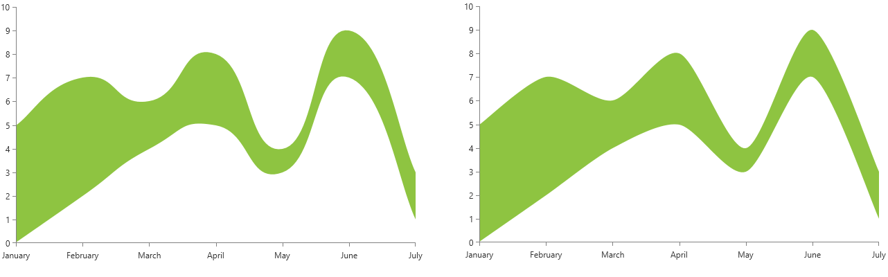
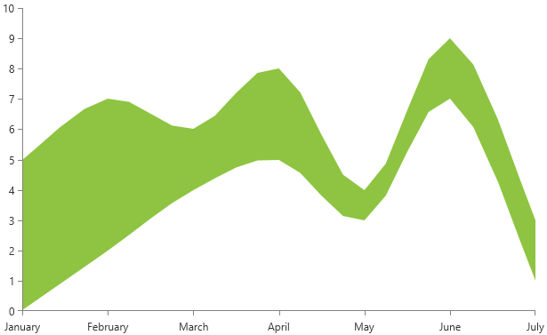

# RangeSplineSeries

__RangeSplineSeries__ displays a range of data by plotting two numeric values per data point. Additionally, you need to specify a minimum and maximum value for each data point. The high data points, as well as the low data points, are connected with smooth line segments and the area enclosed the two lines is colored in an arbitrary way. By default the colors of the line and the area are the same.

## Declaratively Defined Series

You can use the definition from __Example 1__ to display a RangeSplineSeries.

__Example 1: Declaring a RangeSplineSeries in XAML__
```XAML
	<telerik:RadCartesianChart Palette="Windows8">            
		<telerik:RadCartesianChart.HorizontalAxis>
			<telerik:CategoricalAxis/>
		</telerik:RadCartesianChart.HorizontalAxis>            
		<telerik:RadCartesianChart.VerticalAxis>
			<telerik:LinearAxis/>
		</telerik:RadCartesianChart.VerticalAxis>
		<telerik:RadCartesianChart.Series>
			<telerik:RangeSplineSeries>
				<telerik:RangeSplineSeries.DataPoints>
					<telerik:RangeDataPoint Category="January" High="5" Low="0"/>
					<telerik:RangeDataPoint Category="February" High="7" Low="2"/>
					<telerik:RangeDataPoint Category="March" High="6" Low="4"/>
					<telerik:RangeDataPoint Category="April" High="8" Low="5"/>
					<telerik:RangeDataPoint Category="May" High="4" Low="3"/>
					<telerik:RangeDataPoint Category="June" High="9" Low="7"/>
					<telerik:RangeDataPoint Category="July" High="3" Low="1"/>
				</telerik:RangeSplineSeries.DataPoints>
			</telerik:RangeSplineSeries>
		</telerik:RadCartesianChart.Series>
	</telerik:RadCartesianChart>
```

#### __Figure 1: RangeSplineSeries visual appearance__  


## Properties

* __CategoryBinding__: A property of type __DataPointBinding__ that gets or sets the property path that determines the category value of the data point.
* __HighBinding__: A property of type __DataPointBinding__ that gets or sets the property path that determines the high value of the data point.
* __LowBinding__: A property of type __DataPointBinding__ that gets or sets the property path that determines the low value of the data point.
* __Fill__: A property of type __Brush__ that gets or sets the color of the RangeSplineSeries area.
* __DashArray__: A property of type __DoubleCollection__ that gets or sets the dash pattern applied to the stroke of the area.
* __Stroke__: A property of type __Brush__ that gets or sets the outline stroke of the RangeSplineSeries area. You can control the thickness of the line via the __StrokeThickness__ property.
* __AreaShapeStyle__: A property of type __Style__ that gets or sets the appearance of the area shape. The property excepts a style that targets an object of type Path.
* __StrokeShapeStyle__: A property of type __Style__ that gets or sets the style of the stroke of the area shape. The property accepts a style that targets an object of type Path.
* __StrokeMode__: A property of type __RangeSeriesStrokeMode__ that gets or sets the mode that determines what part of the series will be stroked. The stroke mode is an enumeration and it allows the following values:  
	* __None__: No outlining.
	* __LowPoints__: The stroke will be applied on the Low value of the data points.
	* __HighPoints__: The stroke will be applied on the High value of the data points.
	* __LowAndHighPoints__: The stroke will be applied on the Low and High values of the data points.

## Data Binding

You can use the __HighBinding__, __LowBinding__ and __CategoryBinding__ properties of the RangeSplineSeries to bind the DataPoints’ properties to the properties from your view models.

__Example 2: Defining the view model__

```C#
	public class PlotInfo
    {
        public string Category { get; set; }
        public double HighValue { get; set; }
        public double LowValue { get; set; }
    }

	//.......
	this.DataContext = new ObservableCollection<PlotInfo>
	{
		new PlotInfo() { Category = "January", HighValue = 5, LowValue = 0},
		//....
	};
```		
	

__Example 3: Specify a RangeSplineSeries in XAML__
```XAML
	<telerik:RangeSplineSeries ItemsSource="{Binding}" HighBinding="HighValue" LowBinding="LowValue" CategoryBinding="Category"/>
```
	
>See the [Create Data-Bound Chart]() for more information on data binding in the RadChartView suite.

## Spline Tension

The spline-type series provide two properties allowing to control the additional points calculated for the spline of the line. The tension is controlled via the `SplineTension` property. The tension works with relative values between 0 and 1. The default tension is set to `0.5d`.

__Example 4: Setting SplineTension__
```XAML	
	 <telerik:RangeSplineSeries SplineTension="0.4" />
```

__Spline tension 0.8 (left) and 0.4 (right)__



Additionally, you can control the smoothness of the spline using the `SplinePointsDistanceFactor` property. The property controls the distance between the additionally calculated spline points. The bigger the factor is the less points will be created, thus the line will become less smooth. The property works with values between 0 and 0.35. The default value is `0.03d`.

__Example 5: Setting SplinePointsDistanceFactor__
```XAML	
	 <telerik:RangeSplineSeries SplinePointsDistanceFactor="0.18" />
```

__SplinePointsDistanceFactor set to 0.18__



## Styling the Series

You can see how to style range series using different properties in the [RangeSplineSeries section]() of the Customizing CartesianChart Series help article.

Additionally, you can use the Palette property of the chart to change the colors of the RangeSplineSeries on a global scale. You can find more information about this feature in the [Palettes]() section in our help documentation.

## See Also
 * [Getting Started]()
 * [Chart Series Overview]()
 * [Spline Area Series Overview]()
 * [Create Data-Bound Chart]()
