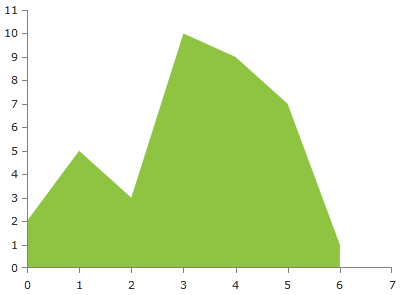

# ScatterAreaSeries

The __ScatterAreaSeries__ is visualized on the screen as a straight line connecting all data points and the area between the line and the axis is colored in an arbitrary way. By default, the colors of the line and the area are the same. As all scatter series, this one also requires the RadCartesianChart to define two LinearAxis.

* [Declaratively Defined Series](#declaratively-defined-series)
* [Properties](#properties)
* [Data Binding](#data-binding)
* [Styling the Series](#styling-the-series)

## Declaratively defined series

You can use the definition from __Example 1__ to display a ScatterAreaSeries.

__Example 1: Declaring a ScatterAreaSeries in XAML__
```XAML	
	<telerik:RadCartesianChart Palette="Windows8">
	<telerik:RadCartesianChart.HorizontalAxis>
		<telerik:LinearAxis />
	</telerik:RadCartesianChart.HorizontalAxis>
	<telerik:RadCartesianChart.VerticalAxis>
		<telerik:LinearAxis />
	</telerik:RadCartesianChart.VerticalAxis>
	<telerik:RadCartesianChart.Series>
		<telerik:ScatterAreaSeries>
			<telerik:ScatterAreaSeries.DataPoints>
				<telerik:ScatterDataPoint XValue="0" YValue="2" />
				<telerik:ScatterDataPoint XValue="1" YValue="5" />
				<telerik:ScatterDataPoint XValue="2" YValue="3" />
				<telerik:ScatterDataPoint XValue="3" YValue="10" />
				<telerik:ScatterDataPoint XValue="4" YValue="9" />
				<telerik:ScatterDataPoint XValue="5" YValue="7" />
				<telerik:ScatterDataPoint XValue="6" YValue="1" />
			</telerik:ScatterAreaSeries.DataPoints>
		</telerik:ScatterAreaSeries>
	</telerik:RadCartesianChart.Series>
	</telerik:RadCartesianChart>
```

#### __Figure 1: ScatterAreaSeries visual appearance__  


## Properties

* __YValueBinding__: A property of type __DataPointBinding__ that gets or sets the property path that determines the Y value of the data point.
* __XValueBinding__: A property of type __DataPointBinding__ that gets or sets the property path that determines the X value of the data point.
* __Fill__: A property of type __Brush__ that gets or sets the color of the ScatterAreaSeries area.
* __DashArray__: A property of type __DoubleCollection__ that gets or sets the dash pattern applied to the stroke of the area.
* __Stroke__: A property of type __Brush__ that gets or sets the outline stroke of the ScatterAreaSeries area. You can control the thickness of the line via the __StrokeThickness__ property.
* __AreaShapeStyle__: A property of type __Style__ that gets or sets the appearance of the area shape. The property excepts a style that targets an object of type Path.
* __StrokeShapeStyle__: A property of type __Style__ that gets or sets the style of the stroke of the area shape. The property accepts a style that targets an object of type Path.
* __OriginValue__: A property of type double which controls the origin value from which the series should start drawing on the numeric axis (LinearAxis or LogarithmicAxis).
* __StrokeMode__: A property of type __AreaSeriesStrokeMode__ that gets or sets the mode that determines what part of the series will be stroked. The stroke mode is an enumeration and it allows the following values:  
	* __None__: No outlining.
	* __LeftLine__: The left line (from plotline to the __first point__) is outlined.
	* __Points__: The line that connects all points is outlined. This is the default mode.
	* __LeftAndPoints__: The left line and the line that connects all points are outlined.
	* __RightLine__:  The right line (from plotline to the __last point__) is outlined.
	* __RightAndPoints__: The right line and the line that connects all points is outlined.
	* __AllButPlotLine__: All members except the PlotLine are specified..
	* __PlotLine__: The plotline is outlines.
	* __All__: All sides of the area is outlined.

## Data Binding

You can use the __YValueBinding__ and __XValueBinding__ properties of the ScatterAreaSeries to bind the DataPoints’ properties to the properties from your view models.

__Example 2: Defining the view model__

```C#
	public class PlotInfo
    {
        public double XValue { get; set; }
        public double YValue { get; set; }
    }

	//.......
	this.DataContext = new ObservableCollection<PlotInfo>
	{
		new PlotInfo() { XValue = 0, YValue = 2},
		//....
	};
```		

__Example 3: Specify a ScatterAreaSeries in XAML__
```XAML
	<telerik:ScatterAreaSeries ItemsSource="{Binding}" YValueBinding="YValue" XValueBinding="XValue"/>
```	

>See the [Create Data-Bound Chart]() for more information on data binding in the RadChartView suite.

## Styling the Series

You can see how to style scatter area series using different properties in the [ScatterAreaSeries section]() of the Customizing CartesianChart Series help article.

Additionally, you can use the Palette property of the chart to change the colors of the ScatterAreaSeries on a global scale. You can find more information about this feature in the [Palettes]() section in our help documentation.

## See Also
 * [Getting Started]()
 * [Chart Series Overview]()
 * [Create Data-Bound Chart]()
