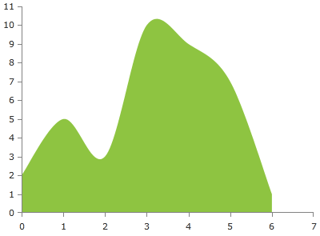

# ScatterSplineAreaSeries

The ScatterSplineAreaSeries behave like the ScatterSplineSeries but it also allows the area between the line and the axis to be colored in an arbitrary way. By default the colors of the line and the area are the same. As all scatter series, this one also requires the RadCartesianChart to define two LinearAxis.

## Declaratively defined series

You can use the following definition to display a simple ScatterSplineAreaSeries:

	
            <telerik:RadCartesianChart Palette="Windows8">
            <telerik:RadCartesianChart.HorizontalAxis>
                <telerik:LinearAxis />
            </telerik:RadCartesianChart.HorizontalAxis>
            <telerik:RadCartesianChart.VerticalAxis>
                <telerik:LinearAxis />
            </telerik:RadCartesianChart.VerticalAxis>
            <telerik:RadCartesianChart.Series>
                <telerik:ScatterSplineAreaSeries>
                    <telerik:ScatterSplineAreaSeries.DataPoints>
                        <telerik:ScatterDataPoint XValue="0" YValue="2" />
                        <telerik:ScatterDataPoint XValue="1" YValue="5" />
                        <telerik:ScatterDataPoint XValue="2" YValue="3" />
                        <telerik:ScatterDataPoint XValue="3" YValue="10" />
                        <telerik:ScatterDataPoint XValue="4" YValue="9" />
                        <telerik:ScatterDataPoint XValue="5" YValue="7" />
                        <telerik:ScatterDataPoint XValue="6" YValue="1" />
                    </telerik:ScatterSplineAreaSeries.DataPoints>
                </telerik:ScatterSplineAreaSeries>
            </telerik:RadCartesianChart.Series>
            </telerik:RadCartesianChart>

# See Also

 * [Chart Series Overview]()
