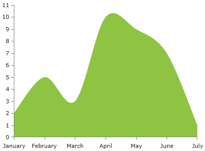
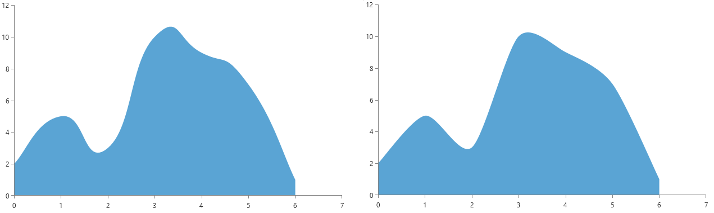
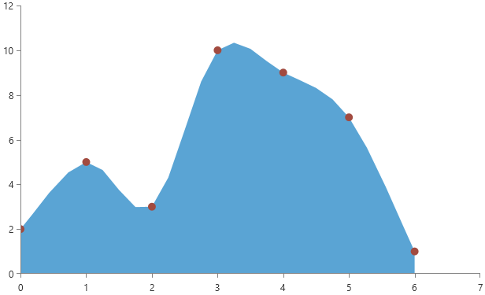

# SplineAreaSeries

The __SplineAreaSeries__ is visualized on the screen as a smooth line connecting all data points and the area between the line and the axis is colored in an arbitrary way. By default the colors of the line and the area are the same.

* [Declaratively Defined Series](#declaratively-defined-series)
* [Properties](#properties)
* [Data Binding](#data-binding)
* [Styling the Series](#styling-the-series)

## Declaratively defined series

You can use the definition from __Example 1__ to display an SplineAreaSeries.

__Example 1: Declaring a SplineAreaSeries in XAML__
```XAML
	<telerik:RadCartesianChart Palette="Windows8">
	<telerik:RadCartesianChart.HorizontalAxis>
		<telerik:CategoricalAxis/>
	</telerik:RadCartesianChart.HorizontalAxis>
	<telerik:RadCartesianChart.VerticalAxis>
		<telerik:LinearAxis />
	</telerik:RadCartesianChart.VerticalAxis>
	<telerik:RadCartesianChart.Series>
		<telerik:SplineAreaSeries>
			<telerik:SplineAreaSeries.DataPoints>
				<telerik:CategoricalDataPoint Category="January" Value="2" />
				<telerik:CategoricalDataPoint Category="February" Value="5" />
				<telerik:CategoricalDataPoint Category="March" Value="3" />
				<telerik:CategoricalDataPoint Category="April" Value="10" />
				<telerik:CategoricalDataPoint Category="May" Value="9" />
				<telerik:CategoricalDataPoint Category="June" Value="7" />
				<telerik:CategoricalDataPoint Category="July" Value="1" />
			</telerik:SplineAreaSeries.DataPoints>
		</telerik:SplineAreaSeries>
	</telerik:RadCartesianChart.Series>
	</telerik:RadCartesianChart>
```

#### __Figure 1: SplineAreaSeries visual appearance__


## Properties

* __CategoryBinding__: A property of type __DataPointBinding__ that gets or sets the property path that determines the category value of the data point.
* __ValueBinding__: A property of type __DataPointBinding__ that gets or sets the property path that determines the value of the data point.
* __Fill__: A property of type __Brush__ that gets or sets the color of the SplineAreaSeries area.
* __DashArray__: A property of type __DoubleCollection__ that gets or sets the dash pattern applied to the stroke of the area.
* __Stroke__: A property of type __Brush__ that gets or sets the outline stroke of the SplineAreaSeries area. You can control the thickness of the line via the __StrokeThickness__ property.
* __AreaShapeStyle__: A property of type __Style__ that gets or sets the appearance of the area shape. The property excepts a style that targets an object of type Path.
* __StrokeShapeStyle__: A property of type __Style__ that gets or sets the style of the stroke of the area shape. The property accepts a style that targets an object of type Path.
* __OriginValue__: A property of type double which controls the origin value from which the series should start drawing on the numeric axis (LinearAxis or LogarithmicAxis).
* __StrokeMode__: A property of type __AreaSeriesStrokeMode__ that gets or sets the mode that determines what part of the series will be stroked. The stroke mode is an enumeration and it allows the following values:  
	* __None__: No outlining.
	* __LeftLine__: The left line (from plotline to the __first point__) is outlined.
	* __Points__: The line that connects all points is outlined. This is the default mode.
	* __LeftAndPoints__: The left line and the line that connects all points are outlined.
	* __RightLine__:  The right line (from plotline to the __last point__) is outlined.
	* __RightAndPoints__: The right line and the line that connects all points is outlined.
	* __AllButPlotLine__: All members except the PlotLine are specified..
	* __PlotLine__: The plotline is outlines.
	* __All__: All sides of the area is outlined.

## Data Binding

You can use the ValueBinding and CategoryBinding properties of the SplineAreaSeries to bind the DataPoints’ properties to the properties from your view models.

__Example 2: Defining the view model__

```C#
	public class PlotInfo
    {	
        public string Category { get; set; }
        public double Value { get; set; }
    }

	//.......
	this.DataContext = new ObservableCollection<PlotInfo>
	{
		new PlotInfo() { Category = "January", Value = 2},
		//....
	};
```	

__Example 3: Specify a SplineAreaSeries in XAML__
```XAML	
	 <telerik:SplineAreaSeries ItemsSource="{Binding}" CategoryBinding="Category" ValueBinding="Value"/>
```

>See the [Create Data-Bound Chart]() for more information on data binding in the RadChartView suite.

## Spline Tension

The spline-type series provide two properties allowing to control the additional points calculated for the spline of the line. The tension is controlled via the `SplineTension` property. The tension works with relative values between 0 and 1. The default tension is set to `0.5d`.

__Example 4: Setting SplineTension__
```XAML	
	 <telerik:SplineAreaSeries SplineTension="0.4" />
```

__Spline tension 0.8 (left) and 0.4 (right)__



Additionally, you can control the smoothness of the spline using the `SplinePointsDistanceFactor` property. The property controls the distance between the additionally calculated spline points. The bigger the factor is the less points will be created, thus the line will become less smooth. The property works with values between 0 and 0.35. The default value is `0.03d`.

__Example 5: Setting SplinePointsDistanceFactor__
```XAML	
	 <telerik:SplineAreaSeries SplinePointsDistanceFactor="0.18" />
```

__SplinePointsDistanceFactor set to 0.18__



## Styling the Series

You can see how to style spline area series using different properties in the [SplineAreaSeries section]() of the Customizing CartesianChart Series help article.

Additionally, you can use the Palette property of the chart to change the colors of the SplineAreaSeries on a global scale. You can find more information about this feature in the [Palettes]() section in our help documentation.

## See Also
  * [Getting Started]()
  * [Chart Series Overview]()
  * [Create Data-Bound Chart]()
