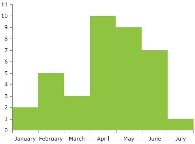
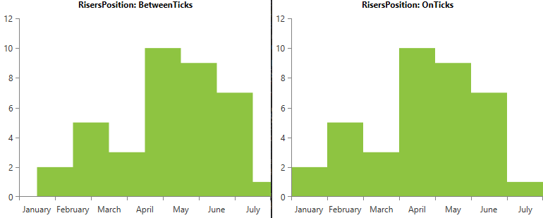

# StepAreaSeries

The __StepAreaSeries__ is visualized on the screen as a horizontal and vertical line instead of straight line which connects all data points. The area between the line is colored in an arbitrary way. By default the colors of the line and the area are the same.

## Declaratively defined series

You can use the definition from __Example 1__ to display a StepAreaSeries.

__Example 1: Declaring a StepAreaSeries in XAML__
```XAML
	<telerik:RadCartesianChart Palette="Windows8">
		<telerik:RadCartesianChart.HorizontalAxis>
			<telerik:CategoricalAxis/>
		</telerik:RadCartesianChart.HorizontalAxis>
		<telerik:RadCartesianChart.VerticalAxis>
			<telerik:LinearAxis />
		</telerik:RadCartesianChart.VerticalAxis>
		<telerik:RadCartesianChart.Series>
			<telerik:StepAreaSeries>
				<telerik:StepAreaSeries.DataPoints>
					<telerik:CategoricalDataPoint Category="January" Value="2" />
					<telerik:CategoricalDataPoint Category="February" Value="5" />
					<telerik:CategoricalDataPoint Category="March" Value="3" />
					<telerik:CategoricalDataPoint Category="April" Value="10" />
					<telerik:CategoricalDataPoint Category="May" Value="9" />
					<telerik:CategoricalDataPoint Category="June" Value="7" />
					<telerik:CategoricalDataPoint Category="July" Value="1" />
				</telerik:StepAreaSeries.DataPoints>
			</telerik:StepAreaSeries>
		</telerik:RadCartesianChart.Series>
	</telerik:RadCartesianChart>
```

#### __Figure 1: StepAreaSeries visual appearance__


## Properties

* __CategoryBinding__: A property of type __DataPointBinding__ that gets or sets the property path that determines the category value of the data point.
* __ValueBinding__: A property of type __DataPointBinding__ that gets or sets the property path that determines the value of the data point.
* __Fill__: A property of type __Brush__ that gets or sets the color of the StepAreaSeries area.
* __DashArray__: A property of type __DoubleCollection__ that gets or sets the dash pattern applied to the stroke of the area.
* __Stroke__: A property of type __Brush__ that gets or sets the outline stroke of the StepAreaSeries area.
* __AreaShapeStyle__: A property of type __Style__ that gets or sets the appearance of the area shape. The property excepts a style that targets an object of type Path.
* __StrokeShapeStyle__: A property of type __Style__ that gets or sets the style of the stroke of the area shape. The property accepts a style that targets an object of type Path.
* __OriginValue__: A property of type double which controls the origin value from which the series should start drawing on the numeric axis (LinearAxis or LogarithmicAxis).
* __StrokeMode__: A property of type __AreaSeriesStrokeMode__ that gets or sets the mode that determines what part of the series will be stroked. The stroke mode is an enumeration and it allows the following values: 
	* __None__: No outlining.
	* __LeftLine__: The left line (from plotline to the __first point__) is outlined.
	* __Points__: The line that connects all points is outlined. This is the default mode.
	* __LeftAndPoints__: The left line and the line that connects all points are outlined.
	* __RightLine__:  The right line (from plotline to the __last point__) is outlined.
	* __RightAndPoints__: The right line and the line that connects all points is outlined.
	* __AllButPlotLine__: All members except the PlotLine are specified..
	* __PlotLine__: The plotline is outlines.
	* __All__: All sides of the area is outlined.
* __RisersPosition__: A property of type __StepSeriesRisersPosition__ that gets or sets the mode that determines where the risers of the step line series should be positioned. The risers position is an enumeration and it allows the following values:  
	* __Default__: The risers position depends on the plot mode of the axes.
	* __OnTicks__: The risers will be plotted over each tick.
	* __BetweenTicks__: The risers are plotted in the middle of the range, defined between each two ticks.

#### __Figure 2: BetweenTicks and OnTicks RisersPosition values based on Example 1__


## Data Binding

You can use the ValueBinding and CategoryBinding properties of the StepAreaSeries to bind the DataPoints’ properties to the properties from your view models.

__Example 2: Defining the view model__

```C#
	public class PlotInfo
    {	
        public string Category { get; set; }
        public double Value { get; set; }
    }

	//.......
	this.DataContext = new ObservableCollection<PlotInfo>
	{
		new PlotInfo() { Category = "January", Value = 2},
		//....
	};
```	

__Example 3: Specify a StepAreaSeries in XAML__
```XAML	
	 <telerik:StepAreaSeries ItemsSource="{Binding}" CategoryBinding="Category" ValueBinding="Value"/>
```

>See the [Create Data-Bound Chart]() for more information on data binding in the RadChartView suite.

## Styling the Series

You can see how to style spline area series using different properties in the [StepAreaSeries section]() of the Customizing CartesianChart Series help article.

Additionally, you can use the Palette property of the chart to change the colors of the StepAreaSeries on a global scale. You can find more information about this feature in the [Palettes]() section in our help documentation.	
	
## See Also
  * [Getting Started]()
  * [Chart Series Overview]()
  * [Create Data-Bound Chart]()
