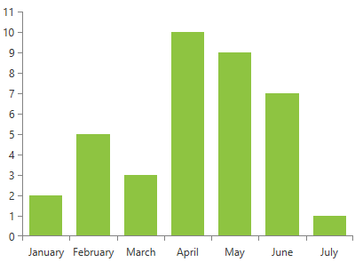
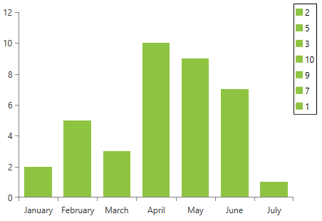
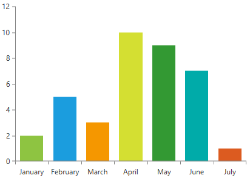
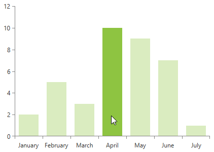

# BarSeries

This series is visualized on the screen as separate rectangles representing each of the __DataPoints__.      

* [Declaratively Defined Series](#declaratively-defined-series)
* [Properties](#properties)
* [Data Binding](#data-binding)
* [Features](#features)
* [Styling the Series](#styling-the-series)

## Declaratively defined series

You can use the following definition to display a simple BarSeries

#### __[XAML] Example 1: Declaring a BarSeries in XAML__
{{region radchartview-series-barseries_0}}
	<telerik:RadCartesianChart Palette="Windows8">
	<telerik:RadCartesianChart.HorizontalAxis>
		<telerik:CategoricalAxis/>
	</telerik:RadCartesianChart.HorizontalAxis>
	<telerik:RadCartesianChart.VerticalAxis>
		<telerik:LinearAxis />
	</telerik:RadCartesianChart.VerticalAxis>
	<telerik:RadCartesianChart.Series>
		<telerik:BarSeries>
			<telerik:BarSeries.DataPoints>
				<telerik:CategoricalDataPoint Category="January" Value="2" />
				<telerik:CategoricalDataPoint Category="February" Value="5" />
				<telerik:CategoricalDataPoint Category="March" Value="3" />
				<telerik:CategoricalDataPoint Category="April" Value="10" />
				<telerik:CategoricalDataPoint Category="May" Value="9" />
				<telerik:CategoricalDataPoint Category="June" Value="7" />
				<telerik:CategoricalDataPoint Category="July" Value="1" />
			</telerik:BarSeries.DataPoints>
		</telerik:BarSeries>
	</telerik:RadCartesianChart.Series>
	</telerik:RadCartesianChart>
{{endregion}}

#### __Figure 1: BarSeries visual appearance__  

## Properties

* __CategoryBinding__: A property of type __DataPointBinding__ that gets or sets the property path that determines the category value of the data point.
* __ValueBinding__: A property of type __DataPointBinding__ that gets or sets the property path that determines the value of the data point.
* __OriginValue__: A property of type double which controls from which Y point value the area series should be start drawing.
* __LegendSettings__: A property of type ChartLegendSettings that gets or sets the legend setting.
* __PaletteMode__: A property of type __SeriesPaletteMode__ that gets or sets the mode that determines how the pallete should be applied. This property will be applied only if the Palette property of the chart is set. The pallete mode is an enumeration and it allows the following values: 
	* __Series__: Default value. When set every series will be applied a different color.
	* __DataPoint__: When set each data point will have a different color.

## Data Binding

You can use the ValueBinding and CategoryBinding properties of the BarSeries to bind the DataPoints’ properties to the properties from your view models.

#### __[C#] Example 2: Defining the view model__

{{region radchartview-series-barseries_1}}
	public class PlotInfo
    {
        public string Category { get; set; }
        public double Value { get; set; }
    }

	//.......
	this.DataContext = new ObservableCollection<PlotInfo>
	{
		new PlotInfo() { Category = "January", Value = 2},
		//....
	};
{{endregion}}	

#### __[XAML] Example 3: Specify a BarSeries in XAML__
{{region radchartview-series-barseries_2}}	
	<telerik:BarSeries ItemsSource="{Binding}" CategoryBinding="Category" ValueBinding="Value" />
{{endregion}}

>See the [Create Data-Bound Chart]() for more information on data binding in the RadChartView suite.

## Features

The series supports all standard features exposed by all other categorical series. However, the specification of the series brings few additional functionalities which are listed below:

* __DataPointLegendSettings__: The series supports two types of legend settings, the first one is the common SeriesLegendSettings which can be used with all types of series and it maps each legend item to a series. The series supports an additional DataPointLegendSettings which maps the legend items per data point.

#### __[XAML] Example 4: Specify LegendSettings of the BarSeries__
{{region radchartview-series-barseries_3}}	
	<telerik:BarSeries.LegendSettings>
		<telerik:DataPointLegendSettings/>
	</telerik:BarSeries.LegendSettings>
{{endregion}}

#### __Figure 2: Setting BarSeries legend settings__
	

* __PaletteMode__: The BarSeries supports two modes that determine whether the applied palette should be applied per series or per data point. The mode can be controlled through the PalleteMode property. The modes are called Series and DataPoint. The following image demonstrates the DataPoint PaletteMode with the Windows8 palette applied:
	
#### __Figure 3: Specify BarSeries pallete mode__
	
	
Setting the PaletteMode to __Series__ will apply different color for each series defined in the chart.

* __Hover interactivity__: RadCartesianChart exposes a property called HoverMode. This property can be used only by the bar and bubble series. If it is set to “FadeOtherSeries”, when you mouse over a data point, the bar from all other series will fade out. The default value of the property is “None”.

#### __[XAML] Example 8: Setting the HoverMode of the RadCartesianChart__
{{region radchartview-series-barseries_4}}	
	<telerik:RadCartesianChart HoverMode="FadeOtherSeries">
{{endregion}}

#### __Figure 4: Hover interactivity in BarSeries__ 

## Styling the Series

You can see how to style area series using different properties in the [BarSeries section]() of the Customizing CartesianChart Series help article.

Additionally, you can use the Palette property of the chart to change the colors of the BarSeries on a global scale. You can find more information about this feature in the [Palettes]() section in our help documentation.

## See Also
 * [Getting Started]()
 * [Chart Series Overview]()
 * [Create Data-Bound Chart]()